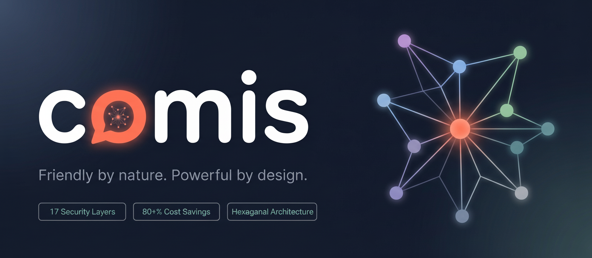
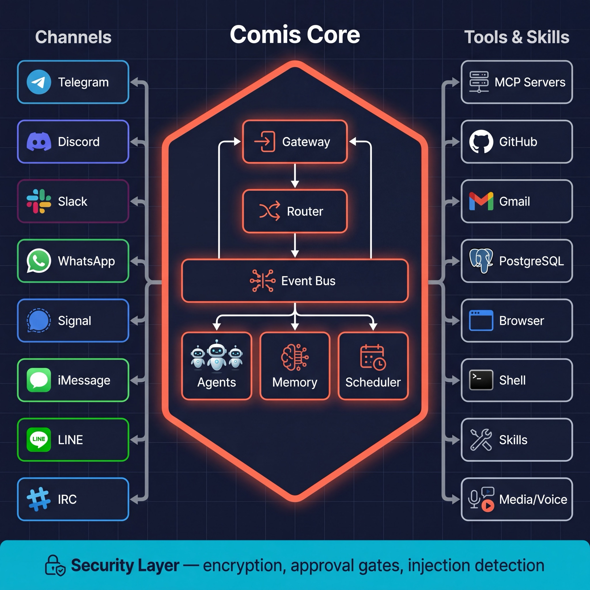

<p align="center">
  
</p>

<p align="center">
  <strong>Your personal AI team, always by your side.</strong>
</p>

<p align="center">
  <a href="https://github.com/comisai/comis/actions/workflows/ci.yml"></a>
  <a href="https://www.npmjs.com/package/comisai"></a>
  <a href="https://github.com/comisai/comis/blob/main/LICENSE"></a>
  <a href="https://github.com/comisai/comis/stargazers"></a>
  <a href="https://discord.gg/FsqgJkpp"></a>
</p>

<p align="center">
  <a href="https://docs.comis.ai">Docs</a> &middot;
  <a href="https://comis.ai/compare/openclaw">Compare</a> &middot;
  <a href="https://discord.gg/FsqgJkpp">Discord</a> &middot;
  <a href="https://twitter.com/comis_ai">Twitter</a> &middot;
  <a href="#quick-start">Quick Start</a>
</p>

<p align="center">
  <a href="#why-comis">Why Comis</a> · <a href="#quick-start">Quick Start</a> · <a href="#features">Features</a> · <a href="#supported-channels">Channels</a> · <a href="#architecture">Architecture</a> · <a href="#security">Security</a> · <a href="#context-engine--cost-optimization">Context & Cost</a> · <a href="#graph-pipelines">Pipelines</a> · <a href="#skills">Skills</a> · <a href="#developer-setup">Dev Setup</a> · <a href="#contributing">Contributing</a>
</p>

---

Comis is a self-hosted, open-source AI assistant platform that lives inside your messaging apps - not a browser tab. Deploy a team of specialized agents with persistent memory, 50+ tools, and DAG-based workflows across 9 platforms. Secured by 22 defense layers and optimized to reduce LLM costs by 80%+.

> **comis** _(Latin)_ - courteous, kind, affable, gracious. That's what an AI assistant should be.

---

## Why Comis

### Security: the LLM is the attack surface

AI agents have access to your messaging apps, files, shell, and API keys. A single prompt injection can make the LLM leak secrets, execute destructive commands, or exfiltrate private data. Most platforms have no defenses against this.

Comis assumes the LLM will be attacked. 22 independent defense layers intercept threats at every stage: input scanning for injection patterns, output scanning for leaked secrets, kernel-enforced exec sandboxes, per-agent tool restrictions with approval gates, trust-partitioned memory, and canary tokens for prompt extraction detection. No single layer has to be perfect because an attack only succeeds if it bypasses all of them.

### Cost: prompt caching saves 81%

LLM providers charge per token via API keys, and frontier models aren't cheap. At [$5/MTok input for Opus 4.6](https://platform.claude.com/docs/en/about-claude/pricing), costs add up fast without optimization.

Comis has the most advanced prompt cache management available for Anthropic, with 20 dedicated optimizations including adaptive TTL escalation, cache fence protection that prevents the context engine from breaking the cached prefix, sub-agent spawn staggering for pipeline cost sharing, and two-phase cache break detection that attributes every invalidation to its root cause. Gemini gets native CachedContent API integration with SHA-256 content hashing and automatic lifecycle management. OpenAI is supported with completion storage for cost reduction.

| Metric | Value |
|---|---|
| 76-call Opus 4.6 session | **$5.02** vs $26.42 uncached |
| Cache hit rate | 94% of input tokens |
| 8-agent trading pipeline | **$2.11** for 788K tokens |

### Context: scales without degradation

Most assistants silently drop old messages when context fills up. Comis never deletes a message. The entire conversation history is stored in a DAG-backed database with hierarchical summaries. When the context window fills, older messages are compacted into structured summaries at increasing depth while originals remain retrievable on demand. An 8-layer context engine handles the rest: stale content is evicted, critical context is preserved through LLM compaction and rehydration, and progressive tool disclosure keeps 50+ tools available without burning context.

Between sessions, a background learning job reviews past conversations to extract user preferences and facts, deduplicates them against existing knowledge, and stores them as persistent memory. The agent gets better over time without being told to remember.

### Orchestration: team agents from natural language

> *"Have four analysts research NVDA in parallel, then run a bull vs bear debate, and let the head trader make the final call."*

One sentence creates a 7-node DAG pipeline with parallel fan-out, multi-round debate, and synthesis. No YAML, no scripting. 7 node types, 3-tier concurrency control, and barrier synchronization. Each agent gets isolated memory, budgets, and tool policies.

---

## Quick Start

**One-liner** - installs Node.js and everything else:

```bash
curl -fsSL https://comis.ai/install.sh | bash
```

Works on macOS and Linux.

**Or with npm** (requires Node.js 22+):

```bash
npm install -g comisai
comis init
comis configure    # choose your LLM provider, add API keys, connect a channel
comis daemon start
```

**Or with Docker** (no Node.js required):

```bash
# Clone the repo for the Compose file and env template
git clone https://github.com/comisai/comis.git && cd comis

# Configure your API keys
cp .env.docker.example .env
# Edit .env and add at minimum: ANTHROPIC_API_KEY or OPENAI_API_KEY

# Pull the official image and start
COMIS_IMAGE=comisai/comis:latest-slim docker compose up -d
```

Verify the daemon is running:

```bash
curl http://localhost:4766/health
# {"status":"ok"}
```

Images are published to [Docker Hub](https://hub.docker.com/u/comisai) on every release:

| Image | Description |
|---|---|
| `comisai/comis:latest-slim` | Daemon (recommended — minimal base) |
| `comisai/comis:latest` | Daemon (full base with debugging tools) |
| `comisai/comis-web:latest` | Web dashboard (Nginx SPA) |

Both `linux/amd64` and `linux/arm64` are supported.

Setup takes about 2 minutes. Message your agent. That's it.

---

## Features

| | Feature | Description |
|---|---|---|
| 💬 | **9 messaging channels** | Telegram, Discord, Slack, WhatsApp, Signal, iMessage, IRC, LINE, Email - text, voice, images, files, reactions, threads |
| 🤖 | **Multi-agent fleet** | Specialized agents with isolated memory, budgets, and tool policies. Per-agent model selection. Delegate work via sub-agent spawning (sync or fire-and-forget). |
| 🧠 | **Persistent memory** | SQLite + FTS5 + vector search with trust-partitioned storage (system/learned/external). RAG retrieval keeps context relevant weeks later. |
| 🔀 | **DAG pipelines** | 7 node types (agent, debate, vote, refine, collaborate, map-reduce, approval gate). Built from natural language. Visual canvas editor. |
| 🔌 | **MCP ecosystem** | 50+ tool servers - GitHub, Gmail, Notion, databases, browser automation, shell. Add any MCP server with one config line. |
| 🧩 | **Skills system** | Modular prompt packages for domain expertise, workflows, and persona traits. Runtime eligibility filtering, dynamic injection, file watching for live reload. |
| 🧊 | **8-layer context engine** | Reasoning stripping, dead content eviction, three-tier observation masking, LLM compaction, rehydration, progressive tool disclosure - 80%+ cost reduction. |
| 🛡️ | **22 security layers** | OS-level exec sandbox, injection detection (40+ patterns), AES-256 encrypted secrets, SSRF guard, canary tokens, approval gates, budget guards. |
| 🌐 | **Any model, any provider** | Claude, GPT, Gemini, Groq, Ollama, OpenRouter. Tool presentation adapts to each model's context window - small models get pruned schemas and a focused tool set. |
| 🖼️ | **Media processing** | Vision analysis, STT (Whisper/Groq/Deepgram), TTS (OpenAI/ElevenLabs/Edge), image generation (FAL/OpenAI), PDF extraction - native on all channels. |
| 🌍 | **Headless browser** | Web automation, screenshots, form filling, JavaScript execution. |
| ⏰ | **Scheduling & cron** | Recurring tasks, heartbeat health checks, cron triggers for pipeline automation. |
| ⚙️ | **Gateway & API** | OpenAI-compatible API, JSON-RPC, WebSocket, mTLS, bearer auth. |
| 📊 | **Observability** | Structured logging (Pino), circuit breakers, per-agent cost tracking, context engine metrics, trace IDs. |

---

## Supported Channels

<p align="center">
  &nbsp;&nbsp;
  &nbsp;&nbsp;
  &nbsp;&nbsp;
  &nbsp;&nbsp;
  &nbsp;&nbsp;
  &nbsp;&nbsp;
  &nbsp;&nbsp;
  &nbsp;&nbsp;
  &nbsp;&nbsp;
</p>

<p align="center">
  Telegram &middot; Discord &middot; Slack &middot; WhatsApp &middot; Signal &middot; iMessage &middot; LINE &middot; IRC &middot; Email
</p>

<p align="center">
  Text, voice, images, files, reactions, threads - full experience on every platform.
</p>

---

## Architecture

<p align="center">
  
</p>

Comis uses **hexagonal architecture** (ports and adapters). Core defines port interfaces - adapters implement them. Swap Discord for Matrix, SQLite for Postgres, or OpenAI for Ollama without touching core logic. Adding a channel, tool, or provider means writing an adapter, not modifying the core.

**19 ports, 30+ adapters, 13 packages.** Driving adapters (channels, CLI, API) call into the core. Driven adapters (memory, LLM providers, media processors) are called by the core through ports. Every function returns `Result<T, E>` - zero thrown exceptions. Fully testable in isolation.

[Deep dive: Architecture &rarr;](https://comis.ai/architecture)

---

## Security

22 independent defense layers across 9 categories - built from the first commit as a design constraint, not bolted on after the fact.

### OS-Level Exec Sandbox

Every shell command runs inside **kernel-enforced filesystem isolation**. The agent sees its workspace. Nothing else.

- **Linux:** [Bubblewrap](https://github.com/containers/bubblewrap) with full namespace unsharing (mount, PID, user, cgroup, IPC). Private `/tmp` and `/dev`. `--die-with-parent` cascade kill.
- **macOS:** `sandbox-exec` with default-deny SBPL profiles generated per invocation. Symlink-aware path resolution.

The sandbox is one of six layers around exec - tool policy can remove exec entirely, command denylist blocks destructive commands, env denylist strips `LD_PRELOAD`/`DYLD_*`, CWD validation prevents traversal, and subprocess env filtering strips API keys from child processes.

### Defense in Depth

| Category | Layers |
|---|---|
| **Perimeter** | Input Guard (13 weighted pattern categories, typoglycemia detection), Output Guard (15 secret patterns, canary leak detection), external content wrapping (randomized delimiters), zero-width character stripping, injection rate limiter |
| **Secrets** | AES-256-GCM encryption at rest, per-agent scoped access (glob patterns), 3-layer log sanitizer (Pino fast-redact + regex + ReDoS mitigation) |
| **Network** | DNS-pinned SSRF guard - blocks RFC 1918, loopback, link-local, cloud metadata IPs (AWS/GCP/Azure/Alibaba) |
| **Process Isolation** | Kernel-enforced exec sandbox (bubblewrap / sandbox-exec) |
| **Access Control** | Tool policy engine (5 named profiles, per-agent allow/deny), approval gates with dual caching and mutual invalidation |
| **Memory** | Trust-partitioned storage (system/learned/external), pre-write security scan, RAG excludes external by default |
| **Detection** | Per-session canary tokens (HMAC-SHA256) detect system prompt extraction |
| **Transport** | Timing-safe bearer tokens, mTLS with CN extraction, HMAC webhook verification with replay protection |
| **Runtime** | 3-tier budget guard (per-execution/hour/day, checked pre-call), circuit breaker, tool output sanitizer (NFKC normalization, invisible char stripping) |

[Deep dive: Security &rarr;](https://comis.ai/security)

---

## Context Engine & Cost Optimization

Most agents degrade as conversations grow - context fills up, old messages are silently dropped, and the agent forgets what mattered. Comis solves this with an **8-layer context engine**, **progressive tool disclosure**, and **20 prompt cache optimizations** that cut LLM costs by 80%+ while maintaining full coherence.

### Context Processing Layers

| Layer | What it does | When |
|---|---|---|
| Thinking Cleaner | Strips old reasoning traces | Every call |
| Reasoning Tag Stripper | Strips inline reasoning tags from non-Anthropic providers | Every call |
| History Window | Caps to last N turns per channel | Every call |
| Dead Content Evictor | Replaces superseded file reads / exec results with 50-byte placeholders | Every call |
| Observation Masker | Three-tier masking (protected/standard/ephemeral) with hysteresis, persists to disk | Context > 120K chars |
| LLM Compaction | Summarizes 50+ messages into 9 structured sections (3-tier fallback) | Context > 85% of window |
| Rehydration | Re-injects workspace instructions + recently-accessed files post-compaction | After compaction |
| Objective Reinforcement | Preserves sub-agent task objectives through compression | After compaction |

**Progressive tool disclosure** manages 50+ tools without context bloat. Lean definitions (~20 tokens each) are always present for tool selection. Detailed usage guides inject on first use. Tools irrelevant to the current context defer behind a semantic discovery tool. Small models get pruned schemas and a focused core set.

Microcompaction offloads oversized tool results to disk at write time. Three-tier budget guard (per-execution/hour/day) is checked before each call. Every layer has its own circuit breaker.

### Prompt Cache Architecture

LLM providers charge 10-20x less for cached prompt reads than cache writes. Cache only works when the prompt prefix stays identical across turns. Most agents break this by injecting timestamps, RAG results, or hook output into the system prompt - every variation forces a full cache rebuild.

Comis uses a **dual-prompt architecture** that separates static content from per-turn content:

| Content | Location | Why |
|---|---|---|
| Identity, tools, security rules | **System prompt** (static, cached) | Same bytes every turn - cache prefix holds |
| Timestamps, RAG results, channel context, hook output, skills manifest, canary tokens | **Dynamic preamble** (first user message) | Changes every turn without breaking the cache |

Most agent platforms treat caching as a provider feature - a single `cache_control` tag on the system prompt. Comis treats it as a **target architecture**. The context engine is cache-aware: it knows where the cache boundary is and actively prevents modifications within the cached region. Anthropic gets an active cache fence with TTL monotonicity enforcement and spawn staggering. Gemini gets explicit CachedContent API integration with SHA-256 content hashing. Cache break detection attributes every invalidation to its root cause.

### Production Results

**76-call session with Claude Opus 4.6 (2 cache breaks from skill hot-loading):**

| | Tokens | Cost |
|---|---|---|
| Cache read | 4,892,893 | $2.45 |
| Cache write | 289,900 | $2.06 |
| Output | 20,662 | $0.52 |
| **Total** | **5,213,517** | **$5.02** |
| Without caching | - | ~~$26.42~~ |

**16.9x** cache read/write ratio. **81% savings.** 94% of input tokens served from cache at $0.50/MTok.

| Metric | Value |
|---|---|
| Cache hit rate | **94%** of all input tokens served from cache |
| Per-message cost (cached) | **$0.04-0.09** vs $0.25 cold |
| Cache write cost | ~6% of tokens (unavoidable new content) |
| Uncached tokens | <0.01% (effectively zero) |

An 8-agent NVDA trading pipeline (Sonnet 4.5 sub-agents, 788K tokens): **$2.11 total**, 70% graph cache effectiveness.

<details>
<summary><strong>Detailed cache optimization mechanics</strong></summary>

<br>

```
breakpoint callback -> fence index -> layer guards -> trim offset translation
         ^                                                    |
         +--------------- persisted across execute() calls ---+
```

- **Cache fence index** - tracks the highest cache breakpoint position from each LLM call. Content-modifying layers skip messages at or below the fence on the next turn.
- **Trim offset translation** - the history window trims 100+ messages from the front. The fence index is stored in pre-trim space and correctly adjusted after trimming so protection survives across turns.
- **Sub-agent spawn staggering** - concurrent sub-agents in a pipeline wave are staggered by 4 seconds. The first agent writes the shared cache prefix; siblings read it at 10x lower cost.
- **Adaptive cold-start retention** - parent agents write at 1h TTL from the first call so the system prompt survives pipeline gaps (>5m). Sub-agents inherit mixed 5m/1h TTLs - shared prefix blocks use the first writer's TTL, conversation-specific content uses 5m.
- **TTL monotonicity enforcement** - Anthropic's API requires cache breakpoint TTLs to be non-increasing. The SDK sets system blocks to 5m, but tool breakpoints escalate to 1h. Comis upgrades system block TTLs in the `onPayload` hook to satisfy the constraint.
- **Session-scoped warm state** - adaptive retention escalation persists across `execute()` calls. Returning executions start at the configured retention immediately.
- **3-zone cache breakpoints** - up to 3 strategic `cache_control` markers (semi-stable zone, mid-point, recent zone). Sub-agents use 512-token threshold, parent agents use 1024.
- **Observation masker hysteresis** - 120K activation / 80K deactivation band prevents cache-thrashing oscillation. Three-tier classification (protected/standard/ephemeral) with per-tier keep windows. Monotonic masking: once masked, always re-masked.
- **Tool schema snapshotting** - freezes the tools array per session so MCP tool connect/disconnect doesn't invalidate the cache.
- **Cache break detection & attribution** - two-phase system records pre-call SHA-256 hashes and post-call token analysis. Dual threshold (>5% relative AND >2K absolute) triggers attribution across a priority chain: model > system > tools > retention > metadata > TTL > server eviction. Lazy content diffing keeps hot-path overhead near zero.
- **Gemini explicit caching** - CachedContent API with SHA-256 content hashing, per-model minimum cacheable tokens (Flash 1,024 / Pro 4,096), concurrent request deduplication, session-scoped lifecycle, and orphaned cache cleanup. Mutually exclusive with Anthropic cache at runtime via provider guards.
- **Prefix instability detection** - forces short TTL if cache reads stay at baseline for 5 consecutive turns, preventing write-cost accumulation on unstable prefixes.

</details>

[Deep dive: Context Management &rarr;](https://comis.ai/context-management)

---

## Graph Pipelines

Describe what you want in plain language - the LLM selects node types and builds the DAG. No YAML, no scripting. A visual canvas editor lets you inspect and modify the graph.

> *"Have four analysts research NVDA in parallel, then run a bull vs bear debate, and let the head trader make the final call."*
>
> That's a 7-node pipeline with parallel fan-out, a 2-round debate driver, and a synthesizer node - created from one sentence.

### Node Types

| Type | What it does |
|---|---|
| **Agent** | Single sub-agent execution - the building block |
| **Debate** | Multi-round adversarial - 2+ agents argue, optional synthesizer delivers the verdict |
| **Vote** | Parallel independent voting - all voters spawn together, results tallied |
| **Refine** | Sequential refinement chain - each agent improves on the previous output |
| **Collaborate** | Sequential multi-perspective - agents contribute in order, building on shared history |
| **Map-Reduce** | Parallel decomposition + aggregation - mappers fan out, reducer sees all results |
| **Approval Gate** | Human checkpoint - pauses the pipeline, sends a prompt to your chat, waits for yes/no |

### Execution Engine

- **3-tier concurrency control:** per-node, per-graph, and global caps prevent resource exhaustion
- **Barrier modes:** all (default), majority (>50%), best-effort (at least 1)
- **Failure policies:** fail-fast (cascade skip) or continue (proceed if barrier met)
- **Template interpolation:** downstream nodes reference upstream output via `{{nodeId.result}}`
- **Limits:** 20 nodes per graph, per-node timeouts, 0-3 retries with exponential backoff

---

## Skills

Modular prompt packages that give agents specialized knowledge, workflows, and persona traits. A skill is a markdown file with YAML frontmatter:

```markdown
---
name: deep-research
description: Conduct systematic, multi-angle web research on any topic.
---

# Deep Research

Systematic methodology for thorough web research.

## Research Methodology

### Phase 1: Broad Exploration
1. **Initial survey** -- use `web_search` on the main topic
2. **Identify dimensions** -- note key subtopics and angles
3. **Map the territory** -- note different perspectives
...
```

Drop a `SKILL.md` file into the skills directory and Comis picks it up automatically. Runtime eligibility filtering ensures only relevant skills are injected into context. File watching enables live reload during development, and all skill content is security-scanned before injection.

[Create your own skill &rarr;](https://docs.comis.ai/skills)

---

## Developer Setup

Requires **Node.js >= 22** and **pnpm**.

```bash
git clone https://github.com/comisai/comis.git
cd comis
pnpm install
pnpm build
```

### Run with pm2

```bash
npm install -g pm2
node packages/cli/dist/cli.js pm2 setup   # one-time setup
pm2 flush comis && node packages/cli/dist/cli.js pm2 start
```

Verify: `pm2 logs comis --lines 10 --nostream` - look for `"Comis daemon started"`.

After code changes: `pnpm build && pm2 flush comis && pm2 restart comis`.

### Run Tests

```bash
pnpm test              # unit tests
pnpm lint:security     # security lint
pnpm test:integration  # integration tests (requires build)
```

---

## Contributing

We welcome contributions — bug reports, skills, channel adapters, docs, and code.

**Getting started:**

1. Fork the repo and create a branch (`feature/my-change` or `fix/my-fix`)
2. Make your changes and run `pnpm build && pnpm test && pnpm lint:security`
3. Open a Pull Request against `main`

**Where to help most:** new skills, channel adapters, and documentation improvements. Look for issues labeled [`good first issue`](https://github.com/comisai/comis/issues?q=is%3Aissue+is%3Aopen+label%3A%22good+first+issue%22) if you're getting started.

[Issues](https://github.com/comisai/comis/issues) &middot; [Pull Requests](https://github.com/comisai/comis/pulls) &middot; [Discussions](https://github.com/comisai/comis/discussions)

---

## Community

<p align="center">
  <a href="https://discord.gg/FsqgJkpp"></a>
  <a href="https://twitter.com/comis_ai"></a>
  <a href="https://docs.comis.ai"></a>
</p>

---

## Acknowledgments

Comis was inspired by [OpenClaw](https://github.com/openclaw/openclaw) and the community around self-hosted AI assistants. We saw the enthusiasm, and the recurring concerns around security, LLM costs, and production readiness, and built Comis from scratch to address those gaps. Enterprise-grade infrastructure, fully open source, Apache-2.0-licensed.

Special thanks to [Mario Zechner](https://mariozechner.at/) for his support and for [pi-mono](https://github.com/badlogic/pi-mono), the open-source project Comis relies on.

---

## License

[Apache-2.0](LICENSE)

---

<p align="center">
  
  <br /><br />
  <em>Friendly by nature. Powerful by design.</em>
</p>
