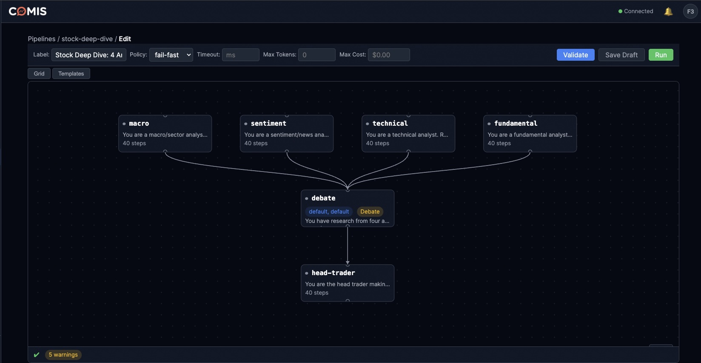

<p align="center">
  
</p>

<p align="center">
  <strong>Self-hosted AI agents for teams, communities, and serious personal workflows.</strong>
  <br />
  <sub>Messaging-native agents, encrypted secrets, sandboxed tools, learning memory, and an auditable operations surface.</sub>
</p>

<p align="center">
  <a href="https://github.com/comisai/comis/actions/workflows/ci.yml"></a>
  <a href="https://www.npmjs.com/package/comisai"></a>
  <a href="https://github.com/comisai/comis/blob/main/LICENSE"></a>
  <a href="https://github.com/comisai/comis/stargazers"></a>
  <a href="https://discord.gg/FsqgJkpp"></a>
</p>

<p align="center">
  <a href="#quick-start"><strong>Quick Start</strong></a> ·
  <a href="https://docs.comis.ai">Docs</a> ·
  <a href="#why-comis">Why Comis</a> ·
  <a href="#how-comis-compares">Compare</a> ·
  <a href="#contributing">Contribute</a>
</p>

---

# Comis

Comis is an open-source platform for running AI agents inside the places people already communicate: **Telegram, Discord, Slack, WhatsApp, Signal, iMessage, LINE, IRC, and Email**.

It is built for more than a single bot. One Comis install can run multiple agents for multiple operators, each with its own memory, tools, budgets, routing rules, and scoped secrets. Agents can answer chat messages, read files, handle voice and images, use MCP tools, schedule work, call other agents, and run multi-step workflows with a full audit trail.

Comis is fully self-hosted. No hosted tier, no telemetry, and no cloud dependency unless you choose a cloud model.

It runs on **small local models**, not just frontier ones. Because Comis's security and reliability are properties of the *platform, not the model*, those guarantees hold even on a **27B model running on your own hardware at $0/token** — verified end-to-end across the full security and reliability suite.

---

## Quick Start

One-liner installs Node.js and everything else (macOS & Linux):

```bash
curl -fsSL https://comis.ai/install.sh | bash
```

Install with npm:

```bash
npm install -g comisai
comis init
comis daemon start
```

Then open the dashboard at `http://127.0.0.1:4766` or message your agent from a connected channel.

Prefer Docker:

```bash
docker run -d --name comis --restart unless-stopped \
  -p 127.0.0.1:4766:4766 \
  -v comis-data:/home/comis/.comis \
  comisai/comis:latest-slim
docker exec -it comis comis init
```

Check the daemon:

```bash
curl http://127.0.0.1:4766/health
```

Requirements: Node.js **22.19+** for npm/source installs. Production deployments should run on Linux; Docker Desktop and many dev containers cannot provide the same Bubblewrap sandbox behavior as a Linux host. See the [Docker platform notes](https://docs.comis.ai/operations/docker#platform-support).

---

## Why Comis

| Advantage | What you get |
| --- | --- |
| **Agents where people already work** | Put agents in chat, not in another browser tab. Comis handles platform differences, message splitting, delivery retries, typing indicators, media, and rich messages. |
| **Self-hosted control** | Keep the daemon, logs, memory, config, and secrets on infrastructure you control. Use cloud models, local models, or both. |
| **First-class small local models** | Small models are not a fallback. Capability-aware scaffolding (frontier → nano) tightens the security lockdown, defers cold tools, and anchors goals as the model shrinks — so the guarantees stay the platform's, not the model's. Tested end-to-end down to a **27B model**, on-device, at $0/token. |
| **Security boundaries that do real work** | Sandboxed exec runtimes, encrypted secrets, SSRF guards, prompt-injection scanning, output guards, canary tokens, per-agent tool policy, and approval gates for risky actions. |
| **Multi-agent operations** | Run specialized agents with separate memory, models, budgets, permissions, and routing. Spawn sub-agents or build DAG workflows from natural language. |
| **Memory that learns, not just remembers** | Comis consolidates repeated facts, builds user profiles, learns from use, and keeps recall trust-aware. Under the hood: SQLite + FTS5 + vectors, local storage, and [published benchmark manifests](benchmarks/results/) for reproducible claims. |
| **Context that can scale** | A context engine keeps active turns useful, supports lossless DAG-backed recovery with `ctx_search` / `ctx_expand`, and avoids silently throwing away important work. |
| **Developer-friendly architecture** | TypeScript monorepo, hexagonal ports/adapters, `Result<T, E>` error handling, architecture tests, and clear extension points for channels, skills, tools, and storage. |

---

## See It Run

<p align="center">
  <em>"Have four analysts research NVDA in parallel, then run a bull-vs-bear debate, and let the head trader make the final call."</em>
  <br />
  <strong>One request becomes a live multi-agent DAG with budgets, barriers, approval gates, and an audit trail.</strong>
</p>

<p align="center">
  <a href="https://comis.ai/#demo">
    
  </a>
</p>

---

## What Is Included

| Area | Capabilities |
| --- | --- |
| **Messaging channels** | Telegram, Discord, Slack, WhatsApp, Signal, iMessage, LINE, IRC, Email. Text, images, files, voice notes, reactions, threads, buttons, polls, and platform-aware formatting where supported. |
| **Agent runtime** | Per-agent model selection, tool policy, budget controls, memory, session history, sender trust levels, sub-agents, and background tasks. |
| **Learning memory** | Long-term memory that improves with use: durable facts, user profiles, trust-aware recall, consolidation of repeated knowledge, and local SQLite-backed storage. |
| **Tools and MCP** | Built-in web, browser, media, messaging, scheduling, memory, session, and infrastructure tools. Connect the MCP ecosystem's 50+ servers; Comis can also expose a permission-gated MCP server. |
| **Terminal driver** | Drive interactive CLIs and full-screen TUIs inside an operator-allowlisted Bubblewrap jail — with **Claude Code** and **Codex** supported first-class as coding agents. Per-session sandbox scope (filesystem/network/uid), autonomous long-running drives with durable tmux survival + resume across daemon restarts, event-driven wake (never polling), and read-side per-platform perception profiles. |
| **Models** | 35 catalog providers via `pi-ai`, local Ollama/LM Studio with **capability-tiered scaffolding (frontier → nano) for first-class small-model support**, OpenAI-compatible endpoints, OAuth-backed OpenAI Codex profiles, fallback chains, and provider-specific tool-schema handling. |
| **Media** | Speech-to-text, text-to-speech, image analysis, video analysis, image generation, PDF/document extraction, and link context. |
| **Multilingual** | First-class non-Latin support (Hebrew, Arabic, Russian, CJK, and more): per-script token math so dense scripts are sized honestly instead of silently truncated, morphology-tolerant FTS search that works with embeddings off, summaries and memories kept in the conversation's own language (never translated), and per-script fleet health checks. RTL rendering is native to each chat platform; **Latin/English behavior is unchanged**. |
| **Security** | AES-256-GCM encrypted secrets, credential broker for API-key CLIs, sandboxed exec tools, URL validation, content scanning, memory-write validation, output guards, signed approvals, and `comis security audit`. |
| **Operations** | Web dashboard, JSON-RPC, WebSocket, OpenAI-compatible API, ACP server/bridge primitives, cron, heartbeat monitoring, trace export, health checks, config history, and rollback. |

---

## Security Model

Comis treats the LLM as an attack surface, not as a trusted process.

- **Secrets are encrypted at rest** and resolved through the daemon's SecretManager.
- **Credential broker mode** can keep real API keys out of an agent-driven CLI sandbox; the sandbox sees a placeholder and the broker injects the key at the network boundary.
- **Exec tools run through sandbox providers** where available: Bubblewrap on Linux and `sandbox-exec` on macOS. Interactive terminal sessions fail closed when a jail cannot be materialized.
- **Untrusted content is wrapped and scanned** before it reaches prompts, memory, logs, or tool results.
- **Risky actions require approval** through signed callbacks, and unknown action kinds classify conservatively.

Read more: [Threat model](https://docs.comis.ai/security/threat-model), [Exec sandbox](https://docs.comis.ai/security/exec-sandbox), [Credential broker](https://docs.comis.ai/security/credential-broker), [Secrets](https://docs.comis.ai/security/secrets).

---

## For Developers

Comis is a TypeScript monorepo with 15 packages:

```text
shared        Result type and utilities
core          domain types, ports, config, security, event bus
infra         logging and runtime infrastructure
observability diagnostics, traces, stats, health signals
memory        SQLite stores, FTS5, vectors, sessions, queues
gateway       Hono HTTP, JSON-RPC, WebSocket, mTLS
skills        tools, MCP, prompt skills, media integrations
scheduler     cron, heartbeats, task extraction
agent         execution, planning, RAG, sessions, model safety
channels      Discord, Telegram, Slack, WhatsApp, Signal, iMessage, LINE, IRC, Email
orchestrator  inbound routing, channel manager, execution coordination
cli           setup, operations, audits, RPC client
daemon        composition root for the running service
comis         umbrella package
web           Lit + Vite dashboard
```

The architecture is intentionally boring in the best way: core defines ports, adapters implement them, and the daemon wires everything together. To add a channel, implement `ChannelPort`. To add a storage backend, implement the relevant store port. To add a tool, register metadata and a handler.

Local development:

```bash
git clone https://github.com/comisai/comis.git
cd comis
pnpm install
pnpm build
pnpm test
```

Full project validation:

```bash
pnpm validate
```

Developer docs: [Architecture](https://docs.comis.ai/developer-guide/architecture), [Packages](https://docs.comis.ai/developer-guide/packages), [Custom adapters](https://docs.comis.ai/developer-guide/custom-adapters), [Custom skills](https://docs.comis.ai/developer-guide/custom-skills).

---

## How Comis Compares

Comis was built after studying [OpenClaw](https://github.com/openclaw/openclaw) and [Hermes Agent](https://github.com/NousResearch/hermes-agent). Both are strong projects with different goals.

| If you want... | Choose |
| --- | --- |
| A personal assistant with the widest channel list and native mobile-first feel | **OpenClaw** |
| A self-improving research agent that can rewrite its own skills | **Hermes Agent** |
| A self-hosted agent platform for multiple agents, multiple operators, scoped secrets, sandboxed tools, and auditability | **Comis** |

| Area | Comis | OpenClaw | Hermes Agent |
| --- | --- | --- | --- |
| Design center | Multi-agent, multi-operator platform | Personal assistant for a trusted operator | Single-tenant personal agent |
| Exec posture | Configured on by default; kernel-enforced where supported | Docker sandbox is opt-in; default is host-first exec | Host-first by default; containers confine terminal backends, not the full agent |
| Secrets | AES-256-GCM store + credential broker option | Plaintext config/auth profiles supported; opt-in SecretRefs | Plaintext `.env` with optional Bitwarden flow |
| Memory | Trust-aware, local, benchmarked, learns from use | No trust levels | No trust levels; learning loop not publicly benchmarked |
| Channels | 9 | 23+ | 20+ platform adapters |
| License | Apache-2.0 | MIT | MIT |

<sub>Sourced from each project's repository and security documentation, June 2026. Detailed pages: [Comis vs OpenClaw](https://comis.ai/compare/openclaw) · [Comis vs Hermes](https://comis.ai/compare/hermes)</sub>

---

## Contributing

Comis is designed to be extended. The most useful contributions are:

- New channel adapters and platform actions
- MCP integrations and prompt skills
- Security hardening, tests, and docs
- Dashboard workflows and operator tooling
- Benchmarks and reproducible evaluation harnesses

Start with [good first issues](https://github.com/comisai/comis/issues?q=is%3Aissue+is%3Aopen+label%3A%22good+first+issue%22), open a [discussion](https://github.com/comisai/comis/discussions), or bring a focused PR. The repo's [AGENTS.md](AGENTS.md) documents the engineering protocol: tests first for behavior changes, `Result<T, E>` discipline, security lint rules, and architecture boundaries.

If Comis looks useful, star the repository so more people can find it. If you want to build on it, fork it and ship an adapter, skill, or deployment guide.

---

## Community

- [Discord](https://discord.gg/FsqgJkpp) for setup help, design discussion, and deployment notes
- [GitHub Discussions](https://github.com/comisai/comis/discussions) for proposals and questions
- [Issues](https://github.com/comisai/comis/issues) for bugs and feature requests
- [Docs](https://docs.comis.ai) for setup guides and reference material

---

Comis builds on prior art from [OpenClaw](https://github.com/openclaw/openclaw), [Hermes Agent](https://github.com/NousResearch/hermes-agent), and [pi-mono](https://github.com/earendil-works/pi) by [Mario Zechner](https://mariozechner.at/), studied closely and credited gladly.

**License:** [Apache-2.0](LICENSE) across all packages. Commercial use, modification, redistribution, and private deployment are permitted.
