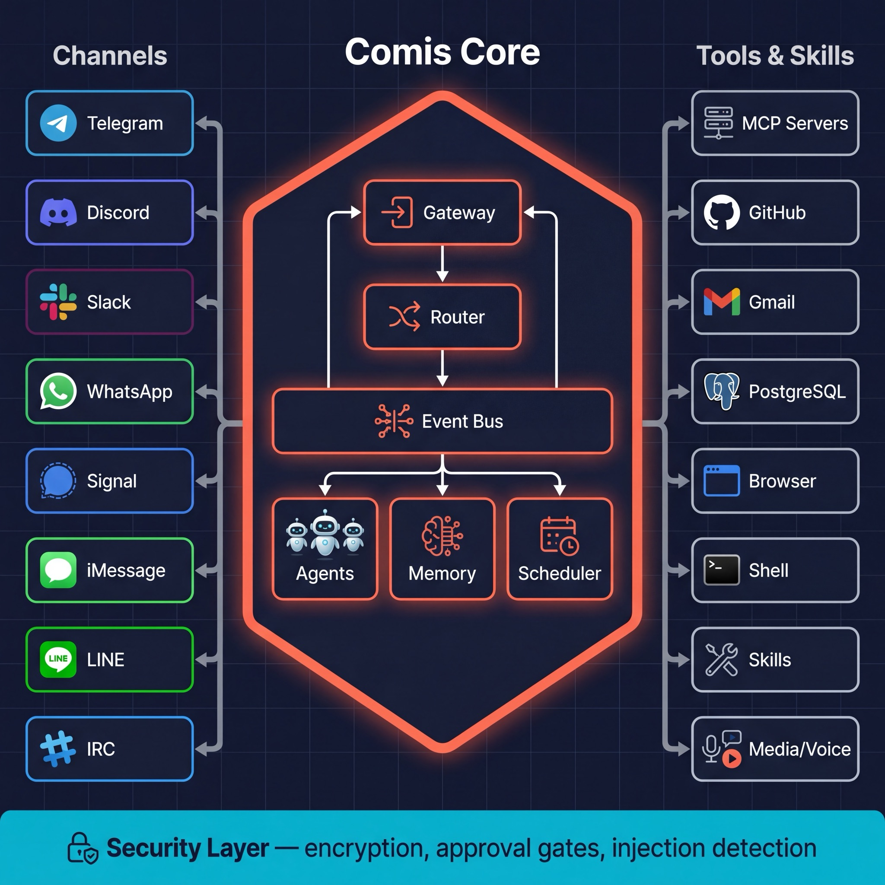

<p align="center">
  
</p>

<p align="center">
  <strong>Self-hosted AI agents for teams, communities, and serious personal workflows.</strong>
  <br />
  <sub>Messaging-native agents, encrypted secrets, sandboxed tools, learning memory, and an auditable operations surface.</sub>
</p>

<p align="center">
  <a href="https://github.com/comisai/comis/actions/workflows/ci.yml"></a>
  <a href="https://www.npmjs.com/package/comisai"></a>
  <a href="https://github.com/comisai/comis/blob/main/LICENSE"></a>
  <a href="https://github.com/comisai/comis/stargazers"></a>
  <a href="https://discord.gg/FsqgJkpp"></a>
</p>

<p align="center">
  <a href="#quick-start"><strong>Quick Start</strong></a> ·
  <a href="https://docs.comis.ai">Docs</a> ·
  <a href="#how-comis-compares">How it compares</a> ·
  <a href="https://comis.ai/#demo">Demo</a> ·
  <a href="#contributing">Contributing</a>
</p>

---

## What is Comis

Comis deploys AI agents into the messaging channels people already use (**Telegram, Discord, Slack, WhatsApp, Signal, iMessage, LINE, IRC, Email**) and runs them as a *platform*, not a pet. Multiple agents and multiple operators share one install, each with isolated memory, budgets, tool policies, and scoped secrets.

Your agents read and reply in chat (text, voice, images, files), run tools inside sandboxed runtimes where supported, connect to the MCP ecosystem's 50+ tool servers, schedule their own jobs, and spin up multi-agent pipelines from a single sentence. They also get better over time, carrying long-term memory that learns from conversations and from its own use. Run them on frontier cloud models or entirely on-device with local ones; the same policies, credential handling, and audit trail stay in place. You watch every step from a web dashboard, or reconstruct it later from the trace log.

TypeScript monorepo, 15 packages, hexagonal architecture, Node.js 22.19+. Apache-2.0. Fully self-hosted. No cloud dependency, no telemetry, no hosted tier.

---

## Quick Start

**One-liner** installs Node.js and everything else (macOS & Linux):

```bash
curl -fsSL https://comis.ai/install.sh | bash
```

**Or with npm** (Node.js 22.19+):

```bash
npm install -g comisai
comis init
comis daemon start
```

**Or with Docker:**

```bash
docker run -d --name comis --restart unless-stopped \
  -p 127.0.0.1:4766:4766 \
  -v comis-data:/home/comis/.comis \
  comisai/comis:latest-slim
docker exec -it comis comis init
```

Verify with `curl http://127.0.0.1:4766/health`, then message your agent on any connected channel.

> **Production runs on Linux.** Docker Desktop's VM kernel cannot provide the same exec sandbox guarantees as a Linux host, so Comis detects unsupported dev/container hosts at startup, logs the downgrade, and disables exec sandboxing rather than pretending isolation exists. [Platform support](https://docs.comis.ai/operations/docker#platform-support)

---

## See it run

<p align="center">
  <em>"Have four analysts research NVDA in parallel, then run a bull-vs-bear debate, and let the head trader make the final call."</em>
  <br />
  <strong>One sentence becomes a live 7-node DAG pipeline, with isolated memory, budgets, and an audit trail per agent.</strong>
</p>

<p align="center">
  <a href="https://comis.ai/#demo">
    
  </a>
</p>

---

## Why Comis

**🛡️ Security is enforced, not promised.** The LLM is the attack surface. Comis assumes it will be attacked. Exec sandboxing is configured by default and uses kernel-backed isolation where the host supports it: [Bubblewrap](https://github.com/containers/bubblewrap) on Linux and `sandbox-exec` on macOS ([`bwrap-provider`](packages/skills/src/tools/builtin/sandbox/bwrap-provider.ts), [`sandbox-exec-provider`](packages/skills/src/tools/builtin/sandbox/sandbox-exec-provider.ts)). Unsupported hosts are detected and surfaced instead of silently overstating isolation. Around it: input scanning, output scanning, canary tokens, trust-partitioned memory with write validation, per-agent tool policy, and every tool call audited on the event bus. The supply line is screened too. Skills are content-scanned at load against 18 rules covering exec injection, exfiltration, and XML breakout ([`content-scanner`](packages/skills/src/skills/prompt/content-scanner.ts)). MCP packages are checked against the OSV malware database before first spawn ([`mcp-client-osv-check`](packages/skills/src/skills/integrations/mcp-client/mcp-client-osv-check.ts)), and destructive actions pause for operator approval via HMAC-signed chat buttons, with unknown action types classifying as destructive, fail-closed ([`action-classifier`](packages/core/src/security/action-classifier.ts)). ESLint-enforced security bans (no `path.join`, no `process.env`, no `eval`/`new Function`, no swallowed errors) plus architecture-as-tests block insecure patterns before they reach `main`. [Deep dive](https://comis.ai/security)

**🔑 Your keys never meet your agents.** Secrets live in an AES-256-GCM encrypted store. When an agent drives an API-key CLI (Claude Code included), the sandbox sees only a placeholder. The code that builds the sandbox env never even reads the real key ([`broker-placeholder-builder`](packages/daemon/src/wiring/broker-placeholder-builder.ts)). The CLI's HTTPS is routed through an in-process credential broker ([`mitm-broker`](packages/infra/src/credential-broker/mitm-broker.ts)) that validates a single-use session token, terminates TLS with its own CA, matches host *and* path against the binding allow-list, resolves the secret per request, and swaps the placeholder at the header layer. It **fails closed**: any gate failure (407/403/502) destroys the tunnel before a single byte reaches upstream, and every session, injection, and denial is audited on the event bus, never the secret itself. On Linux the credentialed sandbox runs in `broker-only` network mode: namespace unshared (`--unshare-net`) with the broker socket as the *only* bound network path ([`bwrap-provider`](packages/skills/src/tools/builtin/sandbox/bwrap-provider.ts)). Egress to anywhere else fails in the kernel, not in policy. [Deep dive](https://docs.comis.ai/security/credential-broker)

**🏠 Any model — same policies, tuned to actually run well.** The security posture is a property of the platform, not the model: sandboxed execution where supported, the credential broker, the skill content scanner, and the ESLint/architecture bans apply no matter which model you run. Comis also adapts to the model at the scaffolding layer. Every execution resolves an immutable [`ModelProfile`](packages/agent/src/executor/model-profile.ts) along two independent axes — capacity and capability — and threads that one value through the execution path. Capability drives both directions at once: weaker models get stricter lockdown and more reliability scaffolding, while frontier models stay byte-identical-off for scaffolds they do not need. For local models, that keeps the prompt inside what the model can actually use and adds rails for common failure modes: goal re-anchoring, recall confidence floors, JSON repair, self-correction, and chain-of-thought cleanup.

**👥 Built for more than one of you.** Multiple agents and multiple operators share one daemon without stepping on each other: per-tenant data isolation, per-agent scoped secret access, per-agent budgets and tool policies, per-sender trust levels (guest / user / admin) that can route to different models, and message routing that binds channels, guilds, and peers to the right agent. Multi-tenant primitives are first-class, not bolted on.

**🔀 An agent fleet from one sentence.** Natural language becomes a DAG: 7 node types (agent, debate, vote, refine, collaborate, map-reduce, human approval gate), barrier synchronization, automatic retries, token-and-cost budgets, and 3-tier concurrency control, with isolated memory per node and cache-aware spawning. No YAML, no scripting. [Watch the demo](https://comis.ai/#demo)

**🧠 Memory that learns, not just remembers.** Storing facts and finding them again is the baseline. Hybrid recall (FTS5 + vectors + entity links), re-read by an on-device cross-encoder reranker, all local. What sets Comis apart is that the store *improves over time*, and every claim below links to the code that does it:

- **It learns from conversations.** Between sessions, background jobs distill chats into durable facts with entity and causal links ([`memory-review-job`](packages/agent/src/memory/memory-review-job.ts)), a deepening per-user profile ([`memory-user-representation-job`](packages/agent/src/memory/memory-user-representation-job.ts)), and a per-channel relationship model. Nobody has to say "remember this."
- **It learns from repetition.** A re-confirmed fact *folds* into its existing observation and the proof count grows ([`foldIntoExisting`](packages/memory/src/sqlite-memory-consolidation-store.ts)), so corroborated knowledge out-ranks one-off mentions, and a reasoning job derives new deductive and inductive knowledge from what's already stored ([`memory-reasoning-job`](packages/agent/src/memory/memory-reasoning-job.ts)).
- **It learns from being used** *(opt-in)*. Every turn records which recalled memories actually helped and which were ignored ([`memory_usefulness`](packages/memory/src/sqlite-memory-usefulness-store.ts)), and a background tuner nudges the recall-ranking weights from that signal in bounded, clamped steps ([`online-tuning-job`](packages/agent/src/memory/online-tuning-job.ts)), while the trust weight is structurally frozen ([`scoring-overlay`](packages/agent/src/rag/scoring-overlay.ts)), so learning can never be poisoned into overriding a verified fact.
- **It stays right.** Trust-first conflict resolution: a verified fact takes precedence over a newer low-trust claim, the loser is soft-expired and never deleted ([`sqlite-triple-store`](packages/memory/src/sqlite-triple-store.ts)), and principled decay fades stale, unused memories while never reordering fresh ones ([`score.ts`](packages/agent/src/rag/score.ts)).

And it's measured, not asserted: **~71%** on LongMemEval + LoCoMo (cross-judged by two independent models), **84.5%** recall@5, a head-to-head **tie with mem0 (87.5%, N=8) at $0 on-device**, and the learning loop's own lift measured over repeated episodes. Every number traces to a [committed run manifest](https://github.com/comisai/comis/tree/main/benchmarks/results), reproducible with `pnpm bench:memory`. [Methodology](https://docs.comis.ai/agents/memory-benchmarks)

**🧊 Context that stays useful.** Before model calls, an interchangeable context engine reshapes the conversation to fit the window. The operator picks the mode with one config key (`contextEngine.version`):

- **DAG-backed recovery.** Older detail can compress into a zoomable summary hierarchy, with leaf summaries that fold into deeper condensed ones ([`lcd-leaf-summarizer`](packages/agent/src/context-engine/lcd-leaf-summarizer.ts), [`lcd-condense`](packages/agent/src/context-engine/lcd-condense.ts)). The agent drills back into compressed regions mid-conversation with `ctx_search` / `ctx_inspect` / `ctx_expand` ([context tools](packages/skills/src/tools/builtin/context-tools)).
- **Deterministic pipeline.** Ten deterministic layers run in fixed order before calls ([`context-engine`](packages/agent/src/context-engine/context-engine.ts)): strip stale reasoning blocks, mask dead content, evict, re-hydrate critical references, re-state the original objective so the agent does not drift after compaction ([`objective-reinforcement`](packages/agent/src/context-engine/objective-reinforcement.ts)), and LLM-compact only past ~85% of the window. Lighter, deterministic, with a per-layer circuit breaker.

Switching modes is a config reload. No restart, no data loss, fully reversible. And `contextEngine.version` is **operator-only**: an agent cannot switch its own engine, because the engine governs which context tools the agent is exposed to. [Deep dive](https://docs.comis.ai/agents/context-management)

**💰 81% cheaper by architecture.** Prompt caching is a target architecture, not an afterthought: a **cache-fence index** keeps the cached prefix byte-stable while the context engine edits everything after it, with adaptive TTL escalation, two-phase cache-break detection, and sub-agent spawn staggering, 15+ shipped optimizations in all. Measured: **$5.02 vs $26.42** for a 76-call Opus session, **94%** cache-hit rate on warm turns, **$2.11** for an 8-agent pipeline (788K tokens). [Deep dive](https://comis.ai/context-management)

**🔍 A glass box, end to end.** Domain code is Result-first (`Result<T, E>`), and architecture tests keep stray boundary violations visible. An `AsyncLocalStorage`-bound `traceId` rides through log lines, tool calls, and model invocations. A typed event bus announces state transitions. When something breaks at 3am, you reconstruct what happened from the logs.

---

## How Comis compares

We built Comis after studying its two closest neighbors in depth: [OpenClaw](https://github.com/openclaw/openclaw) and [Hermes Agent](https://github.com/NousResearch/hermes-agent). Both are excellent, and both are candid about their design center: OpenClaw's security model is *"'personal assistant' (one trusted operator, potentially many agents), not 'shared multi-tenant bus'"*, and Hermes describes itself as *"a single-tenant personal agent"* where *"the only security boundary against an adversarial LLM is the operating system."* That's their own documentation, and honest engineering.

Comis starts from the opposite premise: **an install that holds up even when the agents and people sharing it aren't fully trusted.**

|                                | **Comis**                                                                                | **OpenClaw**                                                  | **Hermes Agent**                                                          |
| ------------------------------ | ---------------------------------------------------------------------------------------- | ------------------------------------------------------------- | ------------------------------------------------------------------------- |
| Design center                  | Platform: many agents across many operators, one install                                 | Personal assistant: one trusted operator, by design           | Single-tenant personal agent, by design                                   |
| Exec sandbox                   | Configured by default; kernel-backed where supported (Bubblewrap / sandbox-exec)         | Docker sandbox, opt-in (`off` by default)                     | Host-first by default, containers confine the shell tool, not the agent   |
| Secrets at rest                | AES-256-GCM encrypted store                                                              | Config/auth profiles support plaintext paths and SecretRefs   | `.env` + file permissions (Bitwarden opt-in)                              |
| API keys vs. agent runtime     | Credential broker: key injected at the network boundary, never inside the sandbox        | Keys held in the gateway process                              | Env-scrub blocklist for child processes                                   |
| Prompt injection               | Layered runtime defenses + benchmarked poisoning resistance                              | Out of scope absent a boundary bypass ("usually not a security bug") | Heuristic wrapping, no boundary claimed                            |
| Memory                         | Trust-partitioned, learns from use (bounded tuner, trust frozen), benchmarked in public  | No trust levels                                               | No trust levels, learning loop unbenchmarked                              |
| Context at scale               | DAG-backed recovery plus deterministic compaction; compressed detail remains inspectable | Compaction/pruning hooks, tool-result compaction              | Auto-compression at 50% of window (cheap-model summary)                   |
| Local models                   | Tier-aware `ModelProfile`: a weaker model gets *stricter* security **and** an auto-tuned reliability scaffold (prompt-size caps, tool deferral, JSON repair, self-correction) | Supported (Ollama, LM Studio, vLLM), no model-aware hardening | Supported (Ollama, LM Studio, vLLM), the OS is the boundary, whatever the model |
| Multi-agent orchestration      | Natural-language DAGs: 7 node types, barriers, budgets, approval gates                   | Agent routing + spawn, hierarchy frameworks declined          | `delegate_task` (depth up to 2) + kanban board                            |
| Typed errors end-to-end        | Result-first domain code and architecture-tested boundaries                              | -                                                             | -                                                                          |
| Supply-chain integrity         | Sigstore-attested releases, exact-pinned + bundled deps                                  | npm provenance, SHA-pinned images                             | Sigstore-signed releases, exact-pinned deps                               |
| Messaging channels             | 9                                                                                        | **23+**                                                       | **20+**                                                                    |
| Self-improvement               | In memory, not code: the memory learns from use (bounded, auditable), skills stay operator-reviewed | -                                                  | **Yes, agent rewrites its own skills**                                     |
| License                        | Apache-2.0                                                                               | MIT                                                           | MIT                                                                        |

<sub>Sourced from each project's own repository and security documentation, June 2026. Full side-by-sides: [Comis vs OpenClaw](https://comis.ai/compare/openclaw) · [Comis vs Hermes](https://comis.ai/compare/hermes)</sub>

Choose honestly. If you want a personal assistant with native mobile apps, voice wake, and the widest channel list, **OpenClaw is excellent**. If you want a self-improving research agent that writes its own skills, **Hermes is excellent**. If you want an agent platform you can hand to your team, your family, or your company, and audit every action it takes, **that's Comis**.

---

## Everything in the box

|                          |                                                                                                                                          |
| ------------------------ | ---------------------------------------------------------------------------------------------------------------------------------------- |
| 💬 **9 channels**        | Telegram, Discord, Slack, WhatsApp, Signal, iMessage, LINE, IRC, Email: text, voice, images, files, threads, buttons & polls, plus live agent-activity status rendered natively per platform |
| 🤖 **Agent fleet**       | Per-agent memory, budgets, and tool policy. Sub-agents (sync or fire-and-forget). Agent-to-agent messaging. Steer a running agent mid-task. DAG pipelines with human approval gates |
| 🎙️ **Media & voice**     | Voice notes auto-transcribe (3 STT providers with fallback), voice replies via TTS (incl. keyless Edge), vision + video analysis, image generation, PDF/document extraction, automatic link context |
| 🧠 **Learning memory**   | SQLite + FTS5 + vectors with on-device reranking. Consolidates repeated facts, learns ranking from use, builds per-user profiles, all local |
| 🧊 **Recoverable context** | DAG-backed recovery keeps compressed history inspectable mid-conversation (`ctx_search`/`ctx_expand`). The ten-layer pipeline provides deterministic compaction |
| 🔌 **Tools & MCP**       | Connect the MCP ecosystem's 50+ servers (GitHub, Gmail, Notion, databases). None bundled, you choose. Built-in web/browser/media/scheduling tools and prompt skills. Comis itself runs as an MCP server too |
| 🌐 **Any model**         | 35 catalog providers via pi-ai, local Ollama/LM Studio, and any OpenAI-compatible endpoint. Tool schemas adapt per model, an immutable `ModelProfile` scales both reliability scaffolding and security posture to it, fallback chains and key rotation included |
| 🖥️ **Operations**        | Web dashboard (live ops views, visual pipeline builder, approval queue), JSON-RPC + WebSocket + OpenAI-compatible + ACP APIs, cron + heartbeat monitoring, `comis security audit` (14 checks), trace CLI with forensic bundle export, git-backed config history & rollback |

---

## Architecture

<p align="center">
  
</p>

Hexagonal (ports + adapters): `core` defines port interfaces, adapters implement them, and everything is wired in one composition root. Swap Discord for Matrix, SQLite for Postgres, or OpenAI for Ollama without touching core logic. Architectural invariants (dependency direction, file-size caps, raw-throw bans, security rules) are enforced as **tests**, not conventions.

[Architecture deep dive](https://comis.ai/architecture) · [Developer guide](https://docs.comis.ai/developer-guide)

---

## Contributing

Comis is engineered to be contributed to safely, and that's the architecture, not a platitude:

- **The rules are executable.** `pnpm validate` runs CI's deterministic gates locally (clean build, cycle checks, security lint, per-package coverage floors) so you find out before you push, not after.
- **The protocol is written down.** [`AGENTS.md`](AGENTS.md) is the engineering contract: `Result<T, E>` discipline, tests-first, security rules, naming. No tribal knowledge required.
- **Extension points are real interfaces.** A new channel is a `ChannelPort` implementation. A new tool is a manifest plus a handler. A new storage backend is a port adapter. You rarely need to touch core.

```bash
git clone https://github.com/comisai/comis.git
cd comis
pnpm install && pnpm build
pnpm test && pnpm lint:security
```

Where help lands hardest: **channel adapters**, **skills and MCP integrations**, and **docs**. Start with [`good first issue`](https://github.com/comisai/comis/issues?q=is%3Aissue+is%3Aopen+label%3A%22good+first+issue%22), or bring your own itch.

Fork, branch (`feature/<your-change>`), run `pnpm validate`, then PR against `main`.

---

## Community

- **[Discord](https://discord.gg/FsqgJkpp)**: the maintainers are there, bring questions, deployments, and benchmark disputes
- **[GitHub Discussions](https://github.com/comisai/comis/discussions)**: design proposals and ideas
- **[Issues](https://github.com/comisai/comis/issues)**: bugs and feature requests

---

Comis builds on prior art from [OpenClaw](https://github.com/openclaw/openclaw), [Hermes Agent](https://github.com/NousResearch/hermes-agent), and [pi-mono](https://github.com/earendil-works/pi) by [Mario Zechner](https://mariozechner.at/), studied closely, credited gladly.

**License:** [Apache-2.0](LICENSE) across all 15 packages: commercial use, modification, redistribution, and private deployment all permitted.
