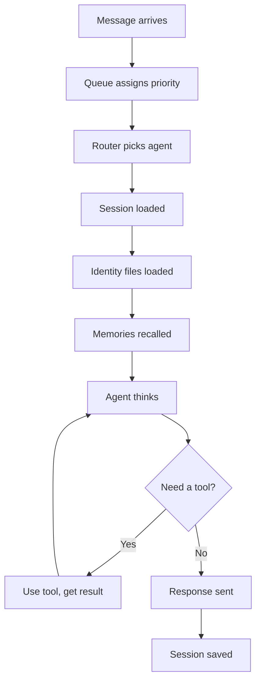
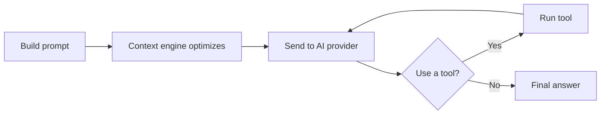

When someone sends a message, your agent follows a series of steps -- from
receiving the message to sending back a reply. This page walks through that
journey.

## The message journey

Every message travels through the same pipeline. Here is the full flow from
the moment you type a message to the moment you see a reply:

## Step by step

Here is what each step means for your message:

### 1. Message arrives

Your message can come from any connected platform -- Discord, Telegram, Slack,
WhatsApp, Signal, iMessage, IRC, LINE, or the web dashboard. It does not matter
which one. Comis normalizes every message into a common format so your agent
sees them all the same way.

### 2. Queue serializes work

Messages enter a queue that controls the order of processing. By default the
queue uses a single global concurrency gate; if `queue.priorityEnabled` is
turned on, DMs and mentions get assigned to a higher priority lane than
background work. Either way, the queue makes sure your agent processes
messages in a sensible order without getting overwhelmed.

See [Message Queue](/agents/queue) for details on priority lanes and queue
modes.

### 3. Router picks agent

If you run multiple agents, the router checks your
[routing rules](/agents/routing) to decide which agent should handle this
message. Rules are checked from most specific to least specific -- a rule
targeting a specific user beats a rule targeting an entire platform. If no rule
matches, the default agent handles it.

### 4. Session loaded

Your agent loads the current conversation. A *session* tracks the messages
exchanged between you and your agent, so it can follow along without starting
from scratch each time. Sessions expire after a period of inactivity and
start fresh automatically.

See [Sessions](/agents/sessions) for how conversation tracking works.

### 5. Identity files loaded

Your agent reads its [workspace files](/agents/identity) -- a set of Markdown
documents that define who it is. These include its personality (SOUL.md), its
name and character (IDENTITY.md), information about you (USER.md), its
operating instructions (AGENTS.md), and its role-specific behavior (ROLE.md). This is how your agent knows how to behave.

### 6. Memories recalled

Before responding, your agent searches its long-term memory for anything
relevant to the current conversation. If you talked about a project last week,
those notes surface automatically. This is called
[memory recall](/agents/rag) -- it works like flipping through a filing cabinet
of past conversations to find useful context.

### 7. Agent thinks

With the message, identity, and memories all assembled, the request goes to
your configured AI provider (Anthropic, OpenAI, Google, and others). The
provider generates a response based on everything your agent knows.

### 8. Tools (if needed)

Sometimes the agent needs to take action or gather more information. It might
search the web, check a calendar, send a message to another channel, or analyze
an image. After each tool use, the agent thinks again with the new information.
This loop can repeat multiple times until the agent has everything it needs.

The number of tool steps is limited by a step counter (default: 150 steps per
execution) to prevent runaway loops. See [Safety](/agents/safety) for details.

### 9. Response sent

Once the agent has a final answer, it formats the response for your platform
and sends it back to the same chat where you sent the original message. Platform
differences are handled automatically -- your agent knows how to format for
Discord, Telegram, and every other supported platform.

### 10. Session saved

The conversation is saved so your agent can pick up where you left off next
time. Messages are also processed for long-term memory -- important facts and
context are stored for future recall. The [context engine](/agents/compaction)
automatically manages conversation length -- trimming old content, masking stale
tool results, and summarizing when needed -- so your agent's memory stays
efficient without losing important information.

## The thinking loop

Steps 7 and 8 -- thinking and using tools -- deserve a closer look because
they form the core of your agent's intelligence. This is where your agent
reasons through a problem, decides whether it needs more information, and
takes action.

The prompt includes everything: your message, the agent's identity, recalled
memories, and (if this is a follow-up loop) the results from previous tool
calls. Before sending to the AI provider, the
[context engine](/agents/compaction) optimizes what is included -- trimming old
thinking blocks, windowing history, and masking old tool results to keep costs
down. Each trip through this loop counts as one "step." The default limit is
150 steps, but most conversations only need 1 to 3.

## What keeps your agent safe

Throughout this entire process, multiple safety systems are running in the
background:

- **Budget limits** prevent your agent from using too many tokens (and costing
  too much money) in a single run, per hour, or per day
- **Circuit breaker** acts like a fuse -- if the AI provider fails repeatedly,
  the breaker trips and stops sending requests until the provider recovers
- **Step counter** limits how many tool-use loops the agent can run before
  stopping (default: 150)

These safety features work automatically with sensible defaults. You can
adjust them in the [Safety](/agents/safety) settings.

## Sub-agent lifecycle

When your agent spawns a sub-agent (using the `sessions_spawn` tool), the
sub-agent goes through its own version of this lifecycle -- but with additional
context management. The sub-agent receives a structured spawn packet with the
task, artifact references, and an optional objective. When it finishes, its
result is condensed and formatted before being returned to the parent.

See [Subagent Context Lifecycle](/agents/subagent-lifecycle) for the complete
sub-agent flow.

<CardGroup cols={2}>
  <Card title="Identity" icon="id-card" href="/agents/identity">
    The workspace files that shape your agent's personality.
  </Card>
  <Card title="Sessions" icon="comments" href="/agents/sessions">
    How conversations are tracked and managed.
  </Card>
  <Card title="Memory Recall" icon="brain" href="/agents/rag">
    How your agent remembers past conversations.
  </Card>
  <Card title="Safety" icon="shield-halved" href="/agents/safety">
    Budget limits, circuit breaker, and step counter.
  </Card>
  <Card title="Sub-Agent Lifecycle" icon="diagram-subtask" href="/agents/subagent-lifecycle">
    The specialized lifecycle for spawned sub-agents.
  </Card>
</CardGroup>
