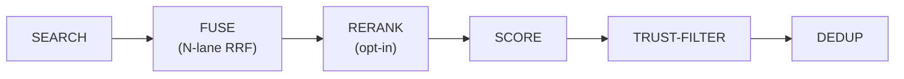

**What it does.** Stores facts, conversation summaries, and how-to procedures
your agent picks up over time, so it can recall them in future conversations
without repeating itself.

**Who it is for.** Anyone who wants their agent to remember things across
sessions. Configuration is optional — sensible defaults work out of the box.

Your agent does not just forget everything after each conversation. Comis stores
important information in long-term memory -- facts, conversation summaries,
instructions, and more. This memory persists across sessions and helps your
agent get smarter over time. Memory is backed by a single SQLite database
(SQLite + FTS5 full-text index + a vector index when an embedding provider is
configured) — see [Search](/agents/search) and
[Embeddings](/agents/embeddings).

## Memory types

Comis organizes memories into four categories, each serving a different purpose.
Think of them as different drawers in a filing cabinet:

**Working** ("Current conversation") -- What is in the active session right now.
This is temporary and only lasts until the session ends or is compacted. It
includes your messages, the agent's responses, and any tool results from the
current conversation.

**Episodic** ("Conversation summaries") -- Summaries of past conversations,
created automatically by [compaction](/agents/compaction). Like a diary, these
capture what happened in previous sessions so your agent can reference past
interactions even after the original messages have been compacted away.

**Semantic** ("Facts and knowledge") -- Specific facts the agent has learned.
Like a notebook of important details -- your name, your preferences, project
details, or anything else the agent has picked up from conversations. Semantic
memories are the most common type your agent creates and recalls.

**Procedural** ("How-to instructions") -- Step-by-step procedures the agent
knows. Like a recipe book, these store instructions for tasks the agent has
learned to do. For example, how to format a report, or the steps to deploy
your application.

## Trust levels

Each memory has a trust level that controls how it is used when recalled:

**system** -- Created by Comis itself (compaction summaries, internal data).
Fully trusted. The agent treats these as reliable facts.

**learned** -- Things the agent learned from conversations with you. Trusted
by default. The agent treats these as information from a reliable source.

**external** -- Information from outside sources (web searches, tool results
from untrusted inputs). When an external memory is recalled, it is marked with
a warning label so the agent knows to verify it before relying on it.

By default, [memory recall (RAG)](/agents/rag) only includes `system` and
`learned` memories. You can include `external` memories as well, but the agent
will always flag them for caution.

Trust does two jobs during recall, not one:

- **Inclusion filter** -- `includeTrustLevels` decides which trust levels are
  eligible at all (default `["system", "learned"]`).
- **Ranking signal** -- among the memories that pass the filter, trust also
  *boosts the score* (`rag.scoring.trustAlpha`, default `0.1`) and breaks ties
  in the order `system > learned > external`. A more-trusted memory therefore
  ranks above an equally-relevant less-trusted one. See the
  [Recall pipeline](#recall-pipeline) below.

## Background learning

Your agent does not have to consciously decide what to remember. A periodic
**memory review job** runs in the background and extracts likely-useful facts
from recent conversations:

1. It scans the last N messages of each session (default 50–100).
2. It asks the LLM to extract preferences, facts, and habits worth keeping.
3. Each extracted item is stored with `trust_level: "learned"`.
4. The new memories are queued for embedding (so meaning-based recall works).

This means your agent slowly builds up a personalised picture of you and your
work without you having to say "remember this." The review runs on a
configurable schedule and de-duplicates by content hash so repeated facts do
not clutter the database.

The job is implemented in
`packages/agent/src/memory/memory-review-job.ts`.

## Memory operations

Your agent can perform these operations on its long-term memory:

- **Store** -- Save new information as a memory entry
- **Search** -- Find relevant memories based on a query (see [Search](/agents/search))
- **Get** -- Retrieve a specific memory by its identifier
- **Update** -- Modify an existing memory with new information
- **Delete** -- Remove a specific memory that is no longer needed
- **Clear** -- Remove all memories of a specific type or from a specific time period

These operations are available as tools that the agent can use during
conversations, or through the web dashboard for manual management.

## How memory is stored

Comis uses a SQLite database (stored as `memory.db` in your data directory,
typically `~/.comis/`) to hold all memories. The database uses secure file
permissions so only the Comis process can access it.

Each agent's memories are isolated by tenant ID, which means if you run
multiple agents, they each have their own separate memory space. An agent
cannot accidentally access another agent's memories.

The database uses WAL mode (write-ahead logging) by default, which allows
your agent to read memories quickly even while new ones are being written.

## Guardrails

Automatic limits prevent memory from growing unbounded:

- **Compaction threshold** -- When the number of entries exceeds the threshold
  (default 1000), older entries are compacted to keep the database manageable.
- **Target size** -- After compaction, the database is trimmed to the target
  size (default 500 entries).
- **Retention limit** -- You can set a maximum age for memories in days
  (`memory.retention.maxAgeDays`, default `0` = no age limit). Memories older
  than this are automatically cleaned up.

These limits work together to keep your agent's memory focused and efficient
without requiring manual cleanup.

## Recall pipeline

Before every agent response, Comis runs a single recall orchestrator —
`MemoryRecall` (`packages/agent/src/rag/memory-recall.ts`) — that turns your
incoming message into the most relevant set of memories. It **replaced the
older inline recall path** (a flat search → trust-filter → sort → dedup). The
orchestrator runs these stages in order:



1. **SEARCH** -- each retrieval lane runs: the FTS5 keyword lane, the vector
   (meaning) lane when embeddings exist, and the optional entity lane. See
   [Search](/agents/search).
2. **FUSE** -- the lanes are merged with **Reciprocal Rank Fusion (RRF, `k=60`)**.
   Fusion order — *not* reranking — is the default recall ordering.
3. **RERANK** *(opt-in, default skipped)* -- when enabled, a cross-encoder
   re-scores the top fused candidates. Off by default, so the all-default
   config never reaches this stage.
4. **SCORE** -- multiplicative boosts are applied to the reranked-or-fused score:
   recency, temporal proximity, proof count, and trust (the `rag.scoring.*`
   alphas below).
5. **TRUST-FILTER** -- memories whose trust level is not in `includeTrustLevels`
   are dropped (`external` excluded by default).
6. **DEDUP** -- near-duplicates are collapsed by content fingerprint, and the
   result is trimmed to `maxResults` / `maxContextChars`.

The recall **core is always on** (as long as `rag.enabled` is `true`); the
reranking, entity-lane, and consolidation features layered on top of it are each
**opt-in** and described below.

### Reranking (opt-in)

Reranking re-scores the fused candidates with a **cross-encoder** — a model that
reads the query and a candidate *together* and judges their relevance directly,
which is more accurate than the bi-encoder similarity used for the vector lane
(see [Embeddings](/agents/embeddings#embedder-vs-reranker) for the distinction).

- **Default `false`** — reranking is opt-in. The Phase-79 latency measurement
  (~777ms p95 at 40 candidates) exceeds the per-turn budget, so fusion (RRF) is
  the default recall order.
- **On-device, zero new dependency** — the reranker is a local GGUF model
  (`bge-reranker-v2-m3`, Q8_0 quantization) run through the same `node-llama-cpp`
  runtime that already powers local embeddings. No external API call, no new
  package.
- **Bounded** — at most `rag.rerank.maxCandidates` (default `40`) candidates are
  re-scored, under a `rag.rerank.timeoutMs` (default `800`) wall-clock budget.
- **Degrades gracefully** — if the reranker is unavailable or the timeout fires,
  recall falls back to the fusion-ranked order. Recall never fails because of
  reranking.
- **Nothing downloaded until you enable it** — the all-default (rerank-off)
  configuration never builds the reranker and never downloads the ~606 MB GGUF.

```yaml title="~/.comis/config.yaml"
agents:
  default:
    rag:
      rerank:
        enabled: true        # OPT-IN (default false) — cross-encoder re-scoring
        maxCandidates: 40
        timeoutMs: 800
memory:
  rerankerModel: "hf:gpustack/bge-reranker-v2-m3-GGUF:bge-reranker-v2-m3-Q8_0.gguf"
  rerankerThreads: 4
  rerankerGpu: auto
```

### Trust-aware ranking

Trust is a **ranking signal**, not only an inclusion filter. During the SCORE
stage, `rag.scoring.trustAlpha` (default `0.1`) boosts more-trusted memories, and
ties are broken in the order **`system > learned > external`**. The pre-existing
`includeTrustLevels` filter still decides which trust levels are *eligible*; the
ranking dimension decides their *order* once they qualify. This is what keeps a
trusted fact ahead of an equally-relevant but less-trusted one, preserving the
poisoning-resistance posture.

| Boost | Knob | Default |
|-------|------|---------|
| Recency (record time) | `rag.scoring.recencyAlpha` | `0.2` |
| Temporal proximity (event time) | `rag.scoring.temporalAlpha` | `0.2` |
| Proof count (consolidation) | `rag.scoring.proofAlpha` | `0.1` |
| Trust level | `rag.scoring.trustAlpha` | `0.1` |

### Read-time temporal correctness

Comis distinguishes two timestamps on every memory:

- **`occurred_at`** -- when the fact was *true* in the world (event time).
- **`created_at`** -- when Comis *recorded* it (record time).

When two memories contradict each other, the conflict is resolved **at read
time**: the **latest-recorded** memory is treated as authoritative. Comis never
averages or sums conflicting values, and it is **non-destructive** — the older
record is never deleted, so both conflicting memories are still returned and the
agent can see the history. `temporalAlpha` boosts memories by event-time
proximity when `occurred_at` is present and stays **neutral when it is absent**,
so memories without an event time are neither penalised nor favoured.

<Note>
  Temporal correctness here is read-time conflict resolution. Comis does not
  (yet) support natural-language time-range retrieval like "what did I say last
  March" — that is a separate, future capability.
</Note>

### Entity associative recall (opt-in)

When enabled, the entity lane adds **associative recall**: starting from the top
search hits, it does a one-hop self-join over memories that share a linked entity
(a person, project, place, …) and fuses those neighbours into the RRF result.

- **Default `false`** (`rag.entityLane.enabled`) — opt-in.
- **Strictly scoped** — the join is confined to the current `(tenant, agent)`;
  one agent can never pull another's linked memories.
- **Safe when empty** — if a query produces no entity seeds, the lane returns
  nothing and the RRF result is unchanged.

```yaml title="~/.comis/config.yaml"
agents:
  default:
    rag:
      entityLane:
        enabled: true        # OPT-IN (default false) — one-hop associative lane
        seedCount: 5
        perEntityCap: 200
```

### Observations & consolidation (opt-in)

When consolidation is enabled, a background job folds repeatedly-seen facts into
**observations** — higher-order memories that summarise a cluster of supporting
entries. Each observation carries:

- a **`proof_count`** and the **`source_ids`** of the memories that support it,
- a **`confidence`** that decays on a half-life schedule and feeds the
  `proofAlpha` ranking boost, and
- a **trust ceiling = `min(sources)`** — an observation can never be more trusted
  than its least-trusted source, so `external` material cannot launder itself
  into a `system`-level fact.

Consolidation is **non-destructive** (source memories are kept) and **opt-in
(default off)** — it is a cost gate because it runs the LLM on a schedule. The
configuration lives in the [config reference](/reference/config-yaml); this page
describes the concept.

## DAG context store

When your agent runs in DAG mode (`contextEngine.version: "dag"`, the **default**
context engine — full details in
[Context Management](/context-management)), Comis
maintains an additional storage layer alongside the regular long-term memory.
The DAG context store preserves the full conversation history in a structured
graph -- every message, tool result, and file content is stored as a node, and
compaction creates summary nodes that link back to their source messages. This
means nothing is ever truly lost; even after compaction, your agent can recall
the original content using the `ctx_search`, `ctx_inspect`, and `ctx_recall`
tools.

The DAG context store lives in the same SQLite database as your agent's regular
memory. It uses 12 dedicated tables (prefixed with `ctx_`) and 2 full-text
search indexes for fast lookups.

See [Compaction](/agents/compaction) for how DAG compaction works, and
[Built-in Tools](/skills/built-in-tools) for the recall tool reference.

## Configuration

| Option | Type | Default | What it does |
|--------|------|---------|--------------|
| `memory.dbPath` | string | `"memory.db"` | Path to the SQLite database file |
| `memory.walMode` | boolean | `true` | Enable write-ahead logging for better read performance |
| `memory.compaction.enabled` | boolean | `true` | Enable automatic memory compaction |
| `memory.compaction.threshold` | number | `1000` | Number of entries before compaction triggers |
| `memory.compaction.targetSize` | number | `500` | Maximum entries to keep after compaction |
| `memory.retention.maxAgeDays` | number | `0` | Maximum age of entries in days (0 = no limit) |

```yaml title="~/.comis/config.yaml"
memory:
  dbPath: "memory.db"
  walMode: true
  compaction:
    enabled: true
    threshold: 1000
    targetSize: 500
  retention:
    maxAgeDays: 0     # No age limit
```

<CardGroup cols={2}>
  <Card title="Search" icon="magnifying-glass" href="/agents/search">
    How Comis finds relevant memories using text and meaning matching.
  </Card>
  <Card title="Embeddings" icon="microchip" href="/agents/embeddings">
    Setting up meaning-based search for better memory recall.
  </Card>
  <Card title="Compaction" icon="compress" href="/agents/compaction">
    How conversation summaries become long-term memories.
  </Card>
</CardGroup>
