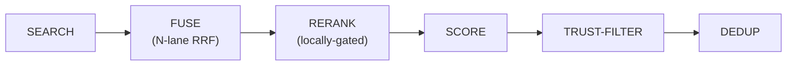

**What it does.** Stores facts, conversation summaries, and how-to procedures
your agent picks up over time, so it can recall them in future conversations
without repeating itself.

**Who it is for.** Anyone who wants their agent to remember things across
sessions. Configuration is optional — sensible defaults work out of the box.

Your agent does not just forget everything after each conversation. Comis stores
important information in long-term memory -- facts, conversation summaries,
instructions, and more. This memory persists across sessions and helps your
agent get smarter over time. Memory is backed by a single SQLite database
(SQLite + FTS5 full-text index + a vector index when an embedding provider is
configured) — see [Search](/agents/search) and
[Embeddings](/agents/embeddings).

## Memory types

Comis organizes memories into four categories, each serving a different purpose.
Think of them as different drawers in a filing cabinet:

**Working** ("Current conversation") -- What is in the active session right now.
This is temporary and only lasts until the session ends or is compacted. It
includes your messages, the agent's responses, and any tool results from the
current conversation.

**Episodic** ("Conversation summaries") -- Summaries of past conversations,
created automatically by [compaction](/agents/compaction). Like a diary, these
capture what happened in previous sessions so your agent can reference past
interactions even after the original messages have been compacted away.

**Semantic** ("Facts and knowledge") -- Specific facts the agent has learned.
Like a notebook of important details -- your name, your preferences, project
details, or anything else the agent has picked up from conversations. Semantic
memories are the most common type your agent creates and recalls.

**Procedural** ("How-to instructions") -- Step-by-step procedures the agent
knows. Like a recipe book, these store instructions for tasks the agent has
learned to do. For example, how to format a report, or the steps to deploy
your application.

## Trust levels

Each memory has a trust level that controls how it is used when recalled:

**system** -- Created by Comis itself (compaction summaries, internal data).
Fully trusted. The agent treats these as reliable facts.

**learned** -- Things the agent learned from conversations with you. Trusted
by default. The agent treats these as information from a reliable source.

**external** -- Information from outside sources (web searches, tool results
from untrusted inputs). When an external memory is recalled, it is marked with
a warning label so the agent knows to verify it before relying on it.

By default, [memory recall (RAG)](/agents/rag) only includes `system` and
`learned` memories. You can include `external` memories as well, but the agent
will always flag them for caution.

Trust does two jobs during recall, not one:

- **Inclusion filter** -- `includeTrustLevels` decides which trust levels are
  eligible at all (default `["system", "learned"]`).
- **Ranking signal** -- among the memories that pass the filter, trust also
  *boosts the score* (`rag.scoring.trustAlpha`, default `0.1`) and breaks ties
  in the order `system > learned > external`. A more-trusted memory therefore
  ranks above an equally-relevant less-trusted one. See the
  [Recall pipeline](#recall-pipeline) below.

## Background learning

Your agent does not have to consciously decide what to remember. A periodic
**memory review job** runs in the background and extracts likely-useful facts
from recent conversations:

1. It scans the last N messages of each session (default 50–100).
2. It asks the LLM to extract preferences, facts, and habits worth keeping.
3. Each extracted item is stored with `trust_level: "learned"`.
4. The new memories are queued for embedding (so meaning-based recall works).

This means your agent slowly builds up a personalised picture of you and your
work without you having to say "remember this." The review runs on a
configurable schedule and de-duplicates by content hash so repeated facts do
not clutter the database.

The job is implemented in
`packages/agent/src/memory/memory-review-job.ts`.

## Memory operations

Your agent can perform these operations on its long-term memory:

- **Store** -- Save new information as a memory entry
- **Search** -- Find relevant memories based on a query (see [Search](/agents/search))
- **Get** -- Retrieve a specific memory by its identifier
- **Update** -- Modify an existing memory with new information
- **Delete** -- Remove a specific memory that is no longer needed
- **Clear** -- Remove all memories of a specific type or from a specific time period

These operations are available as tools that the agent can use during
conversations, or through the web dashboard for manual management.

## How memory is stored

Comis uses a SQLite database (stored as `memory.db` in your data directory,
typically `~/.comis/`) to hold all memories. The database uses secure file
permissions so only the Comis process can access it.

Each agent's memories are isolated by tenant ID, which means if you run
multiple agents, they each have their own separate memory space. An agent
cannot accidentally access another agent's memories.

The database uses WAL mode (write-ahead logging) by default, which allows
your agent to read memories quickly even while new ones are being written.

## Guardrails

Automatic limits prevent memory from growing unbounded:

- **Compaction threshold** -- When the number of entries exceeds the threshold
  (default 1000), older entries are compacted to keep the database manageable.
- **Target size** -- After compaction, the database is trimmed to the target
  size (default 500 entries).
- **Retention limit** -- You can set a maximum age for memories in days
  (`memory.retention.maxAgeDays`, default `0` = no age limit). Memories older
  than this are automatically cleaned up.

These limits work together to keep your agent's memory focused and efficient
without requiring manual cleanup.

## Recall pipeline

Before every agent response, Comis runs a single recall orchestrator —
`MemoryRecall` (`packages/agent/src/rag/memory-recall.ts`) — that turns your
incoming message into the most relevant set of memories. It **replaced the
older inline recall path** (a flat search → trust-filter → sort → dedup). The
orchestrator runs these stages in order:



1. **SEARCH** -- each retrieval lane runs. The FTS5 keyword lane and the vector
   (meaning) lane are **two independent, operator-weighted RRF lanes**
   (`rag.lanes.fts.weight`, default `1.0`; `rag.lanes.vector.weight`, default
   `1.5`). On top
   of those two base lanes, three further lanes are fused in **only when enabled**
   — the entity lane, the temporal-spread lane, and the causal lane (all
   **default-OFF**). See [Search](/agents/search).
2. **FUSE** -- the lanes are merged with **Reciprocal Rank Fusion (RRF, `k=60`)**.
   Fusion order — *not* reranking — is the default recall ordering.
3. **RERANK** *(locally-gated; auto-on only when the reranker model is already
   present)* -- when active, a cross-encoder re-scores the top fused candidates.
   On a fresh all-default install the model is absent, so this stage is skipped
   and recall stays on the fusion order.
4. **SCORE** -- multiplicative boosts are applied to the reranked-or-fused score:
   recency, temporal proximity, proof count, and trust — plus a usefulness factor
   when the recall-utility feedback loop is on (the `rag.scoring.*` alphas below).
5. **TRUST-FILTER** -- memories whose trust level is not in `includeTrustLevels`
   are dropped (`external` excluded by default).
6. **DEDUP** -- near-duplicates are collapsed by content fingerprint, and the
   result is trimmed to `maxResults` / `maxContextChars`.

The recall **core is always on** (as long as `rag.enabled` is `true`). Reranking
is **locally-gated** — auto-on when its model is already present, off on a fresh
install (see below). The remaining layers are each **opt-in** and described below:
the entity, temporal-spread, and causal lanes; the recall-utility feedback factor;
and the higher-order observations maintained by the reflection engine.

### Reranking (locally-gated, default-on)

Reranking re-scores the fused candidates with a **cross-encoder** — a model that
reads the query and a candidate *together* and judges their relevance directly,
which is more accurate than the bi-encoder similarity used for the vector lane
(see [Embeddings](/agents/embeddings#embedder-vs-reranker) for the distinction).

- **Locally-gated default-on** — reranking turns **ON automatically when the
  `bge-reranker-v2-m3` GGUF already resolves locally** (and within the latency
  budget), and stays **OFF on a fresh all-default install** (no model file
  present). The on-disk schema default of `rag.rerank.enabled` is still `false`;
  the "default-on" is the daemon's *effective-config* resolution — it consults a
  no-download presence probe at startup and enables rerank only when the model is
  already there. Explicit `rag.rerank.enabled: true | false` still wins both
  directions: force-on triggers the one-time download, force-off is honored even
  when the model is present.
- **Zero download out of the box (the supply-chain invariant)** — a fresh
  all-default install performs **zero** reranker-model download at startup; the
  ~606 MB GGUF is fetched only when an agent **explicitly** enables rerank. The
  presence probe never reaches the download path, which **decouples default-on
  from the download** (the change vs the old "stay opt-in to avoid the
  download").
- **On-device, zero new dependency** — the reranker is a local GGUF model
  (`bge-reranker-v2-m3`, Q8_0 quantization) run through the same `node-llama-cpp`
  runtime that already powers local embeddings. No external API call, no new
  package.
- **Bounded** — at most `rag.rerank.maxCandidates` (default `40`) candidates are
  re-scored, under a `rag.rerank.timeoutMs` (default `800`) wall-clock budget.
- **Degrades gracefully** — if the reranker is unavailable or the timeout fires,
  recall falls back to the fusion-ranked order. Recall never fails because of
  reranking.

```yaml title="~/.comis/config.yaml"
agents:
  default:
    rag:
      rerank:
        enabled: true        # force on (downloads the model if absent).
                             # OMIT to auto-enable only when the model is present.
        maxCandidates: 40
        timeoutMs: 800
memory:
  rerankerModel: "hf:gpustack/bge-reranker-v2-m3-GGUF:bge-reranker-v2-m3-Q8_0.gguf"
  rerankerThreads: 4
  rerankerGpu: auto
```

### Trust-aware ranking

Trust is a **ranking signal**, not only an inclusion filter. During the SCORE
stage, `rag.scoring.trustAlpha` (default `0.1`) boosts more-trusted memories, and
ties are broken in the order **`system > learned > external`**. The pre-existing
`includeTrustLevels` filter still decides which trust levels are *eligible*; the
ranking dimension decides their *order* once they qualify. This is what keeps a
trusted fact ahead of an equally-relevant but less-trusted one, preserving the
poisoning-resistance posture.

| Boost | Knob | Default |
|-------|------|---------|
| Recency (record time) | `rag.scoring.recencyAlpha` | `0.2` |
| Temporal proximity (event time) | `rag.scoring.temporalAlpha` | `0.2` |
| Proof count (corroboration) | `rag.scoring.proofAlpha` | `0.1` |
| Trust level | `rag.scoring.trustAlpha` | `0.1` |

### Read-time temporal correctness

Comis distinguishes two timestamps on every memory:

- **`occurred_at`** -- when the fact was *true* in the world (event time).
- **`created_at`** -- when Comis *recorded* it (record time).

When two memories contradict each other, the conflict is resolved **at read
time, by trust tier first**: the higher-trust memory wins
(**`system > learned > external`**) — **even when it is older**. Recency only
breaks ties **among equal-trust memories**, so it is no longer the primary
conflict resolver. Comis never averages or sums conflicting values, and it is
**non-destructive** — the older record is never deleted, so both conflicting
memories are still returned and the agent can see the history. `temporalAlpha`
still **orders pure timelines** by event-time proximity when `occurred_at` is
present and stays **neutral when it is absent**, so memories without an event
time are neither penalised nor favoured.

<Note>
  Temporal correctness here is read-time conflict resolution. Comis does not
  (yet) support natural-language time-range retrieval like "what did I say last
  March" — that is a separate, future capability.
</Note>

### Entity associative recall (opt-in)

When enabled, the entity lane adds **associative recall**: starting from the top
search hits, it does a one-hop self-join over memories that share a linked entity
(a person, project, place, …) and fuses those neighbours into the RRF result.

- **Default `false`** (`rag.entityLane.enabled`) — opt-in.
- **Strictly scoped** — the join is confined to the current `(tenant, agent)`;
  one agent can never pull another's linked memories.
- **Safe when empty** — if a query produces no entity seeds, the lane returns
  nothing and the RRF result is unchanged.

```yaml title="~/.comis/config.yaml"
agents:
  default:
    rag:
      entityLane:
        enabled: true        # OPT-IN (default false) — one-hop associative lane
        seedCount: 5
        perEntityCap: 200
```

### Recall-utility feedback loop (opt-in)

Comis can **learn which recalled memories actually got used** and fold that signal
back into ranking — boosting memories that have proven useful, demoting ones that
were recalled but ignored. This is **opt-in and default-OFF**; with the loop off,
recall is byte-identical to the baseline (no read, no emit, no extra factor).

- **Default `false`** (`rag.feedback.enabled`) — the single master toggle. When
  **on**, after each turn Comis attributes which recalled memories were actually
  used or cited, persists a durable per-memory usefulness signal (strictly scoped
  to the current `(tenant, agent)`), and folds a **bounded** multiplicative
  usefulness factor into the SCORE stage. The factor is neutral (1.0) whenever a
  memory has no usefulness signal yet.
- **Bounded so it cannot overturn trust.** The magnitude is
  `rag.scoring.usefulnessAlpha` (default `0.1`) — deliberately small (same
  magnitude as the trust and proof boosts) so a proven-useful memory is lifted but
  **cannot overturn trust-first ordering**. The magnitude lives only on
  `rag.scoring`; there is no `usefulnessAlpha` knob under `rag.feedback`.

```yaml title="~/.comis/config.yaml"
agents:
  default:
    rag:
      feedback:
        enabled: true        # OPT-IN (default false) — learn from recall outcomes
      scoring:
        usefulnessAlpha: 0.1 # magnitude of the usefulness boost (bounded small)
```

### Higher-order observations (the reflection engine)

Higher-order **topic** observations — memories that summarise a cluster of
supporting entries — are maintained by the **one outcome-gated reflection cron**
(`agents.<id>.learning.enabled`) as `kind:"topic"` Mental Model docs, in the same
pass that maintains the learned **skill** docs and the per-user **profile** doc
(see [Memory configuration](/agents/memory-config#the-one-learning-reflection-engine)).
Each observation carries:

- a **`proof_count`** and the **`source_ids`** of the memories that support it,
- a **`confidence`** that feeds the `proofAlpha` ranking boost, and
- a **trust ceiling = `min(sources)`** — an observation can never be more trusted
  than its least-trusted source, so `external` material cannot launder itself
  into a `system`-level fact.

**Supersede, not overwrite (proof accrual).** When a fact is **corroborated across
multiple runs**, the engine **folds the new sources into the existing
observation** — growing its `proof_count` and `source_ids` and appending to its
`history` — instead of creating a second observation. The fold is:

- **idempotent** — re-running over the same sources never double-counts (the new
  source IDs are diffed against the ones already recorded), so a repeated pass is a no-op;
- **trust-ceiling preserving** — the folded trust level is `min(sources)`, so a
  fold can only **lower** an observation's trust, never launder it upward;
- **non-destructive** — a correction **supersedes** the prior body with a
  bi-temporal history-append (the prior body is kept in `history`, never hard-deleted).

Because the grown `proof_count` feeds the `proofAlpha` ranking boost, a fact
corroborated across runs out-ranks a one-off mention at recall time.

The reflection engine is **outcome-gated** (it learns only from trusted-origin
successful trajectories) and gated by `learning.enabled` under the master
`memory.enabled` switch. In the same pass it also distils **advisory procedure
docs** from **verifiably-successful `orchestrate` runs** — a `kind:"skill"` doc
that records the run's deterministic tool footprint and surfaces into
`<available_skills>` bounded by a per-agent budget. Such a doc is **advisory**:
the model reads it and **re-authors** the script through its own permissioned
tools; it is never a stored/replayed template and adds **no new execution path**.
The configuration lives in the
[Memory configuration](/agents/memory-config#the-one-learning-reflection-engine)
reference; this page describes the concept.

## DAG context store (the default engine; in-session expansion tools)

The DAG (LCD) context store preserves the full conversation history losslessly —
every message, tool call, and tool result kept verbatim and paired by id. It backs
the **default** lossless DAG engine (`contextEngine.version` defaults to `"dag"` — full details
in [Context Management](/agents/context-management#dag-mode-the-default-engine)). In DAG mode
the engine compresses old turns into a zoomable summary hierarchy, and three
dedicated **in-session** expansion tools (`ctx_search`, `ctx_inspect`,
`ctx_expand`) let the agent query that store on demand and recover detail the
summarizer compressed away — see
[Context expansion tools](/agent-tools/sessions#context-expansion-tools). They are
`never-export` and **distinct from cross-session recall**. The default context
engine is **DAG** mode (`contextEngine.version` defaults to `"dag"`); in the
opt-in **pipeline** mode (`contextEngine.version: "pipeline"`), the
`session_search` tool searches the raw session history instead. The long-term memory
described above (semantic store, recall, the reflection engine) is independent of the DAG
context store and is fully available.

See [Compaction](/agents/compaction) for the pipeline engine and the DAG design
reference.

## Configuration

| Option | Type | Default | What it does |
|--------|------|---------|--------------|
| `memory.dbPath` | string | `"memory.db"` | Path to the SQLite database file |
| `memory.walMode` | boolean | `true` | Enable write-ahead logging for better read performance |
| `memory.compaction.enabled` | boolean | `true` | Enable automatic memory compaction |
| `memory.compaction.threshold` | number | `1000` | Number of entries before compaction triggers |
| `memory.compaction.targetSize` | number | `500` | Maximum entries to keep after compaction |
| `memory.retention.maxAgeDays` | number | `0` | Maximum age of entries in days (0 = no limit) |

```yaml title="~/.comis/config.yaml"
memory:
  dbPath: "memory.db"
  walMode: true
  compaction:
    enabled: true
    threshold: 1000
    targetSize: 500
  retention:
    maxAgeDays: 0     # No age limit
```

**Recall (`rag.*`) configuration.** Every knob that shapes the recall pipeline
above, with its verified default. The full config reference lives at
[`/reference/config-yaml`](/reference/config-yaml).

| Option | Type | Default | What it does |
|--------|------|---------|--------------|
| `rag.enabled` | boolean | `true` | Enable automatic memory retrieval before LLM calls |
| `rag.maxResults` | number | `5` | Max memory results to retrieve |
| `rag.maxContextChars` | number | `4000` | Max characters of memory context injected |
| `rag.minScore` | number | `0.1` | Minimum RRF score to include a result |
| `rag.includeTrustLevels` | array | `["system","learned"]` | Trust levels eligible (external excluded by default) |
| `rag.rerank.enabled` | boolean | `false` | Force the cross-encoder rerank on/off; UNSET = auto-on when the model is present locally (see [Reranking](#reranking-locally-gated-default-on)) |
| `rag.rerank.maxCandidates` | number | `40` | Candidate cap for rerank |
| `rag.rerank.minResults` | number | `1` | Skip rerank below this many candidates |
| `rag.rerank.timeoutMs` | number | `800` | Rerank wall-clock budget; fall back to fusion on timeout |
| `rag.scoring.recencyAlpha` | number | `0.2` | Recency (record-time) boost weight |
| `rag.scoring.temporalAlpha` | number | `0.2` | Event-time proximity boost weight (neutral when `occurred_at` absent) |
| `rag.scoring.proofAlpha` | number | `0.1` | Proof-count (corroboration) boost weight |
| `rag.scoring.trustAlpha` | number | `0.1` | Trust-level boost + tie-break weight |
| `rag.scoring.usefulnessAlpha` | number | `0.1` | Usefulness boost weight (feedback loop; neutral when absent) |
| `rag.lanes.fts.weight` | number | `1.0` | FTS (BM25) lane RRF weight |
| `rag.lanes.vector.weight` | number | `1.5` | Vector (KNN) lane RRF weight |
| `rag.lanes.temporal.enabled` | boolean | `false` | Enable the temporal-spread lane (default off) |
| `rag.lanes.temporal.weight` | number | `1.0` | Temporal-spread lane RRF weight |
| `rag.lanes.temporal.windowDays` | number | `7` | Window (days) around seed event times |
| `rag.lanes.causal.enabled` | boolean | `false` | Enable the one-hop causal lane (default off) |
| `rag.lanes.causal.weight` | number | `1.0` | Causal lane RRF weight |
| `rag.entityLane.enabled` | boolean | `false` | Enable the entity associative lane (default off) |
| `rag.entityLane.seedCount` | number | `5` | Top hits that seed the entity self-join |
| `rag.entityLane.perEntityCap` | number | `200` | Max shared-entity neighbour rows |
| `rag.entityLane.weight` | number | `1.0` | Entity lane RRF weight |
| `rag.feedback.enabled` | boolean | `false` | Enable the recall-utility feedback loop (default off; opt-in) |

```yaml title="~/.comis/config.yaml"
agents:
  default:
    rag:
      enabled: true
      maxResults: 5
      lanes:
        fts:
          weight: 1.0
        vector:
          weight: 1.5
        temporal:
          enabled: false     # default off
          weight: 1.0
          windowDays: 7
        causal:
          enabled: false     # default off
          weight: 1.0
      feedback:
        enabled: false       # default off — opt-in recall-utility loop
      scoring:
        usefulnessAlpha: 0.1
```

<CardGroup cols={2}>
  <Card title="Search" icon="magnifying-glass" href="/agents/search">
    How Comis finds relevant memories using text and meaning matching.
  </Card>
  <Card title="Embeddings" icon="microchip" href="/agents/embeddings">
    Setting up meaning-based search for better memory recall.
  </Card>
  <Card title="Compaction" icon="compress" href="/agents/compaction">
    How conversation summaries become long-term memories.
  </Card>
</CardGroup>
