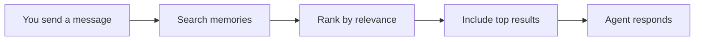

Before your agent responds to a message, it checks its long-term memory for
anything relevant. This is called *Retrieval-Augmented Generation* (RAG) -- but
think of it as your agent looking through a filing cabinet of past conversations
to find useful notes before answering.

## How memory recall works

Every time you send a message, your agent goes through a quick recall process:



1. **You send a message** -- Your question or request arrives at the agent.
2. **Search memories** -- Comis searches the agent's long-term memory for
   anything related to your message.
3. **Rank by relevance** -- The results are sorted by how closely they match
   your message. Only the most relevant memories make the cut.
4. **Include top results** -- The best-matching memories are added to the
   agent's context so it can reference them when forming its response.
5. **Agent responds** -- With both your current message and the relevant
   memories, the agent gives a more informed answer.

## What gets recalled

Memories are ranked by relevance. Only the top results (up to `maxResults`) that
meet a minimum relevance score (`minScore`) are included in the agent's context.
This keeps the agent focused on the most useful information rather than flooding
it with everything it has ever seen.

The total amount of memory context is also capped by `maxContextChars` (default
4000 characters). This prevents memories from taking up too much of the agent's
thinking space, leaving room for your current conversation and the agent's
instructions.

Each memory also has a trust level. By default, only **system** memories
(created by Comis itself) and **learned** memories (from your conversations) are
included. Memories tagged as **external** (from outside sources like web
searches) are excluded by default for safety. You can change this by adjusting
`includeTrustLevels`.

<Note>
  If a recalled memory comes from an external source, it is marked with a
  warning label so the agent knows to treat it with appropriate caution.
</Note>

## When is memory recall used?

Memory recall runs automatically before every agent response. You do not need
to do anything to activate it -- as long as `rag.enabled` is `true` (the
default), your agent will check its memory every time.

You can also configure your agent to use memory tools directly. These tools
let the agent search, store, and manage memories as part of its reasoning
process. See [Memory](/agents/memory) for details on the types of memories
your agent can store and retrieve.

## Configuration

| Option | Type | Default | What it does |
|--------|------|---------|--------------|
| `rag.enabled` | boolean | `true` | Enable automatic memory recall before each response |
| `rag.maxResults` | number | `5` | Maximum number of memories to include |
| `rag.maxContextChars` | number | `4000` | Maximum characters of memory context to add |
| `rag.minScore` | number | `0.1` | Minimum relevance score (0-1) for a memory to be included |
| `rag.includeTrustLevels` | array | `["system", "learned"]` | Which trust levels to include in recall |

```yaml title="~/.comis/config.yaml"
agents:
  default:
    rag:
      enabled: true
      maxResults: 5
      maxContextChars: 4000
      minScore: 0.1
      includeTrustLevels:
        - system
        - learned
```

<CardGroup cols={2}>
  <Card title="Memory" icon="database" href="/agents/memory">
    The different types of memories your agent stores.
  </Card>
  <Card title="Search" icon="magnifying-glass" href="/agents/search">
    How Comis finds relevant memories using text and meaning matching.
  </Card>
  <Card title="Embeddings" icon="microchip" href="/agents/embeddings">
    Setting up meaning-based search for better recall.
  </Card>
</CardGroup>
