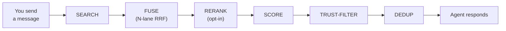

Before your agent responds to a message, it checks its long-term memory for
anything relevant. This is called *Retrieval-Augmented Generation* (RAG) -- but
think of it as your agent looking through a filing cabinet of past conversations
to find useful notes before answering.

## How memory recall works

Every time you send a message, your agent runs a single recall orchestrator —
`MemoryRecall` — that searches, fuses, optionally reranks, scores, filters, and
de-duplicates its long-term memory before answering:


```mermaid
flowchart LR
    A["You send<br/>a message"] --> B["SEARCH"]
    B --> C["FUSE<br/>(N-lane RRF)"]
    C --> D["RERANK<br/>(opt-in)"]
    D --> E["SCORE"]
    E --> F["TRUST-FILTER"]
    F --> G["DEDUP"]
    G --> H["Agent responds"]
```

1. **Search** -- Comis runs every retrieval lane in parallel: keyword (FTS5),
   meaning (vector, when embeddings exist), and the optional entity lane.
2. **Fuse** -- the lanes are merged with Reciprocal Rank Fusion (RRF, `k=60`).
   Fusion order is the default recall ordering.
3. **Rerank** *(opt-in, default skipped)* -- when enabled, a cross-encoder
   re-scores the top fused candidates for sharper relevance.
4. **Score** -- recency, temporal, proof, and trust boosts are applied.
5. **Trust-filter** -- only the eligible trust levels survive (`external`
   excluded by default).
6. **Dedup** -- near-duplicates are collapsed and the result is trimmed to
   `maxResults` / `maxContextChars`, then injected into the agent's context.

The full pipeline — including the opt-in reranking and entity lane, the
trust-aware ranking, and read-time temporal correctness — is documented on the
[Memory](/agents/memory#recall-pipeline) page.

## What gets recalled

Memories are ranked by relevance. Only the top results (up to `maxResults`) that
meet a minimum relevance score (`minScore`) are included in the agent's context.
This keeps the agent focused on the most useful information rather than flooding
it with everything it has ever seen.

The total amount of memory context is also capped by `maxContextChars` (default
4000 characters). This prevents memories from taking up too much of the agent's
thinking space, leaving room for your current conversation and the agent's
instructions.

Each memory also has a trust level. By default, only **system** memories
(created by Comis itself) and **learned** memories (from your conversations) are
included. Memories tagged as **external** (from outside sources like web
searches) are excluded by default for safety. You can change this by adjusting
`includeTrustLevels`.

<Note>
  If a recalled memory comes from an external source, it is marked with a
  warning label so the agent knows to treat it with appropriate caution.
</Note>

## When is memory recall used?

Memory recall runs automatically before every agent response. You do not need
to do anything to activate it -- as long as `rag.enabled` is `true` (the
default), your agent will check its memory every time.

You can also configure your agent to use memory tools directly. These tools
let the agent search, store, and manage memories as part of its reasoning
process. See [Memory](/agents/memory) for details on the types of memories
your agent can store and retrieve.

## How retrieval works under the hood

For developers and operators who want to know what is actually happening, the
`MemoryRecall` orchestrator runs these stages:

1. **Query formulation** -- The current user message and recent conversation
   context are used as the search query.
2. **Search (N lanes)** -- The query fans out to every retrieval lane on the
   [memory store](/agents/memory): SQLite FTS5 (BM25 text ranking), vector
   similarity (cosine distance over embeddings) when an embedding provider is
   configured, and the optional entity lane when `rag.entityLane.enabled` is on.
3. **Fuse (N-lane RRF)** -- The lanes are merged with Reciprocal Rank Fusion
   (`score = 1 / (k + rank)`, `k=60`), which is robust against the lanes'
   incompatible score scales. Fusion order is the default recall order.
4. **Rerank (opt-in, default skipped)** -- When `rag.rerank.enabled` is `true`,
   the top fused candidates (cap `maxCandidates`, default `40`) are re-scored by
   an on-device cross-encoder under an `800ms` timeout; on timeout or
   unavailability recall falls back to the fused order. Default `false`, so this
   stage is normally skipped.
5. **Score** -- Multiplicative boosts are applied to the reranked-or-fused
   score: `recencyAlpha`, `temporalAlpha`, `proofAlpha`, and `trustAlpha` (the
   `rag.scoring.*` knobs). Trust here is a *ranking* signal with the tie-break
   `system > learned > external`, not only a filter.
6. **Trust-filter** -- Hits are filtered by `includeTrustLevels`. By default,
   only `system` and `learned` memories pass; `external` memories (web pages,
   third-party API responses) are excluded unless you opt in.
7. **Dedup + budget** -- Hits are deduplicated by content fingerprint (first 200
   characters), then appended to a memory section until `maxResults` or
   `maxContextChars` is reached. If a single hit would push the section over
   budget, it is dropped (not truncated).
8. **Provenance and sanitization** -- Each included memory is formatted with its
   date, trust level, and source. External content is wrapped in safety markers
   so the model treats it as untrusted input.
9. **Injection** -- The formatted memory section is appended to the system
   prompt as the dynamic preamble (so it never invalidates the cached prefix --
   see [Compaction](/agents/compaction#cache-stable-prompt-architecture)).

The orchestrator is in `packages/agent/src/rag/memory-recall.ts`, and the
underlying lane search engine lives in `packages/memory/src/hybrid-search.ts`.

## What gets indexed

RAG only retrieves what has been written to memory. Three things write to
memory automatically:

- **System facts** -- Hardcoded knowledge configured by you or platform admins.
- **Learned facts** -- Extracted from past conversations by the background
  memory review job (`packages/agent/src/memory/memory-review-job.ts`).
- **Tool-stored facts** -- Anything your agent saves via `memory_store`
  during a conversation.

Web search results, API responses, and other transient content are NOT
indexed by default. They appear as `external` trust-level entries only if
your agent explicitly stores them.

## Configuration

| Option | Type | Default | What it does |
|--------|------|---------|--------------|
| `rag.enabled` | boolean | `true` | Enable automatic memory recall before each response |
| `rag.maxResults` | number | `5` | Maximum number of memories to include |
| `rag.maxContextChars` | number | `4000` | Maximum characters of memory context to add |
| `rag.minScore` | number | `0.1` | Minimum relevance score (0-1) for a memory to be included |
| `rag.includeTrustLevels` | array | `["system", "learned"]` | Which trust levels to include in recall |
| `rag.rerank.enabled` | boolean | `false` | Cross-encoder reranking control (see [Memory](/agents/memory#reranking-locally-gated-default-on)) |
| `rag.rerank.maxCandidates` | number | `40` | Max candidates re-scored when rerank is enabled |
| `rag.rerank.timeoutMs` | number | `800` | Rerank wall-clock budget; on timeout falls back to fusion order |
| `rag.scoring.recencyAlpha` | number | `0.2` | Recency (record-time) boost weight |
| `rag.scoring.temporalAlpha` | number | `0.2` | Event-time proximity boost weight |
| `rag.scoring.proofAlpha` | number | `0.1` | Proof-count (consolidation) boost weight |
| `rag.scoring.trustAlpha` | number | `0.1` | Trust-level boost weight + `system > learned > external` tie-break |
| `rag.entityLane.enabled` | boolean | `false` | Opt-in one-hop entity associative lane (see [Memory](/agents/memory#entity-associative-recall-opt-in)) |
| `rag.entityLane.seedCount` | number | `5` | Top hits that seed the entity self-join |
| `rag.entityLane.perEntityCap` | number | `200` | Max shared-entity neighbours the lane returns |

```yaml title="~/.comis/config.yaml"
agents:
  default:
    rag:
      enabled: true
      maxResults: 5
      maxContextChars: 4000
      minScore: 0.1
      includeTrustLevels:
        - system
        - learned
```

<CardGroup cols={2}>
  <Card title="Memory" icon="database" href="/agents/memory">
    The different types of memories your agent stores.
  </Card>
  <Card title="Search" icon="magnifying-glass" href="/agents/search">
    How Comis finds relevant memories using text and meaning matching.
  </Card>
  <Card title="Embeddings" icon="microchip" href="/agents/embeddings">
    Setting up meaning-based search for better recall.
  </Card>
</CardGroup>
