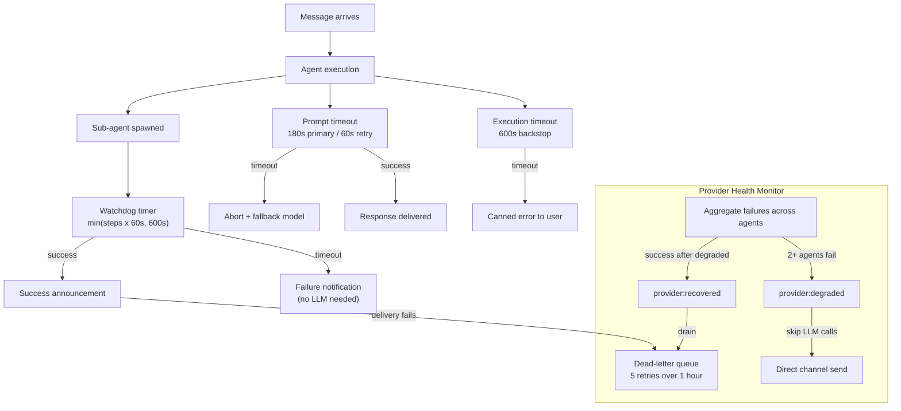

Provider outages, hung prompts, and stuck sub-agents can all cause silent
failures -- your agent stops responding and no one knows why. Comis prevents
this with a layered defense stack that catches failures at every level, from
individual prompt calls up to cross-agent health monitoring and a persistent
dead-letter queue for missed announcements.

Each layer operates independently and activates automatically. If an inner
layer fails to catch a problem, the next outer layer picks it up. The result
is that operators see clear log events and users always receive a response,
even during extended provider outages.

## How resilience works

The resilience stack is organized in layers from inner (closest to the LLM
call) to outer (system-wide). Each layer has a specific scope and escalation
path.



The sections below describe each subsystem in order from the innermost layer
(individual prompt calls) to the outermost (system-wide sweeps).

## Prompt timeout

Every LLM call has a wall-clock timeout that prevents hung prompts from
blocking the agent indefinitely. If the provider does not respond within the
timeout, the call is aborted and the agent automatically retries with a shorter
timeout or falls back to an alternate model.

- **Primary calls:** 180,000 ms (3 minutes) by default
- **Retry and fallback calls:** 60,000 ms (1 minute) by default
- **What the operator sees:** An `execution:prompt_timeout` event in logs,
  followed by an automatic retry or model fallback
- **What the user sees:** A slightly delayed response (the retry is transparent
  to the user)

The timeout covers the full call lifecycle including internal SDK retries and
streaming. If your model legitimately needs more time for complex tasks,
increase `promptTimeoutMs` in the agent's config. See the
[Config YAML Reference](/reference/config-yaml) for details.

## Execution timeout

The execution timeout is a 600-second (10-minute) backstop on the entire agent
pipeline. It fires only when everything else has failed -- prompt timeouts,
retries, and fallback models have all been exhausted or are taking too long.

- **Default:** 600,000 ms (10 minutes), hardcoded
- **What the operator sees:** An `execution:aborted` event with reason
  `pipeline_timeout`
- **What the user sees:** A static error message delivered directly to the
  channel (no LLM call is made)

This timeout is intentionally longer than the worst-case model-retry chain.
If it fires regularly, investigate per-call prompt timeouts first -- the
execution timeout should rarely activate during normal operation.

## Sub-agent watchdog

When a parent agent spawns a sub-agent, a watchdog timer starts automatically.
The timer uses a dynamic formula to calculate the deadline:

> **Timeout = min(max_steps x perStepTimeoutMs, maxRunTimeoutMs)**

If `max_steps` is not set for the sub-agent, the watchdog falls back to
`maxRunTimeoutMs` directly. When the deadline passes, the watchdog force-fails
the run and sends a failure notification to the channel.

- **Default maxRunTimeoutMs:** 600,000 ms (10 minutes)
- **Default perStepTimeoutMs:** 60,000 ms (1 minute per step)
- **What the operator sees:** A `Sub-agent watchdog timeout` warning in logs
- **What the user sees:** A failure notification on the channel explaining that
  the sub-agent task did not complete in time

Both `maxRunTimeoutMs` and `perStepTimeoutMs` are configurable under
`security.agentToAgent.subagentContext`. See the
[Config YAML Reference](/reference/config-yaml) for details.

## Failure notification

When a sub-agent fails (from a watchdog timeout, execution error, or ghost
sweep), a failure notification is delivered to the channel. This notification
uses static text only -- it never makes an LLM call and never exposes raw
error details to the user.

The notification is delivered through the parent agent's announcement system
with a 30-second timeout. If the announcement does not complete within 30
seconds, delivery falls back to sending the message directly to the channel,
bypassing the parent entirely.

- **What the operator sees:** Log entries for the failure and the notification
  delivery path (announcement or direct send)
- **What the user sees:** A brief message indicating the sub-agent task did not
  complete successfully

## Provider health monitor

The provider health monitor aggregates failures across all agents to detect
provider-wide outages. It activates automatically with no configuration
required.

The monitor triggers when either condition is met within a 60-second window:

- **2 or more agents** experience failures, or
- **3 consecutive failures** from any single agent

When triggered, the monitor emits a `provider:degraded` event. While the
provider is degraded:

- LLM-dependent operations are skipped to avoid wasting tokens on a
  down provider
- Failure notifications use direct channel send instead of LLM-based
  responses
- Dead-letter queue entries accumulate for later retry

When failures stop and the provider recovers, the monitor emits a
`provider:recovered` event. The dead-letter queue automatically drains on
recovery.

- **What the operator sees:** `provider:degraded` and `provider:recovered`
  events in logs
- **What the user sees:** During degradation, static error messages instead of
  AI-generated responses. Normal service resumes automatically on recovery.

## Dead-letter queue

When an announcement delivery fails (for example, the channel is temporarily
unreachable), the message is saved to a persistent dead-letter queue backed by
a JSONL file at `~/.comis/dead-letters.jsonl`.

- **Retry policy:** Up to 5 retries per entry
- **Maximum age:** 1 hour -- entries older than this are expired and discarded
- **Automatic drain:** On `provider:recovered` events, the queue drains
  automatically, delivering all queued messages
- **What the operator sees:** `announcement:dead_lettered` events when entries
  are queued, `announcement:dead_letter_delivered` events when they are
  successfully delivered on retry

The dead-letter queue ensures that transient failures do not cause permanent
message loss. Even during extended provider outages, announcements are preserved
and delivered once the provider recovers.

## Ghost sweep

The ghost sweep catches sub-agent runs that are stuck in a "running" state past
their expected lifetime. This can happen if the process crashes during execution
or an unexpected error leaves a run in an inconsistent state.

The grace period is `maxRunTimeoutMs + 120 seconds` (120,000 ms). Any run still
marked as "running" past this deadline is force-failed at ERROR level. A failure
notification is delivered to the channel.

- **Default grace period:** 720,000 ms (12 minutes) with default
  `maxRunTimeoutMs`
- **What the operator sees:** A `Ghost run detected and force-failed` error in
  logs
- **What the user sees:** A failure notification on the channel

Ghost sweeps run on a periodic schedule. They are a safety net for the
sub-agent watchdog -- if the watchdog timer itself fails to fire (due to a
process issue), the ghost sweep catches the stuck run.

## Batcher timeout

The batcher timeout is a 30-second timeout on announcement delivery through
the parent agent's announcement system. If the announcement does not complete
within 30 seconds, delivery falls back to sending the message directly to
the channel.

This timeout is automatic and requires no configuration. It ensures that a
slow or unresponsive announcement system does not delay failure notifications
to users.

- **Default:** 30,000 ms (30 seconds), automatic
- **What the operator sees:** A log entry indicating the fallback from
  announcement to direct channel send
- **What the user sees:** The same message, delivered through the fallback
  path -- no visible difference

## Configuration

Most resilience features activate automatically with sensible defaults. The
configurable settings are:

```yaml title="~/.comis/config.yaml"
agents:
  default:
    # Prompt timeout -- prevents hung LLM calls
    promptTimeout:
      promptTimeoutMs: 180000        # 3 minutes for primary calls
      retryPromptTimeoutMs: 60000    # 1 minute for retry/fallback calls

security:
  agentToAgent:
    subagentContext:
      # Sub-agent watchdog -- kills stuck runs
      maxRunTimeoutMs: 600000        # 10 minutes hard ceiling
      perStepTimeoutMs: 60000        # 1 minute per step (dynamic timeout)
```

See the [Config YAML Reference](/reference/config-yaml) for the full list of
all configuration options with types, defaults, and validation rules.

<Tip>
  Start with the defaults. They are designed to handle typical provider outages
  without operator intervention. Adjust only if you see recurring timeouts in
  logs.
</Tip>

## Related

<CardGroup cols={2}>
  <Card title="Safety" icon="shield-check" href="/agents/safety">
    Budget, circuit breaker, and step limits.
  </Card>
  <Card title="Subagent Lifecycle" icon="diagram-subtask" href="/agents/subagent-lifecycle">
    Spawn packets, lifecycle hooks, and end reasons.
  </Card>
  <Card title="Troubleshooting" icon="wrench" href="/operations/troubleshooting">
    Solutions for resilience-related issues.
  </Card>
  <Card title="Config YAML Reference" icon="file-code" href="/reference/config-yaml">
    Full configuration reference for all settings.
  </Card>
</CardGroup>
