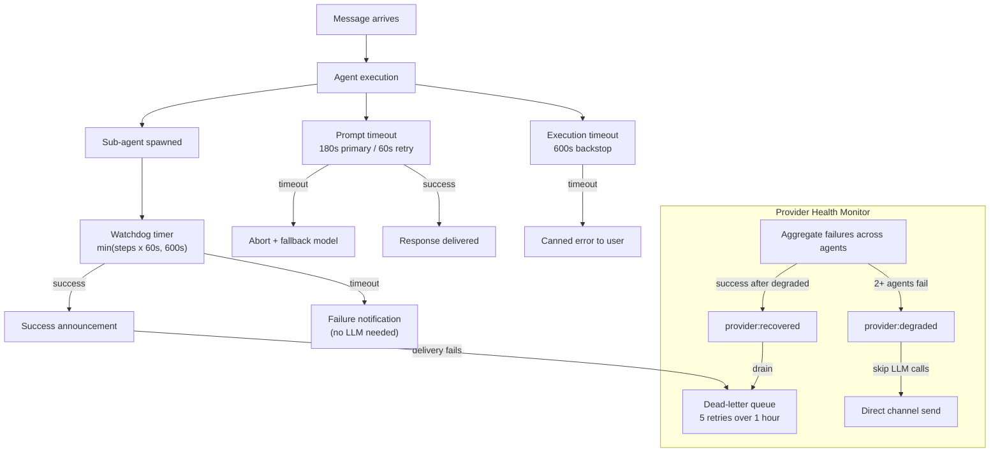

**What it does.** Catches the things that would otherwise leave your agent
quietly stuck — provider hiccups, hung LLM calls, sub-agents that never
return — and either recovers automatically or tells the user clearly that
something failed.

**Who it is for.** Operators of long-running agents. Defaults are designed
to do the right thing without configuration; you only adjust these knobs if
you see a specific failure pattern.

Provider outages, hung prompts, and stuck sub-agents can all cause silent
failures -- your agent stops responding and no one knows why. Comis prevents
this with a layered defense stack that catches failures at every level, from
individual prompt calls up to cross-agent health monitoring and a persistent
dead-letter queue for missed announcements.

Each layer operates independently and activates automatically. If an inner
layer fails to catch a problem, the next outer layer picks it up. The result
is that operators see clear log events and users always receive a response,
even during extended provider outages.

## How resilience works

The resilience stack is organized in layers from inner (closest to the LLM
call) to outer (system-wide). Each layer has a specific scope and escalation
path.


```mermaid
flowchart TD
    MSG["Message arrives"] --> EXEC["Agent execution"]
    EXEC --> PT["Prompt timeout\n180s primary / 60s retry"]
    PT -->|timeout| ABORT["Abort + fallback model"]
    PT -->|success| RESP["Response delivered"]

    EXEC --> ET["Execution timeout\n600s backstop"]
    ET -->|timeout| CANNED["Canned error to user"]

    EXEC --> SA["Sub-agent spawned"]
    SA --> WD["Watchdog timer\nmin(steps x 60s, 600s)"]
    WD -->|timeout| FAIL_NOTIFY["Failure notification\n(no LLM needed)"]
    WD -->|success| ANNOUNCE["Success announcement"]

    ANNOUNCE -->|delivery fails| DLQ["Dead-letter queue\n5 retries over 1 hour"]

    subgraph "Provider Health Monitor"
        PH["Aggregate failures across agents"]
        PH -->|2+ agents fail| DEGRADED["provider:degraded"]
        DEGRADED -->|skip LLM calls| DIRECT["Direct channel send"]
        PH -->|success after degraded| RECOVERED["provider:recovered"]
        RECOVERED -->|drain| DLQ
    end
```

The sections below describe each subsystem in order from the innermost layer
(individual prompt calls) to the outermost (system-wide sweeps).

## Prompt timeout

Every LLM call has a prompt-level deadline that prevents hung prompts from
blocking the agent indefinitely. For primary calls the deadline is a **stall
budget**: it resets on activity (stream text/thinking deltas, throttled ~1/s,
and tool completions), so the call is aborted only when NO activity occurs for
the configured window. A separate **makespan ceiling**
(`promptTimeoutMs × stallCeilingMultiplier`, default ×10) bounds the total turn
even while it is still streaming, so a runaway generation cannot reset the
stall budget forever. On abort, the agent automatically retries with a shorter
timeout or falls back to an alternate model.

- **Primary calls:** 180,000 ms (3 minutes) stall budget by default; makespan
  ceiling at ×10
- **Retry and fallback calls:** 60,000 ms (1 minute) by default — whole-turn,
  not stall-based (no reset on activity)
- **What the operator sees:** An `execution:prompt_timeout` event in logs
  (carrying which limit fired, the binding knob, and elapsed time), followed
  by an automatic retry or model fallback
- **What the user sees:** A slightly delayed response (the retry is transparent
  to the user)

The stall budget only needs to cover the longest silent gap — for local models,
typically the prefill before the first token. If your model legitimately needs
more silent time, increase `promptTimeoutMs` in the agent's config. See the
[Config YAML Reference](/reference/config-yaml) for details.

## Execution timeout

The execution timeout is a 600-second (10-minute) backstop on the entire agent
pipeline. It fires only when everything else has failed -- prompt timeouts,
retries, and fallback models have all been exhausted or are taking too long.

- **Default:** 600,000 ms (10 minutes), hardcoded
- **What the operator sees:** An `execution:aborted` event with reason
  `pipeline_timeout`
- **What the user sees:** A static error message delivered directly to the
  channel (no LLM call is made)

This timeout is intentionally longer than the worst-case model-retry chain.
If it fires regularly, investigate per-call prompt timeouts first -- the
execution timeout should rarely activate during normal operation.

## Sub-agent watchdog

When a parent agent spawns a sub-agent, a watchdog timer starts automatically.
The timer uses a dynamic formula to calculate the deadline:

> **Timeout = min(max_steps x perStepTimeoutMs, maxRunTimeoutMs)**

If `max_steps` is not set for the sub-agent, the watchdog falls back to
`maxRunTimeoutMs` directly. When the deadline passes, the watchdog force-fails
the run and sends a failure notification to the channel.

- **Default maxRunTimeoutMs:** 600,000 ms (10 minutes)
- **Default perStepTimeoutMs:** 60,000 ms (1 minute per step)
- **What the operator sees:** A `Sub-agent watchdog timeout` warning in logs
- **What the user sees:** A failure notification on the channel explaining that
  the sub-agent task did not complete in time

Both `maxRunTimeoutMs` and `perStepTimeoutMs` are configurable under
`security.agentToAgent.subagentContext`. See the
[Config YAML Reference](/reference/config-yaml) for details.

## Failure notification

When a sub-agent fails (from a watchdog timeout, execution error, or ghost
sweep), a failure notification is delivered to the channel. This notification
uses static text only -- it never makes an LLM call and never exposes raw
error details to the user.

The notification is delivered through the parent agent's announcement system
with a 30-second timeout. If the announcement does not complete within 30
seconds, delivery falls back to sending the message directly to the channel,
bypassing the parent entirely.

- **What the operator sees:** Log entries for the failure and the notification
  delivery path (announcement or direct send)
- **What the user sees:** A brief message indicating the sub-agent task did not
  complete successfully

## Provider health monitor

The provider health monitor aggregates failures across all agents to detect
provider-wide outages. It activates automatically with no configuration
required.

The monitor triggers when either condition is met within a 60-second window:

- **2 or more agents** experience failures, or
- **3 consecutive failures** from any single agent

When triggered, the monitor emits a `provider:degraded` event. While the
provider is degraded:

- LLM-dependent operations are skipped to avoid wasting tokens on a
  down provider
- Failure notifications use direct channel send instead of LLM-based
  responses
- Dead-letter queue entries accumulate for later retry

When failures stop and the provider recovers, the monitor emits a
`provider:recovered` event. The dead-letter queue automatically drains on
recovery.

- **What the operator sees:** `provider:degraded` and `provider:recovered`
  events in logs
- **What the user sees:** During degradation, static error messages instead of
  AI-generated responses. Normal service resumes automatically on recovery.

## Dead-letter queue

When an announcement delivery fails (for example, the channel is temporarily
unreachable), the message is saved to a persistent dead-letter queue backed by
a JSONL file at `~/.comis/dead-letters.jsonl`.

- **Retry policy:** Up to 5 retries per entry
- **Maximum age:** 1 hour -- entries older than this are expired and discarded
- **Automatic drain:** On `provider:recovered` events, the queue drains
  automatically, delivering all queued messages
- **What the operator sees:** `announcement:dead_lettered` events when entries
  are queued, `announcement:dead_letter_delivered` events when they are
  successfully delivered on retry

The dead-letter queue ensures that transient failures do not cause permanent
message loss. Even during extended provider outages, announcements are preserved
and delivered once the provider recovers.

### Delivery idempotency

Each sub-agent completion delivery is tagged with an idempotency key derived from
the caller's session key and the sub-agent run ID. The delivery batcher tracks
keys whose delivery has already succeeded, so a completion that is enqueued twice
within a process lifetime is delivered **once** — the second enqueue is a no-op.
This prevents a fallback or retry from double-notifying the parent.

The key is recorded only **after** a successful send, so a failed delivery is
never suppressed — it remains eligible for retry. The delivered-key set is
in-memory: a successful delivery before a restart is already complete, and
re-delivery of a dead-lettered entry across a restart is bounded by the
dead-letter queue's own retry and age limits above.

```yaml
security:
  agentToAgent:
    delivery:
      maxRetries: 3   # default — max transient delivery retries before dead-lettering (0–10)
```

- **`security.agentToAgent.delivery.maxRetries`** (default `3`, range `0`–`10`)
  bounds how many times a *transient* delivery failure is retried before the
  message is dead-lettered. Permanent failures are dead-lettered immediately.

### Self-healing delivery retries

When a completion delivery falls back to a direct channel send and that send
fails, the batcher classifies the failure before deciding what to do:

- **Transient** (network blips — connection reset/refused, socket hang up,
  timeouts, HTTP 5xx, rate limits) — retried up to `maxRetries` times with
  exponential backoff (1s, 2s, 4s, … capped at 30s) before dead-lettering. The
  common case (a momentary `ECONNRESET`/`ETIMEDOUT`) self-heals on the next
  attempt instead of being dead-lettered on the first blip.
- **Permanent** (budget exceeded, context exhausted, step-limit reached,
  killed) — dead-lettered immediately, with no wasted retries.

- **What the operator sees:** a `subagent:delivery_retried` event per retry
  attempt and a `subagent:delivery_deadlettered` event when a delivery is finally
  dead-lettered (its `transient` flag records whether retries were exhausted or
  the failure was permanent). Both carry counts and ids only — never the
  announcement text or the error string.

## Ghost sweep

The ghost sweep catches sub-agent runs that are stuck in a "running" state past
their expected lifetime. This can happen if the process crashes during execution
or an unexpected error leaves a run in an inconsistent state.

The grace period is `maxRunTimeoutMs + 120 seconds` (120,000 ms). Any run still
marked as "running" past this deadline is force-failed at ERROR level. A failure
notification is delivered to the channel.

- **Default grace period:** 720,000 ms (12 minutes) with default
  `maxRunTimeoutMs`
- **What the operator sees:** A `Ghost run detected and force-failed` error in
  logs
- **What the user sees:** A failure notification on the channel

Ghost sweeps run on a periodic schedule. They are a safety net for the
sub-agent watchdog -- if the watchdog timer itself fails to fire (due to a
process issue), the ghost sweep catches the stuck run.

## Batcher timeout

The batcher timeout is a 30-second timeout on announcement delivery through
the parent agent's announcement system. If the announcement does not complete
within 30 seconds, delivery falls back to sending the message directly to
the channel.

This timeout is automatic and requires no configuration. It ensures that a
slow or unresponsive announcement system does not delay failure notifications
to users.

- **Default:** 30,000 ms (30 seconds), automatic
- **What the operator sees:** A log entry indicating the fallback from
  announcement to direct channel send
- **What the user sees:** The same message, delivered through the fallback
  path -- no visible difference

## Summarization spend governance (DAG mode)

When the [DAG context engine](/agents/compaction#dag-mode-the-default-engine) summarizes old
history, the summarizer is an LLM call — so it is governed like any other spend
boundary. Two independent guards bound it, both per **tenant**:

- **Rolling token cap.** A per-tenant rolling-window ceiling on summarizer
  input+output tokens — `summarizerSpend.maxTokensPerTenantPerHour` (default
  500,000) and `summarizerSpend.maxTokensPerTenantPerDay` (default 5,000,000),
  well below the primary per-hour (10M) and per-day (100M) execution budgets
  because summarization is a background seam. A ceiling of `0` disables that
  window.
- **Circuit breaker.** A `summarizerBreaker` opens after
  `failureThreshold` consecutive summarizer failures (default 5) and stays open
  for `resetTimeoutMs` (default 60s) before a half-open trial, reusing the
  standard circuit-breaker config.

When **either** guard trips — the cap is exceeded or the breaker is open — the
summarizer is bypassed and the context engine **degrades to truncation-only
assembly**: it assembles the turn with a deterministic bounded truncation instead
of an LLM summary. There is no LLM call, no hang, and **no turn failure** — the
agent keeps responding with bounded cost and latency. The degrade is also never
retried inline (retrying a bypassed summarizer would defeat the bound).

- **What the operator sees:** a content-free `WARN` (with `errorKind`
  `resource` for the spend cap, `dependency` for the open breaker, plus a `hint`
  and `durationMs`) and a `context:dag_degraded` event carrying the reason
  (`spend_cap` or `breaker_open`) — ids, reason, and timing only, never message
  content.
- **What the user sees:** nothing different — the turn completes; older history is
  carried as a truncation rather than a richer summary until the window resets or
  the breaker closes.

### Emergency-fallback summaries are marked and taint-escaped

A summary produced by the truncation-only degrade path (no LLM) is flagged in its
**trusted header** with an unspoofable `fallback=emergency-truncation` marker, so
the model is told honestly that the summary is a degraded emergency truncation
rather than a full summary. The marker is driven only by the real stored
fallback flag and lives **outside** the untrusted-content region, and the summary
body itself stays taint-wrapped — so a poisoned summarized message can neither
forge the marker nor inject instructions through it. (See
[Honest presentation of summaries](/agents/compaction#honest-presentation-of-summaries).)

### Fail-closed session rollover

When a session's scope is ambiguous or malformed, the DAG ingest path **refuses
the write** rather than silently merging history across sessions. Failing closed
here prevents one session's compressed history from leaking into another. The
refusal is logged and emitted as a `context:dag_degraded` event with the reason
`fail_closed_rollover`, so an operator can see (and fix) the misconfiguration —
again, ids and reason only, never content.

## Reference: circuit breakers, retries, fallbacks

Three circuit breakers run inside Comis, each with its own scope:

| Breaker | Scope | File |
|---|---|---|
| **Provider health breaker** | Per LLM provider — opens after consecutive failures, blocks all calls during cooldown | `packages/agent/src/safety/circuit-breaker.ts` |
| **Tool retry breaker** | Per tool — classifies tool errors and decides whether to retry, fall back, or surface the error | `packages/agent/src/safety/tool-retry-breaker.ts` |
| **Layer circuit breaker** | Per context-engine layer — disables a layer for the rest of the session after 3 consecutive failures | `packages/agent/src/context-engine/context-engine.ts` |
| **Summarizer spend breaker** | Per tenant — bounds DAG summarization LLM spend with a rolling per-tenant token cap and opens after consecutive summarizer failures; degrades to truncation-only assembly (no LLM call) | `packages/agent/src/safety/summarizer-spend-breaker.ts` |

Two retry mechanisms work alongside the breakers:

- **SDK retries** — exponential-backoff retries inside the LLM provider SDK
  for transient HTTP errors (rate limits, 5xx, network timeouts).
- **Per-model fallback chain** — if the primary model fails after retries,
  Comis tries the next model in `modelFailover.fallbackModels`. Configured
  on [Models](/agents/models#fallback-models).

Vision requests use a separate fallback chain
(`packages/agent/src/model/image-router.ts`) — primary → secondary →
tertiary vision-capable models, so you never lose image understanding to a
single provider's outage.

Recovery is also automatic: when the provider health monitor emits
`provider:recovered`, the dead-letter queue drains and the next normal
request closes the breaker.

## Configuration

Most resilience features activate automatically with sensible defaults. The
configurable settings are:

```yaml title="~/.comis/config.yaml"
agents:
  default:
    # Prompt timeout -- prevents hung LLM calls
    promptTimeout:
      promptTimeoutMs: 180000        # 3 minutes for primary calls
      retryPromptTimeoutMs: 60000    # 1 minute for retry/fallback calls

    # DAG summarization spend governance (only used when contextEngine.version: "dag")
    contextEngine:
      summarizerSpend:
        maxTokensPerTenantPerHour: 500000    # rolling-hour per-tenant cap (0 = disabled)
        maxTokensPerTenantPerDay: 5000000     # rolling-day per-tenant cap (0 = disabled)
      summarizerBreaker:
        failureThreshold: 5            # consecutive summarizer failures before opening
        resetTimeoutMs: 60000          # how long the breaker stays open
        halfOpenTimeoutMs: 30000       # half-open trial window

security:
  agentToAgent:
    subagentContext:
      # Sub-agent watchdog -- kills stuck runs
      maxRunTimeoutMs: 600000        # 10 minutes hard ceiling
      perStepTimeoutMs: 60000        # 1 minute per step (dynamic timeout)
```

The summarizer spend cap, breaker, and the `contextEngine.deferCompaction`
toggle that backgrounds compaction are documented in full on the
[Compaction](/agents/compaction#configuration) and
[Config Reference](/reference/config-yaml#context-engine-agents-contextengine)
pages.

See the [Config YAML Reference](/reference/config-yaml) for the full list of
all configuration options with types, defaults, and validation rules.

<Tip>
  Start with the defaults. They are designed to handle typical provider outages
  without operator intervention. Adjust only if you see recurring timeouts in
  logs.
</Tip>

## Related

<CardGroup cols={2}>
  <Card title="Safety" icon="shield-check" href="/agents/safety">
    Budget, circuit breaker, and step limits.
  </Card>
  <Card title="Subagent Lifecycle" icon="diagram-subtask" href="/agents/subagent-lifecycle">
    Spawn packets, lifecycle hooks, and end reasons.
  </Card>
  <Card title="Troubleshooting" icon="wrench" href="/operations/troubleshooting">
    Solutions for resilience-related issues.
  </Card>
  <Card title="Config YAML Reference" icon="file-code" href="/reference/config-yaml">
    Full configuration reference for all settings.
  </Card>
</CardGroup>
