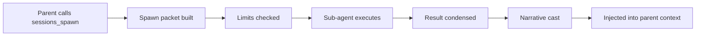

When a parent agent spawns a sub-agent, Comis does more than just start a new
conversation. It prepares a structured context packet with everything the
sub-agent needs, enforces depth and concurrency limits, manages the sub-agent's
execution, condenses the result so it fits back into the parent's context
window, and formats it for clarity. This lifecycle runs automatically whenever an agent
calls `sessions_spawn`.

## How it works

The subagent context lifecycle is a pipeline that begins when the parent agent
calls `sessions_spawn` and ends when the condensed result is injected back into
the parent's conversation.



Each stage has its own configuration options and graceful fallback behavior.
If any stage encounters an error, the pipeline degrades safely rather than
crashing -- the parent always receives a result, even if it is a structured
error message.

## Spawn packets

A spawn packet is the structured context bundle passed to a sub-agent. When `sessions_spawn` is called,
Comis assembles a packet containing everything the sub-agent needs to understand
its task, constraints, and environment.

| Field | Description |
|-------|-------------|
| `task` | The task description from the parent's `sessions_spawn` call |
| `artifactRefs` | File paths the sub-agent should reference (from `artifactRefs` parameter) |
| `domainKnowledge` | Domain knowledge extracted from the parent's system prompt |
| `toolGroups` | Tool profile groups the sub-agent is allowed to use |
| `objective` | An objective statement that survives context compaction |
| `parentSummary` | A condensed summary of the parent conversation (when `includeParentHistory` is `"summary"`) |
| `workspaceDir` | The workspace directory inherited from the parent agent |
| `depth` | The current spawn depth (0 for top-level agents) |
| `maxDepth` | The maximum allowed depth from configuration |
| `graphSharedDir` | Path to the shared pipeline folder (only present for graph/pipeline nodes) |

The spawn packet is injected into the sub-agent's context as structured
sections -- domain knowledge, artifact references, and the objective each get
their own clearly labeled section so the sub-agent can distinguish between its
task, its reference material, and its constraints.

When a sub-agent is spawned as part of an execution graph, the spawn packet
also includes the path to a shared pipeline folder. This directory is created
per-graph and gives all nodes read-write access for exchanging files and
artifacts. See [Pipelines: Shared Data Folder](/developer-guide/pipelines#shared-data-folder)
for the full lifecycle.

<Tip>
  The `objective` field is special: it survives context compaction through
  objective reinforcement. Even if the sub-agent's conversation grows long
  enough to trigger compaction, the objective is re-injected so the sub-agent
  never loses sight of what it was asked to do.
</Tip>

## Spawn limits

Two limits prevent runaway sub-agent recursion and resource exhaustion:

**`maxSpawnDepth`** (default: 3) -- Controls how deep the spawn chain can go.
A depth of 3 means parent, child, and grandchild. If a sub-agent at the maximum
depth tries to spawn another sub-agent, it receives a structured error
explaining the limit -- no crash, no silent failure.

**`maxChildrenPerAgent`** (default: 5) -- Controls how many active children a
single parent can have at once. If a parent already has 5 active sub-agents and
tries to spawn a sixth, the spawn is rejected with a structured error.

<Info>
  Execution graph (pipeline) nodes bypass the per-agent children limit but
  still respect depth limits. This allows complex pipeline orchestrations while
  preventing unbounded recursion.
</Info>

## Result condensation

When a sub-agent finishes, its result goes through a three-level condensation
pipeline. The goal is to give the parent agent a useful summary without
overwhelming its context window.

| Level | Name | When applied | What happens |
|-------|------|-------------|-------------|
| 1 | Passthrough | Result under `maxResultTokens` threshold | Wrapped in a result envelope without transformation |
| 2 | LLM Condensation | Result over threshold, model available | LLM summarizes into structured JSON with conclusions, file paths, actionable items, errors, key data, and a summary |
| 3 | Head+Tail Truncation | LLM fails or no model available | 60% head / 40% tail split with an omission marker in the middle |

Level 1 is the most common path -- most sub-agent results are concise enough to
pass through unchanged. Level 2 produces the highest quality condensation by
using an LLM to extract the most important information into a structured format.
Level 3 is a last-resort fallback that ensures the parent always receives
something, even when LLM condensation is unavailable.

<Info>
  Regardless of condensation level, the full result is always written to disk at
  `~/.comis/subagent-results/{sessionKey}/{runId}.json`. Results are retained
  for 24 hours by default (configurable via `resultRetentionMs`), after which
  they are automatically swept.
</Info>

## Narrative casting

After condensation, the result is formatted with a tagged prefix and metadata
footer so the parent agent can clearly distinguish sub-agent output from its own
conversation. This prevents role confusion when the parent has multiple active
sub-agents.

Here is an example of a narrative-cast result:

```
[Subagent Result: research-task]
Status: Completed
Condensation: Level 2 (LLM summary)

Summary: The research task identified three candidate libraries...

Conclusions:
- Library A has the best performance profile
- Library B has the most active community

File Paths:
- /workspace/research/comparison.md

---
Runtime: 12.3s | Steps: 5 | Tokens: 4500 | Cost: $0.0135
Condensation: Level 2 | Original: 15000 tokens | Ratio: 0.30
Full result: ~/.comis/subagent-results/{session}/{runId}.json
Session: {sessionKey}
```

The `[Subagent Result: {label}]` tag at the top makes it easy for the parent
agent to reference specific sub-agent outputs when coordinating multiple
concurrent tasks. The metadata footer provides observability into cost, runtime,
and condensation effectiveness.

## Objective reinforcement

When a sub-agent's conversation grows long enough to trigger the context
engine's compaction step (see [Compaction](/agents/compaction)), there is a risk
that the sub-agent loses track of its original objective. Objective
reinforcement prevents this.

After compaction produces a summary of the older messages, a
`[Objective Reinforcement]` message is injected immediately after the
compaction summary. This message contains the sub-agent's original objective
from its spawn packet, ensuring the sub-agent re-reads what it was asked to do
before continuing.

This is enabled by default (`objectiveReinforcement: true`) and uses dual
detection -- both a flag and a text pattern match -- to identify compaction
events regardless of which layer triggered them.

<Tip>
  Objective reinforcement is especially valuable for long-running sub-agents
  that go through multiple compaction cycles. Without it, a sub-agent could
  drift from its original task after the conversation is summarized.
</Tip>

## Lifecycle hooks

The subagent context lifecycle provides two hooks for managing resources and
emitting observability events:

**`prepareSpawn`** -- Called before the sub-agent begins execution. Creates the
disk directory for result storage (`~/.comis/subagent-results/{sessionKey}/`)
and returns a rollback handle. If the spawn fails for any reason (limit
rejection, configuration error), the rollback handle cleans up the created
directory so no orphaned files are left behind.

**`onEnded`** -- Called after the sub-agent finishes and its result has been
condensed and narrative-cast. Emits a `session:sub_agent_lifecycle_ended` event
with the full lifecycle metadata (end reason, runtime, token counts,
condensation level, disk path). Plugins and monitoring systems can subscribe to
this event for observability.

Both hooks degrade gracefully: if a hook fails, the spawn proceeds with fallback
behavior and a WARN-level log is emitted. Hooks never block or crash the
sub-agent lifecycle.

## Configuration

All subagent context settings live under `security.agentToAgent.subagentContext`
in your config file. The defaults work well for most setups -- you only need to
configure values you want to change.

```yaml title="~/.comis/config.yaml"
security:
  agentToAgent:
    enabled: true
    allowAgents: ["coder", "researcher"]
    subAgentMaxSteps: 50
    subAgentToolGroups: ["coding"]
    subagentContext:
      # -- Spawn limits --
      maxSpawnDepth: 3             # max depth: parent -> child -> grandchild
      maxChildrenPerAgent: 5       # max concurrent active children per parent

      # -- Result handling --
      maxResultTokens: 4000        # token threshold for condensation
      resultRetentionMs: 86400000  # full result retention (24 hours)
      condensationStrategy: "auto" # auto | always | never
      errorPreservation: true      # keep error details in condensed results

      # -- Parent context --
      includeParentHistory: "none" # none | summary
      parentSummaryMaxTokens: 1000 # token limit for parent summary

      # -- Context management --
      objectiveReinforcement: true # re-inject objective after compaction
      artifactPassthrough: true    # pass artifact refs to sub-agent
      autoCompactThreshold: 0.95   # context fill ratio for auto-compaction

      # -- Narrative casting --
      narrativeCasting: true              # format results with tags
      resultTagPrefix: "Subagent Result"  # tag prefix for result formatting
```

<Warning>
  The `autoCompactThreshold` field is present in the schema but its runtime
  effect on the context engine compaction trigger is being refined in a future
  release. The default value of 0.95 is safe to leave unchanged.
</Warning>

See the [Config YAML Reference](/reference/config-yaml) for the full list of
all `security.agentToAgent` options.

## End reasons

When a sub-agent's lifecycle ends, one of six end reasons is recorded:

| Reason | Description |
|--------|-------------|
| `completed` | The sub-agent finished its task normally |
| `failed` | An unrecoverable error occurred during execution |
| `killed` | The sub-agent was explicitly terminated by the parent agent or a budget guard |
| `swept` | The sub-agent's result files were removed by the retention sweep after `resultRetentionMs` expired |
| `watchdog_timeout` | The sub-agent exceeded its wall-clock timeout and was force-failed by the watchdog timer. See [Resilience](/agents/resilience#sub-agent-watchdog). |
| `ghost_sweep` | The sub-agent was stuck in "running" state past the grace period and was force-failed by the periodic ghost sweep. See [Resilience](/agents/resilience#ghost-sweep). |

The end reason is included in the `session:sub_agent_lifecycle_ended` event and
in the narrative-cast metadata, giving the parent agent and operators full
visibility into how each sub-agent run concluded.

## Related

<CardGroup cols={2}>
  <Card title="Sessions Tool Reference" icon="terminal" href="/agent-tools/sessions">
    Parameters and usage for sessions_spawn, sessions_kill, and other session tools.
  </Card>
  <Card title="Compaction" icon="compress" href="/agents/compaction">
    How the context engine manages conversation length, including the compaction
    that triggers objective reinforcement.
  </Card>
  <Card title="Config YAML Reference" icon="file-code" href="/reference/config-yaml">
    Full configuration reference for all subagentContext options and other
    security settings.
  </Card>
  <Card title="Event Bus" icon="tower-broadcast" href="/developer-guide/event-bus">
    Developer guide for subscribing to lifecycle events like
    session:sub_agent_lifecycle_ended.
  </Card>
  <Card title="Resilience" icon="shield-heart" href="/agents/resilience">
    Timeout guards, provider health monitoring, and dead-letter queue.
  </Card>
</CardGroup>
