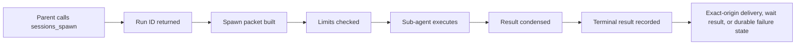

When a parent agent spawns a sub-agent, Comis does more than just start a new
conversation. It prepares a structured context packet with everything the
sub-agent needs, enforces depth and concurrency limits, manages the sub-agent's
execution, condenses the result so it fits back into the parent's context
window, and formats it for clarity. This lifecycle runs automatically whenever an agent
calls `sessions_spawn`.

## How it works

The subagent context lifecycle is a pipeline that begins when the parent agent
calls `sessions_spawn`. The call returns a run ID immediately; the lifecycle ends
when the terminal result is durably recorded and its immutable-origin delivery
reaches an accepted or explicitly recorded failure state. A parent can also
await owned children with `subagents` action `wait` without polling.


```mermaid
flowchart LR
    A[Parent calls sessions_spawn] --> B[Run ID returned]
    B --> C[Spawn packet built]
    C --> D[Limits checked]
    D --> E[Sub-agent executes]
    E --> F[Result condensed]
    F --> G[Terminal result recorded]
    G --> H[Exact-origin delivery, wait result, or durable failure state]
```

Each stage has its own configuration options and graceful fallback behavior.
If execution or post-processing fails, the run retains a typed terminal reason
and a bounded summary. Delivery uses the same durable operation identity for
retries and uncertainty handling, so an acknowledged result is not followed by
a contradictory timeout or failure notice.

## Worked example: parent spawns a research subagent

Say a primary agent named **Atlas** is asked to compile a brief on quantum
computing. Atlas decides it needs background research before writing, so it
spawns a sub-agent.

The parent invokes the `sessions_spawn` tool:

```json
{
  "tool": "sessions_spawn",
  "agent": "researcher",
  "task": "Search the web and summarize the three biggest quantum-computing breakthroughs of the last 12 months. Return a Markdown bullet list with sources.",
  "objective": "Provide background facts for a 500-word brief.",
  "artifact_refs": [],
  "include_parent_history": "none"
}
```

Comis accepts the spawn and returns immediately:

```json
{
  "runId": "research-quantum-2026-04",
  "async": true,
  "inProgress": true,
  "noteType": "background_running"
}
```

The sub-agent then runs in its own session. Its exact-origin completion
announcement, or a `subagents` wait result, carries a condensed result like
this:

```text
[Subagent Result: research-quantum-2026-04]
Status: Completed
Condensation: Level 1 (passthrough)

- Researchers at Google demonstrated... (source: nature.com/...)
- IBM unveiled the Heron R2 processor... (source: research.ibm.com/...)
- A team at Caltech reported... (source: caltech.edu/...)

---
Runtime: 18.4s | Steps: 4 | Tokens: 6200 | Cost: $0.0186
Condensation: Level 1 | Original: 6200 tokens | Ratio: 1.00
Full result: ~/.comis/subagent-results/{tenantId}/{runId}.json
Session: subagent:researcher:abc123
```

Atlas then reads the bullet list back into its own context and writes the
brief. A bounded result reference can provide authorized drill-down access when
the full output was materialized.

The key benefit: Atlas's main session never carries the raw web search
transcript. It only carries the curated three-bullet summary, which keeps
the parent's context budget under control.

## Spawn packets

A spawn packet is the structured context bundle passed to a sub-agent. When `sessions_spawn` is called,
Comis assembles a packet containing everything the sub-agent needs to understand
its task, constraints, and environment.

| Field | Description |
|-------|-------------|
| `task` | The task description from the parent's `sessions_spawn` call |
| `artifactRefs` | File paths the sub-agent should reference (from `artifactRefs` parameter) |
| `domainKnowledge` | Domain knowledge extracted from the parent's system prompt |
| `toolGroups` | Tool profile groups the sub-agent is allowed to use |
| `objective` | An objective statement that survives context compaction |
| `parentSummary` | A condensed summary of the parent conversation (when `includeParentHistory` is `"summary"`) |
| `workspaceDir` | The workspace directory inherited from the parent agent |
| `depth` | The current spawn depth (0 for top-level agents) |
| `maxDepth` | The maximum allowed depth from configuration |
| `graphSharedDir` | Path to the shared pipeline folder (only present for graph/pipeline nodes) |

The spawn packet is injected into the sub-agent's context as structured
sections -- domain knowledge, artifact references, and the objective each get
their own clearly labeled section so the sub-agent can distinguish between its
task, its reference material, and its constraints.

When a sub-agent is spawned as part of an execution graph, the spawn packet
also includes the path to a shared pipeline folder. This directory is created
per-graph and gives all nodes read-write access for exchanging files and
artifacts. See [Pipelines: Shared Data Folder](/developer-guide/pipelines#shared-data-folder)
for the full lifecycle.

<Tip>
  The `objective` field is special: it survives context compaction through
  objective reinforcement. Even if the sub-agent's conversation grows long
  enough to trigger compaction, the objective is re-injected so the sub-agent
  never loses sight of what it was asked to do.
</Tip>

## Spawn limits

Two limits prevent runaway sub-agent recursion and resource exhaustion:

**`maxSpawnDepth`** (default: 3) -- Controls how deep the spawn chain can go.
A depth of 3 means parent, child, and grandchild. If a sub-agent at the maximum
depth tries to spawn another sub-agent, it receives a structured error
explaining the limit -- no crash, no silent failure.

**`maxChildrenPerAgent`** (default: 5) -- Controls how many active children a
single parent can have at once. If a parent already has 5 active sub-agents and
tries to spawn a sixth, the spawn is rejected with a structured error.

<Info>
  Execution graph (pipeline) nodes bypass the per-agent children limit but
  still respect depth limits. This allows complex pipeline orchestrations while
  preventing unbounded recursion.
</Info>

## Result condensation

When a sub-agent finishes, its result goes through a three-level condensation
pipeline. The goal is to give the parent agent a useful summary without
overwhelming its context window.

| Level | Name | When applied | What happens |
|-------|------|-------------|-------------|
| 1 | Passthrough | Result under `maxResultTokens` threshold | Wrapped in a result envelope without transformation |
| 2 | LLM Condensation | Result over threshold, model available | LLM summarizes into structured JSON with conclusions, file paths, actionable items, errors, key data, and a summary |
| 3 | Head+Tail Truncation | LLM fails or no model available | 60% head / 40% tail split with an omission marker in the middle |

Level 1 is the most common path -- most sub-agent results are concise enough to
pass through unchanged. Level 2 produces the highest quality condensation by
using an LLM to extract the most important information into a structured format.
Level 3 is a last-resort fallback that ensures the parent always receives
something, even when LLM condensation is unavailable.

<Info>
  Regardless of condensation level, the full result is written to disk at
  `~/.comis/subagent-results/{tenantId}/{runId}.json`. Results are retained
  for 24 hours by default (configurable via `resultRetentionMs`), after which
  they are automatically swept.
</Info>

## Narrative casting

After condensation, the result is formatted with a tagged prefix and metadata
footer so the parent agent can clearly distinguish sub-agent output from its own
conversation. This prevents role confusion when the parent has multiple active
sub-agents.

Here is an example of a narrative-cast result:

```
[Subagent Result: research-task]
Status: Completed
Condensation: Level 2 (LLM summary)

Summary: The research task identified three candidate libraries...

Conclusions:
- Library A has the best performance profile
- Library B has the most active community

File Paths:
- /workspace/research/comparison.md

---
Runtime: 12.3s | Steps: 5 | Tokens: 4500 | Cost: $0.0135
Condensation: Level 2 | Original: 15000 tokens | Ratio: 0.30
Full result: ~/.comis/subagent-results/{tenantId}/{runId}.json
Session: {sessionKey}
```

The `[Subagent Result: {label}]` tag at the top makes it easy for the parent
agent to reference specific sub-agent outputs when coordinating multiple
concurrent tasks. The metadata footer provides observability into cost, runtime,
and condensation effectiveness.

Failure announcements retain both the failed run status and its terminal
classification. For example, an error-classified failed run is rendered as
`Failed — Halted (error)` rather than being flattened to an unqualified
`Failed`, so delivery does not erase the reason recorded by status and
observability surfaces.

## Objective reinforcement

When a sub-agent's conversation grows long enough to trigger the context
engine's compaction step (see [Compaction](/agents/compaction)), there is a risk
that the sub-agent loses track of its original objective. Objective
reinforcement prevents this.

After compaction produces a summary of the older messages, a
`[Objective Reinforcement]` message is injected immediately after the
compaction summary. This message contains the sub-agent's original objective
from its spawn packet, ensuring the sub-agent re-reads what it was asked to do
before continuing.

This is enabled by default (`objectiveReinforcement: true`) and uses dual
detection -- both a flag and a text pattern match -- to identify compaction
events regardless of which layer triggered them.

<Tip>
  Objective reinforcement is especially valuable for long-running sub-agents
  that go through multiple compaction cycles. Without it, a sub-agent could
  drift from its original task after the conversation is summarized.
</Tip>

## Lifecycle hooks

The subagent context lifecycle provides two hooks for managing resources and
emitting observability events:

**`prepareSpawn`** -- Awaited before the sub-agent begins execution. The built-in
hook emits the prepared lifecycle event but deliberately does not pre-create a
result directory: the success and failure writers create their own directories
when they persist output. A hook implementation may return a rollback handle;
the runner invokes it if admission or execution preparation fails.

**`onEnded`** -- Invoked as a best-effort, fire-and-forget hook after the run has
claimed its terminal state and handed any announcement to its governed delivery
path. It emits a
`session:sub_agent_lifecycle_ended` event with lifecycle metadata (end reason,
runtime, token counts, and condensation level). Its promise is not part
of the active execution set, so a stalled hook cannot retain sub-agent
concurrency capacity, keep a provider execution promise alive, or delay prompt
shutdown. A rejection emits a WARN after the terminal outcome is already owned.

`prepareSpawn` is awaited because admission resources need a rollback handle;
`onEnded` cannot change or contradict the terminal result.

## Configuration

All subagent context settings live under `security.agentToAgent.subagentContext`
in your config file. The defaults work well for most setups -- you only need to
configure values you want to change.

```yaml title="~/.comis/config.yaml"
security:
  agentToAgent:
    enabled: true
    allowAgents: ["coder", "researcher"]
    subAgentMaxSteps: 50
    subAgentToolGroups: ["coding"]
    subagentContext:
      # -- Spawn limits --
      maxSpawnDepth: 3             # max depth: parent -> child -> grandchild
      maxChildrenPerAgent: 5       # max concurrent active children per parent
      maxRunTimeoutMs: 600000      # absolute watchdog ceiling
      perStepTimeoutMs: 60000      # dynamic budget per requested step
      stuckKillThresholdMs: 180000 # idle-progress health-monitor threshold

      # -- Result handling --
      maxResultTokens: 4000        # token threshold for condensation
      resultRetentionMs: 86400000  # full result retention (24 hours)
      condensationStrategy: "auto" # auto | always | never
      errorPreservation: true      # keep error details in condensed results

      # -- Parent context --
      includeParentHistory: "none" # none | summary
      parentSummaryMaxTokens: 1000 # token limit for parent summary

      # -- Context management --
      objectiveReinforcement: true # re-inject objective after compaction
      artifactPassthrough: true    # pass artifact refs to sub-agent
      autoCompactThreshold: 0.95   # context fill ratio for auto-compaction

      # -- Narrative casting --
      narrativeCasting: true              # format results with tags
      resultTagPrefix: "Subagent Result"  # tag prefix for result formatting
```

<Warning>
  The `autoCompactThreshold` field is present in the schema but its runtime
  effect on the context engine compaction trigger is being refined in a future
  release. The default value of 0.95 is safe to leave unchanged.
</Warning>

See the [Config YAML Reference](/reference/config-yaml) for the full list of
all `security.agentToAgent` options.

## Steering a running sub-agent

The `subagents` tool's `steer` action redirects a sub-agent that is already running, and it is **distinct from `kill`**:

- **`kill`** terminates the child and tears it down cleanly. The run ends with the `killed` end reason and its in-flight work is discarded.
- **`steer`** sends a high-priority steering message to the child. *How* that message is delivered is gated behind [`security.agentToAgent.steerInject`](/reference/config-yaml#security) (default `false`):
  - **Flag off (default)** -- `steer` falls back to **kill + respawn**: the running child is killed and a fresh run is spawned with the steering message as its new task. The prior transcript and progress are discarded, and the run gets a new `runId`. This is today's behavior, unchanged.
  - **Flag on** -- `steer` **injects** the message into the *running* child's live session, preserving its transcript and progress (no kill, no respawn; the same `runId` continues).

**Next-step-boundary semantics (inject mode).** An injected steer is **not** a mid-tool-call interrupt. The child finishes its current step, the transcript for that step commits, and the steering message then lands as a user turn in the child's *next* context assembly. The child keeps everything it had done up to that boundary -- the steer adjusts course without throwing away work. (When the child is mid-stream the inject rides the streaming path; when it is idle it lands as a follow-up turn. The [`subagent:steered`](/developer-guide/event-bus) event records which via its `mode` field -- counts/ids/mode only, never the message body.)

**A steer is a message, not a privilege grant.** A steered child's tool set is fixed at spawn time, so it **cannot** be steered into using a tool on the sub-agent tool denylist -- a steered request for a denied tool is still refused with `denied to ALL sub-agents -- the parent must perform this step`, and the child's sandbox posture is unchanged. The steer text cannot widen what the child is allowed to do; it can only redirect what the child works on within its existing governance. See [`subagent.steer`](/reference/json-rpc#subagent-steer) for the RPC surface and its discriminated-union response.

**`steer` targets a *running* child.** If the target run has already `completed`/`failed` or is still `queued`, `steer` fails fast with `Run <id> is not running (status: <status>) -- cannot steer; use kill+respawn instead.` (mirroring `kill`'s precondition error) rather than attempting an inject against a child that has no live session.

**`steer` is intentionally ungated, unlike `kill`.** `kill` requires an explicit confirmation (it discards the child's in-flight work, a destructive teardown). `steer` has no confirmation gate: in inject mode it is non-destructive (the transcript and progress are preserved), and even in the flag-off kill+respawn fallback it is a course-correction, not a bare teardown. A steer is a steering *message*, so the asymmetry is deliberate.

## End reasons

When a sub-agent run reaches a terminal state, one of five completion reasons is
returned by `session.run_status` and `subagent.wait`:

| Reason | Description |
|--------|-------------|
| `completed` | The sub-agent finished its task normally |
| `failed` | An unrecoverable error occurred during execution |
| `killed` | The sub-agent was force-terminated. The kill is attributed via `killedBy` (`parent` \| `health_monitor` \| `operator` \| `system`) on the failure record, the `subagent:killed` event, and the run status the parent polls -- a daemon health-monitor stuck-kill (no observed tool/LLM progress past `stuckKillThresholdMs`) never reads as a parent kill, and it delivers an LLM-free failure notification to the announce channel |
| `watchdog_timeout` | The sub-agent exceeded its wall-clock timeout and was force-failed by the watchdog timer. See [Resilience](/agents/resilience#sub-agent-watchdog). |
| `ghost_sweep` | The sub-agent was stuck in "running" state past the grace period and was force-failed by the periodic ghost sweep. See [Resilience](/agents/resilience#ghost-sweep). |

`swept` is reserved for result-file retention cleanup after `resultRetentionMs`;
it is not a run-completion reason returned by those status surfaces. Terminal
reasons are also included in lifecycle observability and narrative metadata.

## Related

<CardGroup cols={2}>
  <Card title="Sessions Tool Reference" icon="terminal" href="/agent-tools/sessions">
    Parameters and usage for sessions_spawn, subagents kill, and other session tools.
  </Card>
  <Card title="Compaction" icon="compress" href="/agents/compaction">
    How the context engine manages conversation length, including the compaction
    that triggers objective reinforcement.
  </Card>
  <Card title="Config YAML Reference" icon="file-code" href="/reference/config-yaml">
    Full configuration reference for all subagentContext options and other
    security settings.
  </Card>
  <Card title="Event Bus" icon="tower-broadcast" href="/developer-guide/event-bus">
    Developer guide for subscribing to lifecycle events like
    session:sub_agent_lifecycle_ended.
  </Card>
  <Card title="Resilience" icon="shield-heart" href="/agents/resilience">
    Timeout guards, provider health monitoring, and dead-letter queue.
  </Card>
</CardGroup>
