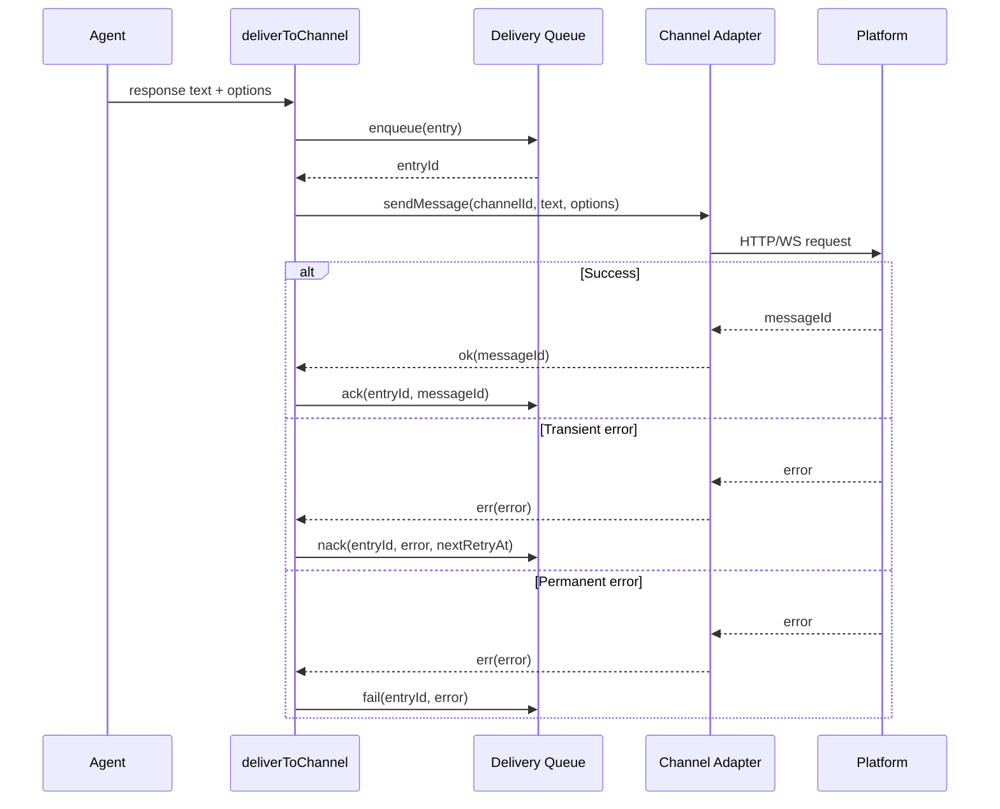
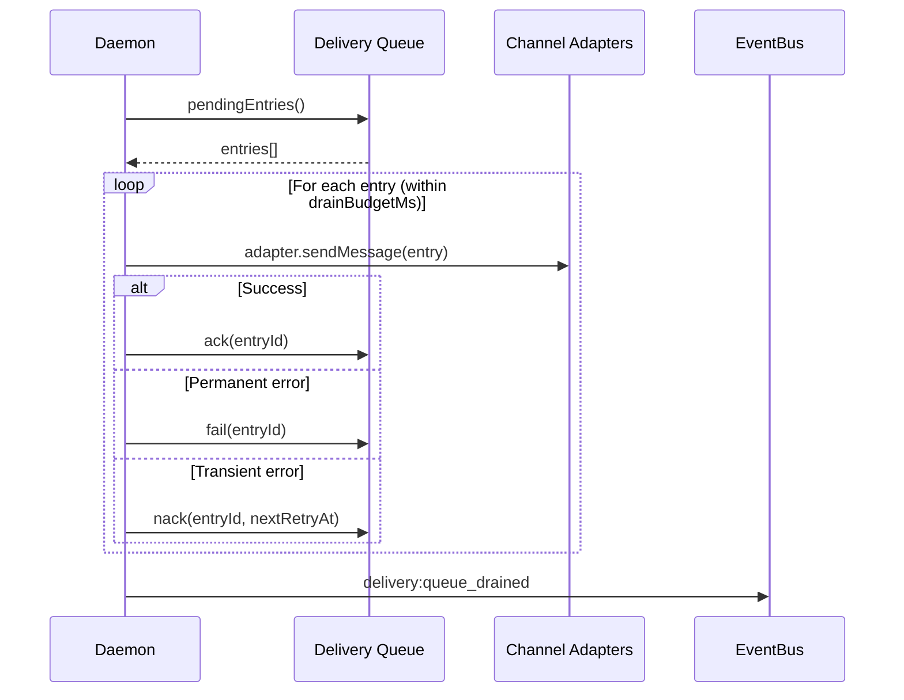

This page explains the full outbound delivery pipeline, from agent response
through crash-safe persistence to platform delivery. It covers the write-ahead
queue pattern, crash recovery, error classification, and backoff schedule.

## Pipeline overview

Every outbound message flows through `deliverToChannel`, the unified delivery
function introduced in Phase 492. This function handles chunking, format
conversion, retry logic, and delivery queue persistence in a single pipeline.

The queue operates as a write-ahead log: the message is persisted **before**
the platform send attempt, and the queue entry status is updated **after** the
platform responds. This guarantees that in-flight messages survive daemon
crashes.

## Write-ahead queue (Phase 499)

The delivery queue implements the enqueue-before-send, ack-after-delivery
pattern:

1. **Enqueue** -- Before sending to the platform, the message text and delivery
   metadata are written to a SQLite table with status `pending`.
2. **Send** -- The channel adapter sends the message to the platform.
3. **Ack** -- On success, the entry is marked `acked` with the platform
   message ID and delivery duration.
4. **Nack** -- On transient failure, the entry is marked `pending` with an
   incremented attempt count and a `scheduledAt` timestamp derived from the
   backoff schedule.
5. **Fail** -- On permanent failure or retry exhaustion, the entry is marked
   `failed` with the error reason.

The queue uses a partial index on `(status, scheduled_at) WHERE status IN
('pending', 'in_flight')` for efficient queries on active entries without
indexing the much larger set of completed/failed entries.

## Crash recovery

When the daemon starts, it runs a **startup drain cycle** if
`drainOnStartup` is enabled (the default):

Key drain behaviors:

- **Budget enforcement**: The drain cycle respects `drainBudgetMs` (default 60
  seconds). If the budget is exhausted before all entries are processed,
  remaining entries are left for future drain cycles.
- **Missing adapters**: If a channel adapter is not registered for an entry's
  `channelType`, the entry is failed immediately (the channel was removed from
  config).
- **Error classification**: The same `isPermanentError` logic is applied during
  drain as during normal delivery.

### Two-phase wiring

The daemon wires the delivery queue in two phases to resolve a circular
dependency:

1. **Phase 1** (before `setupChannels`): Create the queue adapter. Pass the
   `channelAdapters` map by reference (empty at this point).
2. **Phase 2** (after `setupChannels`): Populate the adapters map, then run
   drain + start the prune timer.

This ensures the queue adapter is available when `setupChannels` wires the
inbound pipeline (which needs `deliveryQueue` in `deliverToChannel` deps),
while the drain cycle has access to all registered channel adapters.

## Error classification

The queue classifies platform errors into two categories:

### Permanent errors (never retry)

These indicate the target chat, user, or bot state is non-recoverable:

| Pattern | Example |
|---------|---------|
| `chat not found` | Telegram: deleted group |
| `user not found` | Deleted user account |
| `bot was blocked` | User blocked the bot |
| `forbidden: bot was kicked` | Bot removed from group |
| `chat_id is empty` | Missing target identifier |
| `no conversation reference found` | No prior conversation (WhatsApp, Signal) |
| `ambiguous.*recipient` | Cannot determine target |

All 7 patterns are case-insensitive. Classification is conservative: when in
doubt, an error is treated as transient and retried.

### Transient errors (retry with backoff)

Everything that does not match a permanent pattern is treated as transient:
timeouts, rate limits, server errors, network issues. These are nacked with
the next retry timestamp based on the backoff schedule.

## Backoff schedule

The queue uses a fixed backoff schedule for cross-restart retry spacing:

| Attempt | Delay | Cumulative |
|---------|-------|-----------|
| 1 | 5 seconds | 5s |
| 2 | 25 seconds | 30s |
| 3 | 2 minutes | 2.5m |
| 4 | 10 minutes | 12.5m |
| 5+ | 10 minutes (cap) | 22.5m+ |

These delays are encoded in `QUEUE_BACKOFF_SCHEDULE_MS` and govern the
`scheduledAt` timestamp set during nack. The drain cycle only processes entries
whose `scheduledAt` has passed, so entries are naturally spaced across restarts.

Note that the in-process retry engine (Phase 492) handles immediate retries
within a single delivery attempt. The queue backoff schedule governs
**cross-restart** spacing -- the delay between successive drain attempts for
the same entry.

## Periodic pruning

Expired entries (older than `defaultExpireMs`) are cleaned up by a periodic
prune timer running at `pruneIntervalMs` intervals (default: every 5 minutes).
The timer is unref'd so it does not prevent process exit. Pruning removes
entries that exceeded their TTL without being delivered, keeping the queue
table bounded.
