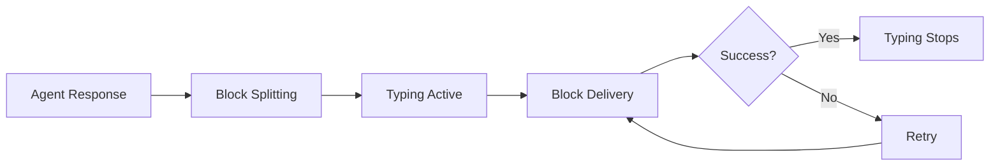

When your agent writes a response, Comis does not just dump it into the chat.
The delivery pipeline splits the response into blocks, paces them at
human-like intervals, shows typing indicators while the agent thinks, and
retries automatically on failure. This page explains each stage of the pipeline
so you can tune it for your use case.

## How delivery works

Every agent response passes through the same pipeline before reaching the chat:



1. The agent finishes writing its response (or streams it as it thinks)
2. The response is split into blocks based on your chosen chunk mode
3. Typing indicators show that the bot is active
4. Each block is delivered to the platform with pacing delays between them
5. If a delivery fails, the retry engine handles it automatically

## Block streaming

Long responses are split into smaller blocks before sending. This prevents
hitting platform message limits and creates a more natural reading experience.

### Chunk modes

Comis offers 4 ways to split responses into blocks:

| Mode | How it splits | Best for |
|---|---|---|
| `paragraph` (default) | At blank lines between paragraphs | Most conversations -- keeps related sentences together |
| `newline` | At any line break | Lists, structured output, step-by-step instructions |
| `sentence` | At sentence boundaries (periods, question marks, etc.) | Short, punchy responses |
| `length` | At an exact character count | Precise control over message size |

Code fences are never split. If your agent writes a code block, it stays in one
message even if it exceeds the normal block size.

The maximum characters per block defaults to each platform's message limit (for
example, 2,000 for Discord or 4,096 for Telegram). You can override this with
the `chunkMaxChars` setting.

### Streaming methods

Different platforms support different ways of delivering blocks as the agent
writes:

**Edit** (Discord, Telegram, Slack): Sends the first block, then keeps editing
the same message with new text as the agent writes. This creates a
"live typing" effect similar to ChatGPT. Edit throttle rates prevent
overwhelming the platform API: Discord at 500 ms, Telegram at 300 ms, Slack
at 400 ms.

**Block** (WhatsApp, Signal): Sends each block as a separate message. These
platforms cannot edit sent messages, so each block arrives as its own message.
WhatsApp throttles at 600 ms, Signal at 500 ms.

**None** (iMessage, LINE, IRC): No streaming. The full response is sent after
the agent finishes writing. Long responses are still split by the block chunker,
but all blocks are sent at once rather than progressively.

## Block pacing

Block pacing controls the timing between messages. Instead of flooding the chat
with all blocks at once, Comis spaces them out at intervals you can configure.

### Pacing modes

| Mode | What it does | When to use |
|---|---|---|
| `off` | Send all blocks instantly with no delay | High-throughput bots where speed matters more than feel |
| `natural` (default) | Random human-like delays between 800 and 2,500 ms | Most use cases -- makes the bot feel like a human typing |
| `custom` | You set the minimum and maximum delay | Fine-tuning for specific audiences or platforms |
| `adaptive` | Adjusts delay based on block length -- longer blocks get longer pauses | Long-form content where readers need time to absorb each block |

The first block is always sent immediately (unless you configure
`firstBlockDelayMs` to add a delay). Short consecutive blocks are automatically
combined into one message to prevent notification spam.

If a new message arrives from the user while blocks are being delivered, the
remaining blocks are sent immediately. This means the bot does not keep typing
an old response when the user has already moved on.

```yaml
streaming:
  defaultDeliveryTiming:
    mode: "natural"
    minMs: 800
    maxMs: 2500
    jitterMs: 200
```

## Typing indicators

Typing indicators are the "User is typing..." status that appears in chat
applications. Comis uses them to show users that the bot is active and working
on a response.

### Typing modes

| Mode | When typing shows | Best for |
|---|---|---|
| `never` | Typing indicator is never sent | Bots that should feel invisible or automated |
| `instant` | Shows typing the moment a message is received | Fast bots where you want immediate feedback |
| `thinking` (default) | Shows typing from when the agent starts processing until the response is delivered | Most use cases -- reassures users the bot is working |
| `message` | Shows typing while blocks are being delivered to the channel | Slow delivery pacing where each block takes time |

Typing indicators are fire-and-forget. If showing the typing status fails (for
example, due to a network hiccup), it never blocks or delays message delivery.

### Typing lifecycle

Comis uses a dual idle signal to ensure typing indicators accurately reflect
the bot's activity. Rather than stopping typing as soon as the agent finishes
thinking, typing persists through the entire delivery phase:

1. The agent finishes generating its response -- a **run-complete** signal fires
2. The delivery pipeline sends all message blocks to the platform
3. When delivery finishes, a **dispatch-idle** signal fires
4. Typing stops only after **both** signals have fired

This eliminates the jarring gap where typing disappears but the message has not
arrived yet. From the user's perspective, typing shows continuously from when
the bot starts working until the response appears in the chat.

**Grace timeout:** If delivery takes too long (more than 10 seconds after the
agent finishes), typing force-stops automatically. This prevents indefinite
typing indicators if something goes wrong in the delivery pipeline.

**Content-driven refresh:** During long tool executions (such as running a
bash command or calling an external API), typing stays alive because each
tool invocation resets the typing TTL. Without this, typing would disappear
during a 30-second tool execution even though the bot is actively working.

### Per-platform refresh intervals

Different platforms expire typing indicators at different rates. Comis
automatically uses optimal refresh intervals for each platform:

| Platform | Refresh Interval | Platform Expiry | Notes |
|----------|-----------------|-----------------|-------|
| Telegram | 4,000 ms | 5 s | 1 s margin before expiry |
| Discord | 8,000 ms | 10 s | 2 s margin before expiry |
| WhatsApp | 8,000 ms | ~10 s | Composing presence via Baileys |
| Signal | 4,000 ms | ~5 s | |
| LINE | 15,000 ms | 20 s | Uses showLoadingAnimation |
| iMessage | 4,000 ms | ~5 s | Process-based expiry |
| IRC | _(none)_ | _(n/a)_ | No typing API -- defaults to `never` |
| Slack | _(none)_ | _(n/a)_ | No typing API -- defaults to `never` |

These defaults are applied automatically. You can override the refresh interval
per channel with `typingRefreshMs` in the per-channel streaming config.

### Typing resilience

Typing indicators include built-in resilience mechanisms that prevent runaway
indicators and handle platform failures gracefully:

**Circuit breaker:** If sending the typing indicator fails
`typingCircuitBreakerThreshold` times consecutively (default: 3), the indicator
is permanently stopped for that message. This prevents log noise from persistent
platform failures. The counter resets on any successful send.

**TTL (Time-to-Live):** Typing indicators automatically stop after `typingTtlMs`
milliseconds (default: 60,000 ms / 1 minute). This prevents indefinite typing
indicators if the agent execution hangs or takes unusually long. The TTL refreshes
on each content signal (text delta from the model), so active generation keeps the
indicator alive.

**Sealed state:** Once a typing indicator stops (via explicit stop, TTL expiry, or
circuit breaker trip), it cannot be restarted for that message. This prevents
flickering indicators.

**Lifecycle coordination:** The typing lifecycle controller wraps the base
typing controller with dual idle signal tracking. In normal operation, the
`dispose()` method is called in a `finally` block to guarantee cleanup even
on errors. The lifecycle controller does not interfere with the sealed state,
circuit breaker, or TTL mechanisms -- those continue to operate on the
underlying controller.

```yaml
streaming:
  defaultTypingMode: "thinking"
  perChannel:
    telegram:
      typingRefreshMs: 4500
      typingCircuitBreakerThreshold: 5  # more tolerant
      typingTtlMs: 120000               # 2 minutes for long tasks
    discord:
      typingRefreshMs: 8000
```

### Sub-agent typing

When an agent delegates work to a sub-agent, you normally see 30 seconds to
several minutes of silence while the sub-agent executes. Comis solves this by
showing a typing indicator on the parent channel for the entire duration of
sub-agent execution.

**How it works:**

1. A sub-agent starts executing on behalf of the parent agent
2. A typing indicator appears on the channel where the user sent their message
3. Typing persists continuously while the sub-agent runs (tool calls, LLM
   reasoning, file operations)
4. When the sub-agent finishes, typing stops and the completion announcement
   arrives

The proxy uses the same per-platform refresh intervals as regular typing
indicators (see the table above), so the behavior feels consistent regardless
of whether the main agent or a sub-agent is doing the work.

**Thread awareness:** If the original message was sent in a forum topic or
thread, the typing indicator appears in that specific thread, not the main
channel.

**Crash safety:** If a sub-agent crashes or is killed, the typing indicator
stops immediately. A background cleanup sweep also removes any orphaned
indicators after 5 minutes, so typing never persists indefinitely even in
unexpected failure scenarios.

**Channels without typing:** Platforms that do not support typing indicators
(IRC, Slack) are automatically skipped. No configuration is needed.

## Retry logic

If sending a message fails due to a network error, rate limit, or server error,
Comis retries automatically using exponential backoff with jitter.

**Exponential backoff** means the bot waits longer between each retry attempt.
The first retry might wait 500 ms, the second might wait 1,000 ms, the third
might wait 2,000 ms, and so on -- up to a maximum of 30 seconds. **Jitter**
adds a small random amount to each wait time so that multiple bots hitting the
same server do not all retry at the exact same moment.

**Default retry behavior:**
- 3 attempts per message
- Starting delay of 500 ms
- Maximum delay of 30 seconds
- Jitter enabled by default

If the platform returns a "retry after X seconds" header (common with rate
limits), Comis respects it and waits the requested amount of time before
retrying.

**Automatic plain-text fallback:** If a message fails because of a formatting
error (for example, invalid HTML for Telegram or invalid Markdown for Discord),
Comis automatically retries with plain text. This prevents formatting issues
from blocking message delivery.

**Safety guard:** If 2 or more consecutive blocks fail delivery, the remaining
blocks in the response are aborted. This prevents a retry storm where the bot
keeps trying to send messages to a platform that is down or has blocked it.

## Delivery strategies

When a multi-chunk response encounters a send failure, Comis can either stop
or keep going. The **delivery strategy** controls this behavior.

| Strategy | Behavior | When to use |
|---|---|---|
| `all-or-abort` (default) | Stops sending after the first failed chunk | When message ordering and completeness matter (conversations, instructions) |
| `best-effort` | Skips the failed chunk and delivers the rest | When partial delivery is better than no delivery (status updates, notifications) |

In all-or-abort mode (the default), a failed chunk stops the entire delivery.
The remaining chunks are never sent. This is the safest choice because users
see either the full response or nothing, never a confusing partial message.

In best-effort mode, each chunk is sent independently. If chunk 2 of 5 fails,
chunks 3, 4, and 5 are still delivered. The failed chunk is logged and reported
via the `delivery:complete` event, but delivery continues. Failed chunks are
marked as terminal in the delivery queue and are not retried later.

<Note>
Best-effort mode is not the default. If you want partial delivery, enable it
explicitly in your streaming configuration.
</Note>

## Stopping delivery

The `/stop` command cancels both the agent's thinking and any in-flight message
delivery. When a user sends `/stop`:

1. The agent execution is aborted (the LLM stops generating)
2. Any blocks waiting for pacing delays are cancelled immediately
3. The current chunk (if mid-send) completes naturally -- Comis never interrupts
   a platform API call in progress
4. Remaining unsent chunks are skipped entirely

This means `/stop` is responsive even during long deliveries with pacing delays
between blocks. There is no waiting for the next block timer to expire.

### What happens to the delivery queue

Comis uses **abort-is-clean** semantics. When delivery is cancelled:

- Chunks already delivered to the platform remain delivered (cannot be recalled)
- Chunks that were queued but not yet sent are acknowledged in the delivery queue
  with an abort marker -- they are not retried later
- No orphaned entries remain in the queue after a `/stop`

The `delivery:aborted` event fires with the abort reason and a count of how many
chunks were delivered before cancellation.

<Note>
The retry engine also respects the abort signal. If a retry sleep is in progress
when `/stop` fires, the sleep resolves immediately rather than waiting for the
full backoff period.
</Note>

## Markdown rendering

Agent responses are written in Markdown. Comis automatically converts them to
each platform's native format before sending:

| Platform | Format | What is preserved |
|---|---|---|
| Discord | Markdown | Bold, italic, code blocks, links, lists, headers |
| Telegram | HTML | Bold, italic, code blocks, links, lists |
| Slack | mrkdwn | Bold, italic, code blocks, links, lists |
| WhatsApp | Plain text | Formatting stripped (WhatsApp does not support bot formatting) |
| Signal | Plain text | Formatting stripped |
| iMessage | Plain text | Formatting stripped |
| LINE | Flex Messages | Rich layout when using Flex, otherwise plain text |
| IRC | Plain text | IRC control codes for bold only |

## Delivery hooks

Comis supports two delivery lifecycle hooks that plugins can register to
intercept or observe outbound messages. These hooks run as part of the delivery
pipeline -- before the message is formatted and sent, and after delivery
completes.

### Hook lifecycle

Every outbound message passes through the hooks in this order:

```
Agent response --> before_delivery hook --> Format --> Chunk --> Send --> after_delivery hook
```

**`before_delivery`** (modifying) -- Fires before each outbound message is
formatted and sent. Your handler receives the raw text and can modify it or
cancel delivery entirely. Handlers run sequentially in priority order (higher
priority first), and results are merged using last-writer-wins for each field.

**`after_delivery`** (void) -- Fires after delivery completes, whether it
succeeded or failed. Handlers run in parallel, fire-and-forget. Errors in
after_delivery hooks are caught and logged without affecting the response.

### Cancelling delivery

If a `before_delivery` handler returns `{ cancel: true }`, the message is not
sent. A `delivery:hook_cancelled` event is emitted so observability subscribers
can track cancellations. The cancellation reason (if provided) is included in
the event and logged at INFO level.

```typescript
registry.registerHook("before_delivery", (event, ctx) => {
  if (containsSensitiveContent(event.text)) {
    return {
      cancel: true,
      cancelReason: "Message contained sensitive content",
    };
  }
});
```

<Tip>
Hook cancellation is distinct from delivery failure. Cancellation returns a
successful result (the hook intentionally stopped the message), while a delivery
failure triggers retry logic.
</Tip>

### Registering hooks

Register delivery hooks through the plugin system. Each plugin calls
`registerHook` during its `register()` method:

```typescript
registry.registerHook("before_delivery", (event, ctx) => {
  // event.text: the raw outbound message text
  // event.channelType: "telegram", "discord", etc.
  // event.channelId: target channel identifier
  // event.origin: what triggered this delivery (e.g., "agent", "command")
  // ctx.agentId, ctx.sessionKey, ctx.traceId: request context

  // Return modified fields, or nothing to pass through unchanged
  return { text: event.text.replace(/badword/gi, "***") };
}, { priority: 10 });

registry.registerHook("after_delivery", (event, ctx) => {
  // event.result: delivery outcome
  // event.durationMs: how long delivery took
  console.log(`Delivered to ${event.channelType} in ${event.durationMs}ms`);
});
```

See the [Plugins guide](/developer-guide/plugins) for full plugin development
documentation, including priority ordering, the `PluginPort` interface, and
registration lifecycle.

### Use cases

- **Content moderation** -- Filter or redact sensitive content before sending
  (PII, profanity, secrets)
- **Compliance logging** -- Create an audit trail of all outbound messages with
  timestamps, channels, and agent identifiers
- **Analytics** -- Track delivery latency, success rates, and message volumes
  per channel
- **Session mirroring** -- Record outbound messages so the agent remembers
  what it sent (see [Session Mirroring](#session-mirroring) below)

### Hook result fields

The `before_delivery` handler can return any combination of these fields:

| Field | Type | Description |
|---|---|---|
| `text` | string | Replace the outbound message text (max 50,000 characters) |
| `cancel` | boolean | Cancel delivery entirely |
| `cancelReason` | string | Reason for cancellation, included in logs (max 500 characters) |
| `metadata` | object | Attach arbitrary metadata to the delivery (passed to after_delivery) |

Return values are validated against a Zod schema before merging. Invalid returns
are logged and ignored, protecting the pipeline from malformed hook output.

## Session mirroring

Agents remember what they sent. After a message is delivered to a chat channel,
the delivered text is recorded to the `delivery_mirror` SQLite table. On the
next inbound user message, pending mirror entries are injected as synthetic
assistant context in the dynamic preamble so the agent has continuity of what it
previously said -- even after a daemon restart.

<Info>
Session mirroring is powered by the `after_delivery` hook. It runs automatically
when enabled and requires no plugin installation -- it is a built-in daemon
subsystem.
</Info>

### Recording flow

When the agent sends a message, the mirror records it in four steps:

1. Message is delivered to the channel via `deliverToChannel()`
2. The `after_delivery` hook fires (void, fire-and-forget)
3. The built-in `comis:delivery-mirror` plugin handler records the entry to the
   `delivery_mirror` table
4. An idempotency key (session + text hash + 1-second time bucket) prevents
   duplicates via `INSERT OR IGNORE`

Recording never blocks or delays message delivery. If recording fails for any
reason, the message is still delivered normally -- only the mirror entry is lost.

### Injection flow

When the user sends their next message, mirror entries are injected into the
agent prompt:

1. User sends a message, agent execution starts
2. `assembleExecutionPrompt()` calls `deliveryMirror.pending(sessionKey)` to
   fetch unacknowledged entries
3. Pending entries are formatted as "Your Recent Outbound Messages" in the
   dynamic preamble section of the prompt
4. Budget caps are applied (max entries, then max characters)
5. Injected entries are acknowledged so they will not appear again

The dynamic preamble is the right location for mirror context because it changes
every turn without invalidating the static system prompt cache.

### Configuration

All session mirroring settings live under the `deliveryMirror` key in your
config file:

```yaml
deliveryMirror:
  enabled: true              # Enable or disable session mirroring
  retentionMs: 86400000      # How long entries are kept (default: 24 hours)
  pruneIntervalMs: 300000    # How often old entries are pruned (default: 5 minutes)
  maxEntriesPerInjection: 10 # Max mirror entries per prompt injection
  maxCharsPerInjection: 4000 # Max total characters injected into prompt
```

| Setting | Type | Default | Description |
|---|---|---|---|
| `enabled` | boolean | `true` | Enable or disable the entire mirror subsystem. When disabled, no entries are recorded or injected. |
| `retentionMs` | number | `86400000` (24h) | Maximum age of mirror entries before they are pruned. Entries older than this are deleted on the next prune sweep. |
| `pruneIntervalMs` | number | `300000` (5m) | Interval between automatic prune sweeps. Each sweep deletes entries older than `retentionMs`. |
| `maxEntriesPerInjection` | number | `10` | Maximum number of mirror entries injected into a single prompt. Oldest entries beyond this limit are acknowledged without injection. |
| `maxCharsPerInjection` | number | `4000` | Maximum total characters across all injected entries. Once the character budget is exhausted, remaining entries are skipped. |

<Warning>
Setting `maxCharsPerInjection` too high can consume a significant portion of
the context window, leaving less room for conversation history and tool results.
The default of 4,000 characters is a conservative balance.
</Warning>

### Lifecycle

Each mirror entry follows this lifecycle:

```
Record --> Pending --> Inject --> Acknowledge --> Prune
```

1. **Record** -- The `after_delivery` hook writes the entry with status
   `pending`
2. **Pending** -- The entry waits in the `delivery_mirror` table until the next
   agent execution for that session
3. **Inject** -- `assembleExecutionPrompt()` fetches pending entries, applies
   budget caps, and includes them in the prompt
4. **Acknowledge** -- Injected entries are marked as `acknowledged` so they are
   not injected again
5. **Prune** -- A periodic timer deletes entries older than `retentionMs`,
   regardless of status

Entries that exceed the budget caps during injection are left as `pending` and
will be included in the next prompt (if they still fit the budget).

### Crash resilience

Mirror entries are stored in SQLite with WAL mode. If the daemon crashes or
restarts:

- **Unacknowledged entries survive.** On the next inbound message after restart,
  the agent will see its previous outbound messages in the prompt, maintaining
  context continuity.
- **The prune timer restarts automatically.** Old entries are cleaned up on the
  regular schedule after the daemon comes back up.
- **No manual intervention is needed.** The mirror subsystem initializes during
  daemon boot and resumes from the persisted state.

## Reply modes

By default, Comis replies to the triggering message on the first chunk of each
response in group chats. This threads the conversation so users can follow which
response belongs to which question. Reply modes let you control this threading
behavior per channel and per chat type.

### Available modes

| Mode | Behavior | Best for |
|---|---|---|
| `off` | Never set reply-to on outbound messages -- messages appear standalone | Bots that post announcements or broadcast content |
| `first` (default) | Reply-to on the first chunk only -- subsequent chunks appear as standalone follow-ups | Most conversational bots -- threads the response without over-threading |
| `all` | Reply-to on every chunk -- full threading | Forums and topic-based chats where every message should be threaded |

### Configuration

Reply modes can be set at three levels, from broadest to most specific.

**Global default** -- Applies to all channels unless overridden:

```yaml
streaming:
  defaultReplyMode: "first"
```

**Per-channel override** -- Applies to all conversations on a specific channel:

```yaml
streaming:
  perChannel:
    telegram:
      replyMode: "all"
    discord:
      replyMode: "off"
```

**Per-chat-type override** -- The most specific level. Overrides the channel-level
setting for a particular conversation type:

```yaml
streaming:
  perChannel:
    telegram:
      replyMode: "first"
      replyModeByChatType:
        dm: "off"
        group: "first"
        forum: "all"
```

### Resolution order

Comis resolves the reply mode using a three-level chain. The most specific match
wins:

```
per-chat-type override > per-channel replyMode > global defaultReplyMode > "first"
```

For example, if a message arrives in a Telegram forum and the config above is
active, the resolution is: `replyModeByChatType.forum` = `"all"`. If there were
no forum entry, it would fall back to the channel-level `replyMode` of `"first"`,
then to `defaultReplyMode`, and finally to the hardcoded default of `"first"`.

### System messages

System messages (compaction notices, system announcements, internal
notifications) always thread regardless of the reply mode setting. This prevents
system messages from appearing as standalone messages in group conversations
where they could be confusing without context.

<Warning>
System message threading is not configurable. It is a safety measure to keep
operational messages visually connected to the conversation they belong to.
</Warning>

### Chat types

The following normalized chat types can be used as keys in `replyModeByChatType`.
Each platform's native conversation types are mapped to these categories
automatically:

| Chat type | Description | Platform examples |
|---|---|---|
| `dm` | Direct/private messages | Telegram private chats, Discord DMs, WhatsApp 1:1, Signal 1:1 |
| `group` | Group conversations | Telegram groups, Discord servers, WhatsApp groups, Signal groups |
| `thread` | Threaded conversations | Slack threads, Discord threads |
| `channel` | Broadcast channels | IRC channels |
| `forum` | Forum topics | Telegram forum topics, Discord forum posts |

## Full configuration reference

Here is a complete example showing all delivery-related options:

```yaml
streaming:
  enabled: true
  defaultChunkMode: "paragraph"
  defaultTypingMode: "thinking"
  defaultReplyMode: "first"
  defaultDeliveryTiming:
    mode: "natural"
    minMs: 800
    maxMs: 2500
    jitterMs: 200
    firstBlockDelayMs: 0
  perChannel:
    telegram:
      chunkMode: "paragraph"
      typingMode: "thinking"
      typingRefreshMs: 4500
      typingCircuitBreakerThreshold: 3
      typingTtlMs: 60000
      replyMode: "first"
      replyModeByChatType:
        dm: "off"
        group: "first"
        forum: "all"
    discord:
      typingRefreshMs: 8000
      replyMode: "off"
    whatsapp:
      chunkMode: "paragraph"
      typingMode: "thinking"
      typingRefreshMs: 8000
```

Each channel can override any of the default settings through the `perChannel`
section. Options not specified in `perChannel` fall back to the defaults above.

<CardGroup cols={2}>
  <Card title="All Channels" icon="message-dots" href="/channels">
    Compare all 9 supported platforms side by side.
  </Card>
  <Card title="Plugins" icon="puzzle-piece" href="/developer-guide/plugins">
    Hook registration and plugin development.
  </Card>
  <Card title="Configuration Reference" icon="book" href="/reference/config-yaml">
    Full configuration options for every Comis setting.
  </Card>
  <Card title="Troubleshooting" icon="wrench" href="/operations/troubleshooting">
    Common issues and how to fix them.
  </Card>
</CardGroup>
