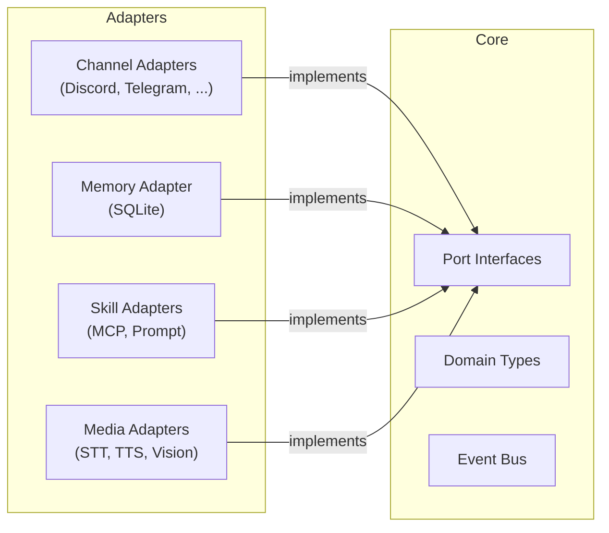
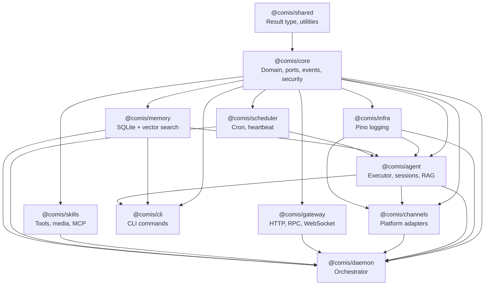

Comis follows hexagonal architecture (ports and adapters). The core domain defines port interfaces that describe what the system needs. Adapter packages implement those interfaces with platform-specific code. This separation means you can swap implementations (e.g., replace SQLite memory with PostgreSQL) without touching the core, and the core compiles without knowing which adapters exist.

All 13 packages adhere to this pattern. The dependency direction is always inward -- adapters depend on ports, never on each other.

## Hexagonal Pattern

The architecture has three conceptual layers:

**Core** (`@comis/core`) -- Domain types, port interfaces, event bus, security primitives, config schemas. This is the center of the hexagon. It defines WHAT the system does, never HOW.

**Ports** (interfaces in `core/src/ports/`) -- Contracts that the outside world must satisfy. A port says "I need something that can send messages" without specifying whether it's Discord, Telegram, or a test mock.

**Adapters** (implementations in other packages) -- Concrete implementations of port interfaces. The Telegram adapter implements `ChannelPort` using the Telegram Bot API. The SQLite adapter implements `MemoryPort` using better-sqlite3. The Echo adapter implements `ChannelPort` with an in-memory message store for testing.



This means any adapter can be replaced or added without modifying core. To add a new chat platform, you implement the `ChannelPort` interface. To add a new storage backend, you implement `MemoryPort`. The rest of the system doesn't know or care which concrete adapter is running.

## Port Interfaces

Comis defines 19 port interfaces organized into 4 categories. All ports live in `packages/core/src/ports/` and are exported from `@comis/core`.

### Core Ports

The foundational interfaces that define the primary system boundaries:

| Port | File | Purpose | Adapters |
|------|------|---------|----------|
| `ChannelPort` | `ports/channel.ts` | Chat platform messaging boundary | 10 adapters (Discord, Telegram, Slack, WhatsApp, Signal, iMessage, LINE, IRC, Echo, Email) |
| `ChannelPluginPort` | `ports/channel-plugin.ts` | Plugin wrapper for channel adapters | One per channel adapter |
| `MemoryPort` | `ports/memory.ts` | Persistent memory with vector search | `SqliteMemoryAdapter` |
| `SkillPort` | `ports/skill.ts` | Skill execution boundary | `SkillRegistry`, MCP client |
| `EmbeddingPort` | `ports/embedding.ts` | Text-to-vector embedding | External LLM providers |
| `PluginPort` | `ports/plugin.ts` | Plugin extension boundary | Any custom plugin |

### Media Ports

Interfaces for processing media content -- speech, images, video, and documents:

| Port | File | Purpose | Adapters |
|------|------|---------|----------|
| `TranscriptionPort` | `ports/transcription-port.ts` | Speech-to-text | OpenAI, Groq, Deepgram |
| `TTSPort` | `ports/tts-port.ts` | Text-to-speech | OpenAI, ElevenLabs, Edge TTS |
| `ImageAnalysisPort` | `ports/image-analysis-port.ts` | Vision AI image analysis | OpenAI, Anthropic, Google |
| `VisionProvider` | `ports/vision-port.ts` | Multi-capability vision (image + video) | Multi-provider vision |
| `MediaResolverPort` | `ports/media-resolver-port.ts` | Platform-specific media download | Per-platform resolvers, CompositeResolver |
| `FileExtractionPort` | `ports/file-extraction-port.ts` | Document text extraction | PDF, text, CSV extractors |

### Security Ports

Interfaces for security, secrets, and identity management:

| Port | File | Purpose | Adapters |
|------|------|---------|----------|
| `OutputGuardPort` | `ports/output-guard.ts` | LLM output safety scanning | Content scanner |
| `SecretStorePort` | `ports/secret-store.ts` | Encrypted secret storage | File-based secret store |
| `CredentialMappingPort` | `ports/credential-mapping.ts` | Credential-to-injection binding | Config-based mapper |
| `DeviceIdentityPort` | `ports/device-identity.ts` | Cryptographic device identity | Hardware identity manager |

### Infrastructure Ports

Interfaces for message delivery, image generation, and other infrastructure services:

| Port | File | Purpose | Adapters |
|------|------|---------|----------|
| `ImageGenerationPort` | `ports/provider.ts` | Image generation | FAL, OpenAI |
| `DeliveryQueuePort` | `ports/delivery-queue.ts` | Crash-safe outbound delivery | `SqliteDeliveryQueue` |
| `DeliveryMirrorPort` | `ports/delivery-mirror.ts` | Session delivery mirroring | `SqliteDeliveryMirror` |

### Example: ChannelPort

The most important port interface is `ChannelPort` -- the boundary between the platform-agnostic core and platform-specific chat adapters. Here is a simplified view of its key methods:

```typescript
// packages/core/src/ports/channel.ts
import type { Result } from "@comis/shared";
import type { NormalizedMessage, SendMessageOptions } from "@comis/core";

export interface ChannelPort {
  readonly channelId: string;
  readonly channelType: string;

  start(): Promise<Result<void, Error>>;
  stop(): Promise<Result<void, Error>>;

  sendMessage(
    channelId: string,
    text: string,
    options?: SendMessageOptions,
  ): Promise<Result<string, Error>>;

  editMessage(
    channelId: string,
    messageId: string,
    text: string,
  ): Promise<Result<void, Error>>;

  onMessage(handler: MessageHandler): void;

  reactToMessage(
    channelId: string,
    messageId: string,
    emoji: string,
  ): Promise<Result<void, Error>>;

  deleteMessage(
    channelId: string,
    messageId: string,
  ): Promise<Result<void, Error>>;

  fetchMessages(
    channelId: string,
    options?: FetchMessagesOptions,
  ): Promise<Result<FetchedMessage[], Error>>;

  sendAttachment(
    channelId: string,
    attachment: AttachmentPayload,
    options?: SendMessageOptions,
  ): Promise<Result<string, Error>>;

  platformAction(
    action: string,
    params: Record<string, unknown>,
  ): Promise<Result<unknown, Error>>;

  getStatus?(): ChannelStatus;
}
```

<Tip>
Every method returns `Result<T, Error>` instead of throwing exceptions. See the Result Pattern section below for why this matters.
</Tip>

Notice the pattern: lifecycle methods (`start`, `stop`), messaging methods (`sendMessage`, `editMessage`, `deleteMessage`), media methods (`sendAttachment`), and an escape hatch (`platformAction`) for platform-specific operations not covered by the generic interface.

## Composition Root

The `bootstrap()` function in `core/src/bootstrap.ts` is the composition root -- the single place where all concrete implementations are wired to port interfaces. It returns an `AppContainer` that holds the fully configured application.

```typescript
import type { Result } from "@comis/shared";
import type { AppConfig, ConfigError } from "@comis/core";

export interface AppContainer {
  readonly config: AppConfig;
  readonly eventBus: TypedEventBus;
  readonly secretManager: SecretManager;
  readonly pluginRegistry: PluginRegistry;
  readonly hookRunner: HookRunner;
  shutdown: () => Promise<void>;
}
```

The bootstrap flow creates these services in a specific order:

1. **SecretManager** -- Loads encrypted secrets from environment variables. This must be created first because config loading may need to resolve secret references.
2. **Config** -- Loads layered configuration: defaults, then YAML files, then environment overrides. Secret references in config values are resolved via the SecretManager.
3. **TypedEventBus** -- Creates the typed event bus with compile-time safety for all events across the `EventMap` interface.
4. **PluginRegistry** -- Creates the plugin registry that discovers, registers, and manages plugins. Connected to the event bus for audit events.
5. **HookRunner** -- Creates the hook execution engine that runs lifecycle hooks at the appropriate points. Connected to the plugin registry to discover registered hooks.

The `bootstrap()` function returns `Result<AppContainer, ConfigError>` -- it never throws. If config loading fails or secrets are missing, you get an explicit error you can handle.

<Info>
The composition root is the ONLY place where concrete implementations are wired to port interfaces. If you're adding a new adapter, this is where it gets connected.
</Info>

## Result Pattern

Every function in Comis returns `Result<T, E>` from `@comis/shared` -- no thrown exceptions anywhere in the codebase. This is enforced by ESLint rules that block `throw` statements.

The `Result` type is a discriminated union:

```typescript
import { ok, err, tryCatch, fromPromise, type Result } from "@comis/shared";

// Result is either { ok: true, value: T } or { ok: false, error: E }
type Result<T, E = Error> =
  | { readonly ok: true; readonly value: T }
  | { readonly ok: false; readonly error: E };
```

Core utilities for working with Results:

- **`ok(value)`** -- Create a success result wrapping the given value
- **`err(error)`** -- Create a failure result wrapping the given error
- **`tryCatch(fn)`** -- Execute a synchronous function and capture exceptions as `err()`
- **`fromPromise(promise)`** -- Await a promise and capture rejections as `err()`

Here is a typical usage pattern:

```typescript
import { ok, err, fromPromise, type Result } from "@comis/shared";

async function fetchUser(id: string): Promise<Result<User, Error>> {
  if (!id) return err(new Error("ID required"));

  const result = await fromPromise(db.query(id));
  if (!result.ok) return err(result.error);

  return ok(result.value);
}

// Caller handles both paths explicitly
const userResult = await fetchUser("user-123");
if (!userResult.ok) {
  logger.error({ err: userResult.error }, "Failed to fetch user");
  return;
}
const user = userResult.value; // TypeScript narrows to User
```

<Warning>
If you write code that throws instead of returning `Result`, it will fail ESLint security checks. Always use `ok()` and `err()` from `@comis/shared`.
</Warning>

## Dependency Direction

The dependency direction is always inward -- every package depends on `core` (and `shared`), but never on sibling packages. Adapters depend on ports, not on each other.



Key rules:

- **`channels` never imports from `gateway`** -- they are sibling adapter packages at the same layer.
- **`skills` never imports from `agent`** -- skills are a dependency of agent, not the other way around.
- **Cross-module communication uses the `TypedEventBus`** -- if two sibling packages need to react to each other's actions, they do so through typed events, not direct imports.
- **`daemon` depends on everything** -- as the composition root and process orchestrator, it wires all packages together at startup.

For the full [package breakdown](/developer-guide/packages) including roles, exports, and boundary rules, see the Packages page.

## Related

<CardGroup cols={2}>
  <Card title="Packages" icon="cubes" href="/developer-guide/packages">
    Detailed package roles and exports
  </Card>
  <Card title="Event Bus" icon="tower-broadcast" href="/developer-guide/event-bus">
    Cross-module communication via typed events
  </Card>
  <Card title="Custom Adapters" icon="plug" href="/developer-guide/custom-adapters">
    Build your own channel adapter
  </Card>
  <Card title="Plugins" icon="puzzle-piece" href="/developer-guide/plugins">
    Hook into the lifecycle
  </Card>
</CardGroup>
