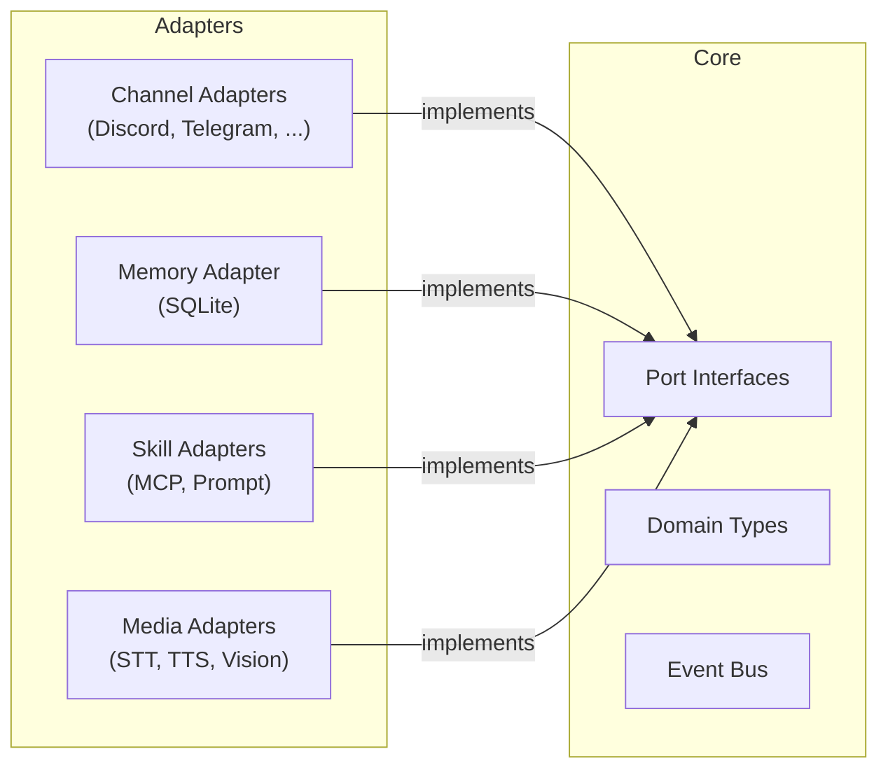

Comis follows hexagonal architecture (ports and adapters). The core domain defines port interfaces that describe what the system needs. Adapter packages implement those interfaces with platform-specific code. This separation means you can swap implementations (e.g., replace SQLite memory with PostgreSQL) without touching the core, and the core compiles without knowing which adapters exist.

All 16 packages follow this boundary model. Dependency direction is inward:
runtime and adapter packages depend on core contracts, while core does not
depend on their implementations.

## Hexagonal Pattern

The architecture has three conceptual layers:

**Core** (`@comis/core`) -- Domain types, port interfaces, event bus, security primitives, config schemas. This is the center of the hexagon. It defines WHAT the system does, never HOW.

**Ports** (interfaces in `core/src/ports/`) -- Contracts that the outside world must satisfy. A port says "I need something that can send messages" without specifying whether it's Discord, Telegram, or a test mock.

**Adapters** (implementations in other packages) -- Concrete implementations of port interfaces. The Telegram adapter implements `ChannelPort` using the Telegram Bot API. The SQLite adapter implements `MemoryPort` using better-sqlite3. The Echo adapter implements `ChannelPort` with an in-memory message store for testing.


```mermaid
graph LR
    subgraph Core
        Ports["Port Interfaces"]
        Domain["Domain Types"]
        Events["Event Bus"]
    end
    subgraph Adapters
        CH["Channel Adapters<br/>(Discord, Telegram, ...)"]
        MEM["Memory Adapter<br/>(SQLite)"]
        SK["Skill Adapters<br/>(MCP, Prompt)"]
        MEDIA["Media Adapters<br/>(STT, TTS, Vision)"]
    end
    CH -->|implements| Ports
    MEM -->|implements| Ports
    SK -->|implements| Ports
    MEDIA -->|implements| Ports
```

This means any adapter can be replaced or added without modifying core. To add a new chat platform, you implement the `ChannelPort` interface. To add a new storage backend, you implement `MemoryPort`. The rest of the system doesn't know or care which concrete adapter is running.

## Port Interfaces

Comis defines its port interfaces in `packages/core/src/ports/` and exports them
from `@comis/core`. The tables below show the main user-facing families; store,
runtime, scheduling, and orchestration ports follow the same pattern.

### Core Ports

The foundational interfaces that define the primary system boundaries:

| Port | File | Purpose | Adapters |
|------|------|---------|----------|
| `ChannelPort` | `ports/channel.ts` | Chat platform messaging boundary | 11 adapters (Discord, Telegram, Slack, WhatsApp, Signal, iMessage, LINE, IRC, Echo, Email, Microsoft Teams) |
| `ChannelPluginPort` | `ports/channel-plugin.ts` | Plugin wrapper for channel adapters | One per channel adapter |
| `MemoryPort` | `ports/memory.ts` | Persistent memory with vector search | `SqliteMemoryAdapter` |
| `SkillPort` | `ports/skill.ts` | Skill execution boundary | `SkillRegistry`, MCP client |
| `EmbeddingPort` | `ports/embedding.ts` | Text-to-vector embedding | External LLM providers |
| `PluginPort` | `ports/plugin.ts` | Plugin extension boundary | Any custom plugin |

### Media Ports

Interfaces for processing media content -- speech, images, video, and documents:

| Port | File | Purpose | Adapters |
|------|------|---------|----------|
| `TranscriptionPort` | `ports/transcription-port.ts` | Speech-to-text | OpenAI, Groq, Deepgram |
| `TTSPort` | `ports/tts-port.ts` | Text-to-speech | OpenAI, ElevenLabs, Edge TTS |
| `ImageAnalysisPort` | `ports/image-analysis-port.ts` | Vision AI image analysis | OpenAI, Anthropic, Google |
| `VisionProvider` | `ports/vision-port.ts` | Multi-capability vision (image + video) | Multi-provider vision |
| `MediaResolverPort` | `ports/media-resolver-port.ts` | Platform-specific media download | Per-platform resolvers, CompositeResolver |
| `FileExtractionPort` | `ports/file-extraction-port.ts` | Document text extraction | PDF, text, CSV extractors |

### Security Ports

Interfaces for security, secrets, and identity management:

| Port | File | Purpose | Adapters |
|------|------|---------|----------|
| `OutputGuardPort` | `ports/output-guard.ts` | LLM output safety scanning | Content scanner |
| `SecretStorePort` | `ports/secret-store.ts` | Encrypted secret storage | File-based secret store |
| `CredentialMappingPort` | `ports/credential-mapping.ts` | Credential-to-injection binding | Config-based mapper |
| `DeviceIdentityPort` | `ports/device-identity.ts` | Cryptographic device identity | Hardware identity manager |

### Infrastructure Ports

Interfaces for message delivery, image generation, and other infrastructure services:

| Port | File | Purpose | Adapters |
|------|------|---------|----------|
| `ImageGenerationPort` | `ports/provider.ts` | Image generation | FAL, OpenAI |
| `DeliveryQueuePort` | `ports/delivery-queue.ts` | Crash-safe outbound delivery | `SqliteDeliveryQueue` |
| `DeliveryMirrorPort` | `ports/delivery-mirror.ts` | Session delivery mirroring | `SqliteDeliveryMirror` |

### Example: ChannelPort

The most important port interface is `ChannelPort` -- the boundary between the platform-agnostic core and platform-specific chat adapters. Here is a simplified view of its key methods:

```typescript
// packages/core/src/ports/channel.ts
import type { Result } from "@comis/shared";
import type { AttachmentPayload, MessageHandler, SendMessageOptions } from "@comis/core";

export interface ChannelPort {
  readonly channelId: string;
  readonly channelType: string;

  start(): Promise<Result<void, Error>>;
  stop(): Promise<Result<void, Error>>;

  sendMessage(
    channelId: string,
    text: string,
    options?: SendMessageOptions,
  ): Promise<Result<string, Error>>;

  editMessage?(
    channelId: string,
    messageId: string,
    text: string,
    options?: SendMessageOptions,
  ): Promise<Result<void, Error>>;

  onMessage(handler: MessageHandler): void;

  reactToMessage?(
    channelId: string,
    messageId: string,
    emoji: string,
  ): Promise<Result<void, Error>>;

  deleteMessage?(
    channelId: string,
    messageId: string,
  ): Promise<Result<void, Error>>;

  sendAttachment?(
    channelId: string,
    attachment: AttachmentPayload,
    options?: SendMessageOptions,
  ): Promise<Result<string, Error>>;

  platformAction(
    action: string,
    params: Record<string, unknown>,
  ): Promise<Result<unknown, Error>>;

  getStatus?(): ChannelStatus;
}
```

<Tip>
Effectful asynchronous operations return `Result<T, Error>` instead of using
exceptions for normal control flow. See the Result Pattern section below.
</Tip>

The required surface covers lifecycle, inbound messages, outbound text, and a
platform-specific action dispatcher. Edit, reaction, history, attachment,
status, and reconciliation methods are optional capabilities implemented only
where the platform supports them.

## Composition Root

The `bootstrap()` function in `core/src/bootstrap.ts` builds the core
`AppContainer`: resolved configuration, the event bus, secret manager, plugin
registry, hook runner, and shutdown contract. The daemon's wiring modules then
compose runtime adapters such as channels, persistence, tools, and the gateway.

```typescript
import type { Result } from "@comis/shared";
import type { AppConfig, ConfigError } from "@comis/core";

export interface AppContainer {
  readonly config: AppConfig;
  readonly eventBus: TypedEventBus;
  readonly secretManager: SecretManager;
  /**
   * Names of secrets referenced by the daemon config (e.g. ANTHROPIC_API_KEY,
   * TELEGRAM_BOT_TOKEN). The exec tool refuses these as `secretRefs` so agents
   * cannot exfiltrate platform-managed credentials.
   */
  readonly platformSecretNames: ReadonlySet<string>;
  readonly pluginRegistry: PluginRegistry;
  readonly hookRunner: HookRunner;
  shutdown: () => Promise<void>;
}
```

The bootstrap flow creates these services in a specific order:

1. **SecretManager** -- Loads encrypted secrets from environment variables. This must be created first because config loading may need to resolve secret references.
2. **Config** -- Loads layered configuration: defaults, then YAML files, then environment overrides. Secret references in config values are resolved via the SecretManager.
3. **TypedEventBus** -- Creates the typed event bus with compile-time safety for all events across the `EventMap` interface.
4. **PluginRegistry** -- Creates the plugin registry that discovers, registers, and manages plugins. Connected to the event bus for audit events.
5. **HookRunner** -- Creates the hook execution engine that runs lifecycle hooks at the appropriate points. Connected to the plugin registry to discover registered hooks.

The `bootstrap()` function returns `Result<AppContainer, ConfigError>` -- it never throws. If config loading fails or secrets are missing, you get an explicit error you can handle.

<Info>
When adding an adapter, define or reuse its core port, export the adapter from
its package, and connect it in the relevant daemon wiring path.
</Info>

## Result Pattern

Domain and service operations use `Result<T, E>` from `@comis/shared` so callers
handle failures explicitly. Narrow boundary wrappers, CLI or web entry flows,
and tests may throw where the exception is immediately caught or asserted;
architecture and lint checks constrain those exceptions.

The `Result` type is a discriminated union:

```typescript
import { ok, err, tryCatch, fromPromise, type Result } from "@comis/shared";

// Result is either { ok: true, value: T } or { ok: false, error: E }
type Result<T, E = Error> =
  | { readonly ok: true; readonly value: T }
  | { readonly ok: false; readonly error: E };
```

Core utilities for working with Results:

- **`ok(value)`** -- Create a success result wrapping the given value
- **`err(error)`** -- Create a failure result wrapping the given error
- **`tryCatch(fn)`** -- Execute a synchronous function and capture exceptions as `err()`
- **`fromPromise(promise)`** -- Await a promise and capture rejections as `err()`

Here is a typical usage pattern:

```typescript
import { ok, err, fromPromise, type Result } from "@comis/shared";

async function fetchUser(id: string): Promise<Result<User, Error>> {
  if (!id) return err(new Error("ID required"));

  const result = await fromPromise(db.query(id));
  if (!result.ok) return err(result.error);

  return ok(result.value);
}

// Caller handles both paths explicitly
const userResult = await fetchUser("user-123");
if (!userResult.ok) {
  logger.error({ err: userResult.error }, "Failed to fetch user");
  return;
}
const user = userResult.value; // TypeScript narrows to User
```

<Warning>
Use `ok()` and `err()` for domain control flow. A boundary throw needs a local
rationale and an immediate translation to the repository's error contract.
</Warning>

## Dependency Direction

Contracts point inward: `shared` provides dependency-free utilities, `core`
owns domain and port contracts, and runtime packages implement or compose those
contracts. Some higher-level packages have explicit sibling dependencies, so
the package manifests and TypeScript project references are the authoritative
graph. Cross-package imports use public exports; lifecycle signals use the
typed event bus where an event is the appropriate boundary.

For the full [package breakdown](/developer-guide/packages) including roles, exports, and boundary rules, see the Packages page.

## Related

<CardGroup cols={2}>
  <Card title="Packages" icon="cubes" href="/developer-guide/packages">
    Detailed package roles and exports
  </Card>
  <Card title="Event Bus" icon="tower-broadcast" href="/developer-guide/event-bus">
    Cross-module communication via typed events
  </Card>
  <Card title="Custom Adapters" icon="plug" href="/developer-guide/custom-adapters">
    Build your own channel adapter
  </Card>
  <Card title="Plugins" icon="puzzle-piece" href="/developer-guide/plugins">
    Hook into the lifecycle
  </Card>
</CardGroup>
