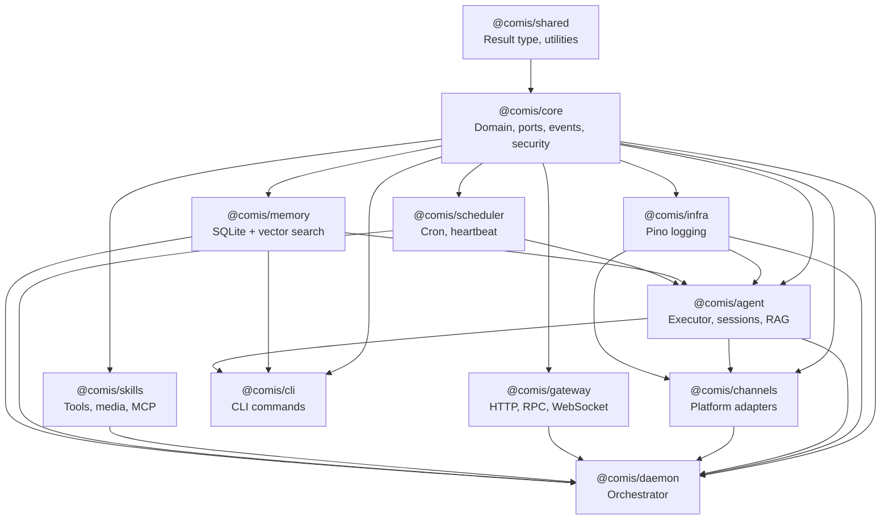

Comis is structured as a monorepo with 13 TypeScript packages under `packages/`. Each package has a single responsibility, exports a public API via `dist/index.js`, and follows strict dependency rules -- always importing inward toward `@comis/core`, never across sibling packages' internals.

All packages use ES modules (`"type": "module"`), strict TypeScript with `composite: true` project references, and ES2023 as the compilation target.

## Package Overview

| Package | npm Name | Role | Key Exports |
|---------|----------|------|-------------|
| shared | `@comis/shared` | Result type, utilities (zero runtime deps) | `Result`, `ok`, `err`, `tryCatch`, `fromPromise` |
| core | `@comis/core` | Domain types, ports, event bus, security, config, plugins | Ports, domain types, `EventMap`, config schemas, security utils |
| infra | `@comis/infra` | Pino structured logging | Logger factory, log level manager |
| memory | `@comis/memory` | SQLite + FTS5 + sqlite-vec vector search | `SqliteMemoryAdapter` (implements `MemoryPort`) |
| gateway | `@comis/gateway` | Hono HTTP, JSON-RPC, WebSocket, mTLS, OpenAI-compatible API | HTTP server, RPC dispatch, WebSocket handler |
| skills | `@comis/skills` | Skill manifest, prompt skills, MCP, built-in tools, media processing | `SkillRegistry`, media preprocessor, STT/TTS/vision adapters |
| scheduler | `@comis/scheduler` | Cron jobs, heartbeat checks, task extraction | Cron engine, heartbeat monitor, task extractor |
| agent | `@comis/agent` | Executor, budget, circuit breaker, RAG, sessions, context engine | `PiExecutor`, session manager, budget tracker |
| channels | `@comis/channels` | 10 platform adapters (Discord, Telegram, Slack, WhatsApp, Signal, iMessage, LINE, IRC, Echo, Email) | Channel adapters, message mappers, media resolvers |
| cli | `@comis/cli` | Commander.js CLI, JSON-RPC client | CLI commands, RPC client |
| daemon | `@comis/daemon` | Orchestrator, observability, graph coordinator | `DaemonInstance`, wiring, graph coordinator |
| comis | `comisai` | Umbrella package (namespace re-exports) and `comis` CLI bin | Namespace re-exports of all sub-packages |
| web | `@comis/web` | Lit + Vite + Tailwind standalone SPA | Web dashboard views and components |

### Package Roles Explained

**`@comis/shared`** is the foundation. It defines the `Result<T, E>` discriminated union and its utility functions. Every other package depends on `shared`, but `shared` depends on nothing. This makes it safe to import anywhere without creating circular dependencies.

**`@comis/core`** is the heart of the hexagonal architecture. It defines all 19 port interfaces in `src/ports/`, all domain types as Zod schemas in `src/domain/`, the `TypedEventBus` for inter-module communication, security primitives (`SafePath`, `SecretManager`, `ActionClassifier`), 22+ config schemas, and the plugin infrastructure (`PluginRegistry`, `HookRunner`). The composition root `bootstrap()` function lives here and returns an `AppContainer`.

**`@comis/agent`** is the execution engine. It contains the `PiExecutor` that orchestrates LLM calls, tool execution, and response generation. It also manages sessions (conversation state), budgets (token/cost limits), circuit breakers (automatic failure recovery), and RAG (retrieval-augmented generation from memory). It also contains the context engine -- an 8-layer pipeline that manages token budgets and conversation length before each AI call.

**`@comis/channels`** contains the 10 platform adapters. Each adapter lives in its own directory (e.g., `src/telegram/`, `src/discord/`) with a standard file set: adapter, message mapper, media handler, credential validator, media resolver, voice sender, and plugin wrapper.

**`@comis/daemon`** is the top-level orchestrator. It wires all packages together using the composition root, manages the process lifecycle (startup, shutdown, signal handling), runs the graph coordinator for multi-agent pipelines, and provides observability metrics. This is the only package that depends on all other packages.

**`@comis/web`** is a standalone single-page application built with Lit web components, Vite for bundling, and Tailwind CSS for styling. It communicates with the daemon exclusively through the gateway's HTTP and WebSocket APIs.

<Note>
The published umbrella package is named `comisai` on npm (the directory is `packages/comis/`). It bundles all `@comis/*` workspace packages and exposes a `comis` CLI binary. Subpath imports such as `comisai/core` or `comisai/agent` are exposed via the umbrella's `exports` map.
</Note>

## Dependency Graph

The dependency graph flows inward -- adapters depend on ports (in core), never on each other. The `daemon` package sits at the top as the composition root that wires all packages together.



### Layer Summary

- **`shared`** is the leaf -- zero runtime dependencies, imported by everything. Defines the `Result<T, E>` type and utility functions (`ok`, `err`, `tryCatch`, `fromPromise`).
- **`core`** depends only on `shared` -- defines all 19 port interfaces, domain types, typed events, security primitives, and config schemas.
- **Mid-tier packages** (`infra`, `memory`, `gateway`, `skills`, `scheduler`) each depend on `core` and implement specific port interfaces or provide infrastructure services.
- **`agent`** depends on `core`, `infra`, `memory`, and `scheduler` -- orchestrates execution, sessions, RAG, budgets, and circuit breakers.
- **`channels`** depends on `core`, `agent`, and `infra` -- platform adapters that receive messages and route them to agents.
- **`cli`** depends on `core`, `memory`, and `agent` -- the command-line interface for managing the daemon via JSON-RPC. (Note: `@comis/agent` is a runtime dependency via package.json but not a tsconfig reference.)
- **`daemon`** depends on all packages -- it is the composition root that wires everything together at startup and manages the process lifecycle.
- **`comis`** is the umbrella package that re-exports all other packages under a single namespace.
- **`web`** is a standalone SPA (Lit + Vite + Tailwind) that communicates with the daemon via the gateway HTTP API.

## Package Boundary Rules

These rules are mandatory across the codebase and enforced through code review and architectural convention (see AGENTS.md section 6.2).

### No Cross-Package Internal Imports

Import from the package's public API, never from internal source paths. Each package exports its public surface through `dist/index.js`. This ensures that internal refactoring within a package never breaks consumers.

```typescript
// Correct: import from the package's public API
import type { ChannelPort, NormalizedMessage } from "@comis/core";
import { ok, err, type Result } from "@comis/shared";

// Wrong: importing internal modules
// import { something } from "@comis/core/src/internal/helper";
```

### Dependency Direction Is Always Inward

Adapters depend on ports (in core), never on each other. `channels` never imports from `gateway`. `skills` never imports from `agent`. If two sibling packages need to communicate, they do so through the `TypedEventBus` or through shared domain types defined in `core`.

### Inject Logger via Deps Interface

Never import `@comis/infra` directly in non-infra packages. Pass a logger through the dependency injection pattern so that packages remain decoupled from the logging implementation. This also makes unit testing easier since you can inject a mock logger that captures log calls for assertions.

### ES Modules Only

All packages use `"type": "module"` with `.js` extensions in import paths. There are no CommonJS modules in the codebase. Import statements use the `.js` extension even though the source files are `.ts`:

```typescript
// In TypeScript source files, use .js extension for local imports
import { createCircuitBreaker } from "./circuit-breaker.js";
```

## Build System

TypeScript project references (`composite: true`) enable incremental builds across the monorepo. Each package has its own `tsconfig.json` that references its dependencies, so `pnpm build` compiles all packages in the correct order respecting the reference graph.

```bash
pnpm install          # Install dependencies (native: better-sqlite3, sharp)
pnpm build            # Build all packages (tsc per package, respects references)
pnpm test             # Run all unit tests (Vitest workspace)
pnpm lint:security    # ESLint with security rules
```

**Configuration details:**

| Setting | Value | Notes |
|---------|-------|-------|
| Target | ES2023 | Modern JavaScript output |
| Module resolution | NodeNext | Native ESM with `.js` extensions |
| Strict mode | Enabled | All strict TypeScript checks active |
| Build output | `packages/*/dist/` | Gitignored, built on CI |
| Isolated modules | `true` | Compatible with esbuild and other bundlers |
| Package exports | `"main": "./dist/index.js"` | Plus `"types": "./dist/index.d.ts"` |

To build and test a single package:

```bash
cd packages/core && pnpm build    # Build one package
cd packages/core && pnpm test     # Test one package
```

To run a single test file from a package directory:

```bash
pnpm vitest run src/path/to/file.test.ts
```

<Info>
Integration tests in `test/integration/` require `pnpm build` first because they import from `dist/`, not from source. Run them with `pnpm test:integration`.
</Info>

## Scale

The Comis monorepo contains approximately:

- **~1185 source files** across 13 packages
- **~944 test files** co-located with source code
- **19 port interfaces** defining the hexagonal architecture boundaries
- **160 typed events** across 4 domain subsystems (Messaging, Agent, Channel, Infra)
- **13 lifecycle hooks** for plugin integration (5 modifying, 8 void)
- **10 channel adapters** connecting to real-world chat platforms

The codebase is large but well-structured -- each package has a focused responsibility and a clear public API. The [architecture page](/developer-guide/architecture) explains how these packages connect through ports and adapters.

<Tip>
To explore the codebase structure, start with `packages/core/src/ports/` for all port interface definitions, `packages/core/src/domain/` for Zod-validated domain types, and `packages/core/src/bootstrap.ts` for the composition root.
</Tip>

## Related

<CardGroup cols={2}>
  <Card title="Architecture" icon="hexagon" href="/developer-guide/architecture">
    How packages connect through ports and adapters
  </Card>
  <Card title="Event Bus" icon="tower-broadcast" href="/developer-guide/event-bus">
    Cross-package communication via typed events
  </Card>
  <Card title="Contributing" icon="code-pull-request" href="/developer-guide/contributing">
    Setup and build instructions
  </Card>
  <Card title="Developer Guide" icon="code" href="/developer-guide">
    Back to developer guide overview
  </Card>
</CardGroup>
