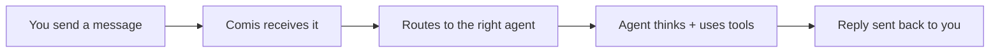
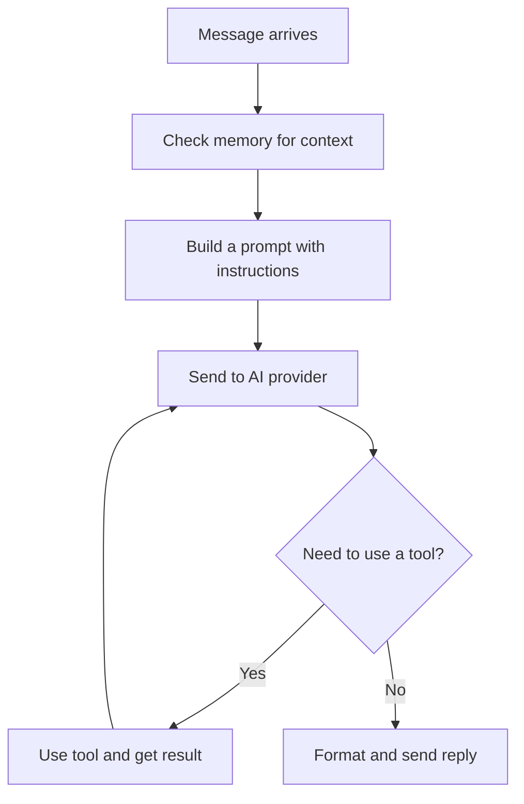

Comis is a system that connects AI agents to your messaging apps. This page
explains how it all fits together -- no technical background required.

## The journey of a message

When someone sends a message to your agent, it goes through a simple pipeline.
Think of Comis as a mail sorting office: messages arrive from different platforms,
get routed to the right agent, and responses get delivered back.

Here is what each step means:

- **You send a message** -- This could be a Discord message, a Telegram chat, a
  Slack DM, or even a message typed in the web dashboard. It does not matter
  which platform you use.
- **Comis receives it** -- The gateway (Comis's front door) accepts the message
  and figures out where it came from.
- **Routes to the right agent** -- If you have multiple agents, Comis checks its
  routing rules to decide which one should respond. You can set up rules based on
  the platform, the channel, or even specific users.
- **Agent thinks and uses tools** -- Your agent reads the message, checks its
  memory, and decides how to respond. It might also use tools -- like searching
  the web, checking a schedule, or reading a document.
- **Reply sent back to you** -- The response travels back through Comis and
  appears in the same chat where you sent the original message.

The whole process takes just a few seconds.

## The building blocks

Comis is made up of a few key building blocks that work together. You do not
need to understand all of them to get started, but knowing what they are helps
you make sense of the rest of the documentation.

| Building Block | What It Does | Analogy |
|---|---|---|
| **Channels** | Connect to messaging apps (Discord, Telegram, Slack, WhatsApp, Signal, iMessage, IRC, LINE) | Phone lines to different networks |
| **Agents** | The AI brains that read messages and write replies | Employees who handle customer requests |
| **Memory** | Stores what agents learn and remember across conversations | A filing cabinet for each agent |
| **Skills** | Extra abilities agents can use (web search, scheduling, file management) | Tools in a toolbox |
| **Gateway** | Allows the web dashboard and other apps to talk to Comis | A reception desk at the front of the office |
| **Security** | Keeps everything safe -- encrypted secrets, access controls, audit logs | Locks, alarms, and access badges |

Each building block is independent. You can start with just one agent on one
channel and add more pieces as your needs grow.

## How agents think

When a message reaches your agent, it does not just fire off a quick reply. It
goes through a thoughtful process to give you the best possible response.

Here is what is happening:

1. **Check memory** -- Your agent looks back at previous conversations to
   understand context. If you mentioned a project last week, it remembers.
2. **Build a prompt** -- The agent combines the message, its memory, and its
   instructions into a single request for the AI provider.
   The [context engine](/agents/compaction) automatically optimizes the prompt by
   trimming older content to fit within the AI model's limits.
3. **Send to AI provider** -- The request goes to your configured provider
   (Anthropic, OpenAI, Google, etc.), which generates a response.
4. **Use tools if needed** -- Sometimes the agent needs more information. It
   might search the web, check a calendar, or read a file. After getting the
   result, it sends another request to the AI provider with the new information.
   This can happen several times in a row.
5. **Send the reply** -- Once the agent has a final answer, it formats the
   response for your platform and sends it back to you.

Your agent does not just answer -- it can think in steps, use tools, and remember
what it learns for next time. The more you use it, the more helpful it becomes.

## How multiple agents work together

If you run more than one agent, each one operates independently with its own
memory, tools, and personality. Comis routes each incoming message to the right
agent based on rules you define.

For example, you might have:

- A **support agent** in your Slack workspace that answers customer questions
- A **research agent** in Telegram that searches the web and summarizes findings
- A **scheduler agent** in Discord that manages reminders and recurring tasks

Each agent only sees messages meant for it. They do not interfere with each
other, and they each have their own memory and conversation history.

For advanced use cases, agents can delegate tasks to other agents using
[sub-agent sessions](/agent-tools/sessions), or orchestrate entire multi-agent
workflows using [execution graphs](/agents/execution-graphs) -- declarative
DAG pipelines where each node is a sub-agent task that can run in parallel,
wait for dependencies, and share data.

## Want to go deeper?

<CardGroup cols={2}>
  <Card title="Architecture (for developers)" icon="code" href="/developer-guide/architecture">
    The full technical architecture with code-level details.
  </Card>
  <Card title="Packages" icon="boxes-stacked" href="/developer-guide/packages">
    Explore the individual packages that make up Comis.
  </Card>
  <Card title="Agent Lifecycle" icon="arrows-spin" href="/agents/lifecycle">
    How an agent processes a message from start to finish.
  </Card>
  <Card title="Glossary" icon="book" href="/get-started/glossary">
    Definitions of every term used in the documentation.
  </Card>
</CardGroup>
