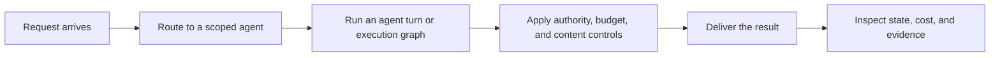

Comis is a governed agent runtime. It connects requests from channels, APIs,
schedules, and the web dashboard to agents with explicit state, tools, budgets,
and policy.

import NonTechnicalNote from '/snippets/non-technical-note.mdx';

<NonTechnicalNote />

## From request to accountable result

```mermaid
flowchart LR
    A["Request arrives"] --> B["Route to a scoped agent"]
    B --> C["Run an agent turn or execution graph"]
    C --> D["Apply authority, budget, and content controls"]
    D --> E["Deliver the result"]
    E --> F["Inspect state, cost, and evidence"]
```

1. **Receive:** a channel, API, schedule, or dashboard submits work inside a
   request context.
2. **Route:** bindings select an agent with its own model, workspace, context,
   memory, tools, budget, secret policy, and channel rules.
3. **Coordinate:** the agent can answer directly, use tools, delegate work, or
   run a typed execution graph with sequential and parallel nodes.
4. **Constrain:** capability gates, origin checks, tool policy, configured
   budgets, input and memory validation, output guards, and supported approval
   paths limit the work.
5. **Record:** sessions, canonical context, memory provenance, traces, costs,
   audit events, and execution state provide evidence for later inspection.
6. **Deliver:** the result returns through the originating interface or a
   configured delivery path.

## The governance layers

| Layer | What Comis controls |
|---|---|
| **Execution** | Agent turns, sub-agents, typed DAGs, dependencies, retries, barriers, configured budgets, and durable checkpoints |
| **Context** | Bounded active prompts backed by canonical messages and tool results that can be searched, inspected, and selectively expanded |
| **Memory** | Trust labels, provenance, corroboration, outcome gates, supersession, corrections, and ranked recall |
| **Authority** | Per-agent tools and secrets, capability membership, origin checks, scoped storage, credential brokering, and audit events |
| **Cost** | Provider accounting, per-run graph budgets, and opt-in spend ceilings |
| **Evidence** | Traces, trajectories, incident explanation, fleet health, delivery state, recall diagnostics, and security decisions |

These layers are useful individually. Comis's design advantage is that they are
wired into one runtime instead of being separate controls around an agent loop.

## How context stays recoverable

Models have finite context windows, so older material cannot remain in every
active prompt. The default DAG context engine summarizes older regions while
retaining canonical messages and tool results in the context store. The agent
can use `ctx_search`, `ctx_inspect`, and `ctx_expand` to recover selected detail
without loading the entire history.

This is active-workflow recoverability. It does not mean every configured
provider, external service, or generated artifact is stored by Comis.

## How multiple agents work together

Agents can have separate identities, workspaces, model settings, context and
memory scopes, tool policies, budgets, secret rules, and routing bindings.
Execution graphs can coordinate sub-agent tasks in sequence or parallel and
persist state for configured durable runs.

Agent and tenant scopes are logical runtime boundaries. The daemon and host
remain trusted infrastructure, so operators must still harden the host and
verify the execution sandbox they rely on.

## Security and provider boundaries

Comis treats external content and model output as untrusted, but controls are
not universal isolation:

- Linux with Bubblewrap is the recommended tool-execution target. Ordinary
  `exec` can run on the host when its sandbox is disabled or unavailable.
- The default agent tool-policy profile is `full`, and an empty
  `secrets.allow` list is unrestricted. Narrow both before accepting untrusted
  input.
- Approval requests are available only on explicitly wired paths when enabled.
- Streaming consumers can receive deltas before the completed output scan.
- Configured model, channel, media, MCP, and tool providers can receive data
  deliberately routed to them.

Read the [security boundaries](/get-started/security) and
[threat model](/security/threat-model) before granting broad tool or network
access.

## Go deeper

<CardGroup cols={2}>
  <Card title="Execution Graphs" icon="diagram-project" href="/agents/execution-graphs">
    Define, persist, and inspect multi-agent DAG workflows.
  </Card>
  <Card title="Context Management" icon="brain" href="/agents/context-management">
    Understand prompt bounds, canonical storage, summaries, and recovery tools.
  </Card>
  <Card title="Capability Model" icon="shield-check" href="/security/capability-model">
    See how privileged runtime operations are gated.
  </Card>
  <Card title="Observability" icon="gauge" href="/operations/observability">
    Trace activity, investigate incidents, and inspect operational evidence.
  </Card>
</CardGroup>
