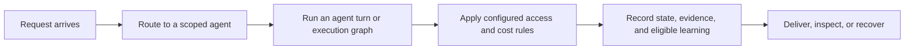

Comis is an open-source security-first runtime for AI agents that learn and act
across sessions. It connects requests from schedules, channels, APIs, and the
web dashboard to agents with their own state, tools, budgets, learning history,
and rules.

import NonTechnicalNote from '/snippets/non-technical-note.mdx';

<NonTechnicalNote />

## From request to recoverable result

```mermaid
flowchart LR
    A["Request arrives"] --> B["Route to a scoped agent"]
    B --> C["Run an agent turn or execution graph"]
    C --> D["Apply configured access and cost rules"]
    D --> E["Record state, evidence, and eligible learning"]
    E --> F["Deliver, inspect, or recover"]
```

1. **Receive:** a channel, API, schedule, or dashboard submits work inside a
   request context.
2. **Route:** bindings select an agent with its own model, workspace, context,
   memory, tools, budget, credential rules, and channel settings.
3. **Coordinate:** the agent can answer directly, use tools, delegate work, or
   run a typed execution graph with sequential and parallel nodes.
4. **Apply rules:** capability checks, origin checks, tool policy, configured
   budgets, content checks, and supported approval paths limit the work.
5. **Record:** sessions, stored context, memory sources, eligible learned
   guidance, traces, costs, audit events, and workflow state provide evidence
   for later inspection and configured recall.
6. **Deliver or recover:** the result returns through a configured path. If the
   run stops, recorded state can support investigation and configured recovery.

Learned or stored text can influence what the model proposes next, including
which tool it asks to use. It cannot grant a capability, reveal a credential,
raise a budget, or bypass a runtime check.

## Govern authority, learning, and recovery

| Runtime responsibility | What it means in Comis |
|---|---|
| **Keep authority outside the model** | Tool access, capabilities, origin checks, credential scope, memory checks, graph budgets, and opt-in spend ceilings are applied outside prompt text. |
| **Govern learning across sessions** | Source records, trust signals, configured corroboration, usefulness, and correction history shape which experience can return as guidance. That guidance can influence proposals but cannot grant permission. |
| **Recover and explain the work** | Stored messages and tool results can be searched, inspected, and selectively expanded. Traces, costs, delivery state, audit events, and memory diagnostics feed bounded incident reports. |

These parts share the same runtime and recorded run state. That lets an operator
connect a failed action to the access rule, context, cost, or workflow state
around it without asking another model to invent an explanation.

## How learning remains governed

Comis can turn qualifying experience into candidate or active learned guidance,
depending on configuration. Source records, trust signals, configured evidence,
usefulness, and correction state affect admission and recall. Candidate guidance
may be available for read-only use before active promotion when configured.

Learned guidance remains model input, not runtime authority. It has no direct
script execution path, and every proposed action still passes through the
capability, origin, credential, tool-policy, and budget controls wired to that
path. Learning admission demonstrates that guidance was recorded; it is not by
itself proof of a general performance improvement.

## How context stays recoverable

Models have finite context windows, so older material cannot remain in every
active prompt. The default DAG context engine summarizes older regions while
retaining canonical messages and tool results in the context store. The agent
can use `ctx_search`, `ctx_inspect`, and `ctx_expand` to recover selected detail
without loading the entire history.

This is active-workflow recoverability. It does not mean every configured
provider, external service, or generated artifact is stored by Comis.

## How multiple agents work together

Agents can have separate identities, workspaces, model settings, context and
memory scopes, tool policies, budgets, secret rules, and routing bindings.
Execution graphs can coordinate sub-agent tasks in sequence or parallel and
persist state for configured durable runs.

Agent and tenant scopes are logical runtime boundaries. The daemon and host
remain trusted infrastructure, so operators must still harden the host and
verify the execution sandbox they rely on.

## Security and provider boundaries

Comis treats external content and model output as untrusted, but controls are
not universal isolation:

- Linux with Bubblewrap is the recommended tool-execution target. Ordinary
  `exec` can run on the host when its sandbox is disabled or unavailable.
- The default agent tool-policy profile is `full`, and an empty
  `secrets.allow` list is unrestricted. Narrow both before accepting untrusted
  input.
- Approval requests are available only on explicitly wired paths when enabled.
- Streaming consumers can receive deltas before the completed output scan.
- Configured model, channel, media, MCP, and tool providers can receive data
  deliberately routed to them.

Read the [security boundaries](/get-started/security) and
[threat model](/security/threat-model) before granting broad tool or network
access.

## Go deeper

<CardGroup cols={2}>
  <Card title="Execution Graphs" icon="diagram-project" href="/agents/execution-graphs">
    Define, persist, and inspect multi-agent DAG workflows.
  </Card>
  <Card title="Context Management" icon="brain" href="/agents/context-management">
    Understand prompt bounds, canonical storage, summaries, and recovery tools.
  </Card>
  <Card title="Capability Model" icon="shield-check" href="/security/capability-model">
    See how privileged runtime operations are gated.
  </Card>
  <Card title="Observability" icon="gauge" href="/operations/observability">
    Trace activity, investigate incidents, and inspect operational evidence.
  </Card>
</CardGroup>
